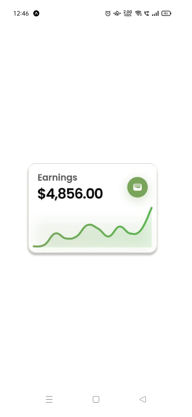

<FlutterBlocksHeroSection/ >


<div className='grid grid-cols-3 gap-4'>

<Tabs items={["preview", "code"]}>
  <Tab value="preview"></Tab>
  <Tab value="code">
```dart

import 'package:flutter/material.dart';
import 'package:google_fonts/google_fonts.dart';
import 'package:fl_chart/fl_chart.dart';

void main() {
  runApp(
    MaterialApp(
      debugShowCheckedModeBanner: false,
      home: Scaffold(backgroundColor: Color(0xffE8E4DD), body: MyApp()),
    ),
  );
}

class MyApp extends StatelessWidget {
  const MyApp({super.key});

  @override
  Widget build(BuildContext context) {
    return Center(
      child: Container(
        width: 200,
        decoration: BoxDecoration(
          borderRadius: BorderRadius.circular(12),
          color: Colors.white,
          boxShadow: [
            BoxShadow(
              color: Colors.black.withValues(alpha: 0.08),
              blurRadius: 20,
              offset: Offset(0, 4),
              spreadRadius: 0,
            ),
            BoxShadow(
              color: Colors.black.withValues(alpha: 0.04),
              blurRadius: 40,
              offset: Offset(0, 8),
              spreadRadius: 0,
            ),
          ],
        ),
        child: Column(
          mainAxisSize: MainAxisSize.min,
          children: [
            Padding(
              padding: EdgeInsets.symmetric(vertical: 14, horizontal: 14),
              child: Row(
                crossAxisAlignment: CrossAxisAlignment.center,
                mainAxisAlignment: MainAxisAlignment.spaceBetween,
                children: [
                  Column(
                    crossAxisAlignment: CrossAxisAlignment.start,
                    children: [
                      Text(
                        'Earnings',
                        style: GoogleFonts.poppins(
                          textStyle: TextStyle(
                            color: Color(0xff525252),
                            fontWeight: FontWeight.w600,
                            letterSpacing: 0,
                            fontSize: 14,
                          ),
                        ),
                      ),
                      Text(
                        '\$4,856.00',
                        style: GoogleFonts.poppins(
                          textStyle: TextStyle(
                            color: Colors.black,
                            fontWeight: FontWeight.w600,
                            letterSpacing: -1,
                            fontSize: 22,
                          ),
                        ),
                      ),
                    ],
                  ),
                  Container(
                    decoration: BoxDecoration(
                      shape: BoxShape.circle,
                      boxShadow: [
                        BoxShadow(
                          color: Color(0xFF78A55A).withValues(alpha: 0.3),
                          blurRadius: 12,
                          offset: Offset(0, 4),
                          spreadRadius: 0,
                        ),
                      ],
                    ),
                    child: CircleAvatar(
                      radius: 16,
                      backgroundColor: Color(0xFF78A55A),
                      child: Icon(Icons.wallet, color: Colors.white, size: 16),
                    ),
                  ),
                ],
              ),
            ),
            Container(
              margin: EdgeInsets.symmetric(horizontal: 8, vertical: 8),
              decoration: BoxDecoration(
                borderRadius: BorderRadius.circular(8),
                boxShadow: [
                  BoxShadow(
                    color: Color(0xFF78A55A).withValues(alpha: 0.12),
                    blurRadius: 16,
                    offset: Offset(0, 4),
                    spreadRadius: -2,
                  ),
                ],
              ),
              child: AspectRatio(
                aspectRatio: 4,
                child: LineChart(
                  LineChartData(
                    gridData: FlGridData(show: false),
                    titlesData: FlTitlesData(show: false),
                    borderData: FlBorderData(show: false),
                    lineTouchData: LineTouchData(
                      enabled: true,
                      touchTooltipData: LineTouchTooltipData(
                        getTooltipItems: (touchedSpots) {
                          return touchedSpots.map((spot) {
                            return LineTooltipItem(
                              '${spot.y.toStringAsFixed(1)}',
                              const TextStyle(
                                color: Colors.white,
                                fontWeight: FontWeight.bold,
                                fontSize: 12,
                              ),
                            );
                          }).toList();
                        },
                      ),
                    ),
                    minX: 0,
                    maxX: 11,
                    minY: 0,
                    maxY: 6,
                    lineBarsData: [
                      LineChartBarData(
                        spots: const [
                          FlSpot(0, 0.2),
                          FlSpot(1, 0.5),
                          FlSpot(2, 2.8),
                          FlSpot(3, 1.8),
                          FlSpot(4, 2.2),
                          FlSpot(5, 4.5),
                          FlSpot(6, 3.8),
                          FlSpot(7, 2.2),
                          FlSpot(8, 4.2),
                          FlSpot(9, 2.8),
                          FlSpot(10, 3.5),
                          FlSpot(11, 8.0),
                        ],
                        isCurved: true,
                        curveSmoothness: 0.4,
                        gradient: const LinearGradient(
                          colors: [Color(0xFF78A55A), Color(0xFF59B74F)],
                        ),
                        barWidth: 3,
                        isStrokeCapRound: true,
                        dotData: FlDotData(
                          show: true,
                          checkToShowDot: (spot, barData) => false,
                        ),
                        showingIndicators: [],
                        belowBarData: BarAreaData(
                          show: true,
                          gradient: LinearGradient(
                            colors: [
                              const Color(0xFF78A55A).withValues(alpha: 0.15),
                              const Color(0xFF59B74F).withValues(alpha: 0.15),
                            ],
                          ),
                        ),
                      ),
                    ],
                  ),
                ),
              ),
            ),
          ],
        ),
      ),
    );
  }
}

```
  </Tab>
</Tabs>


</div>


