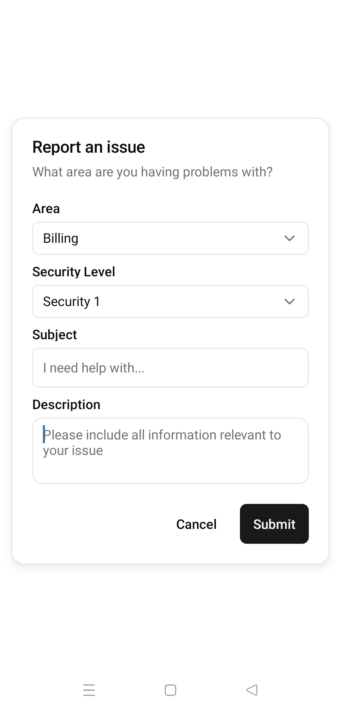
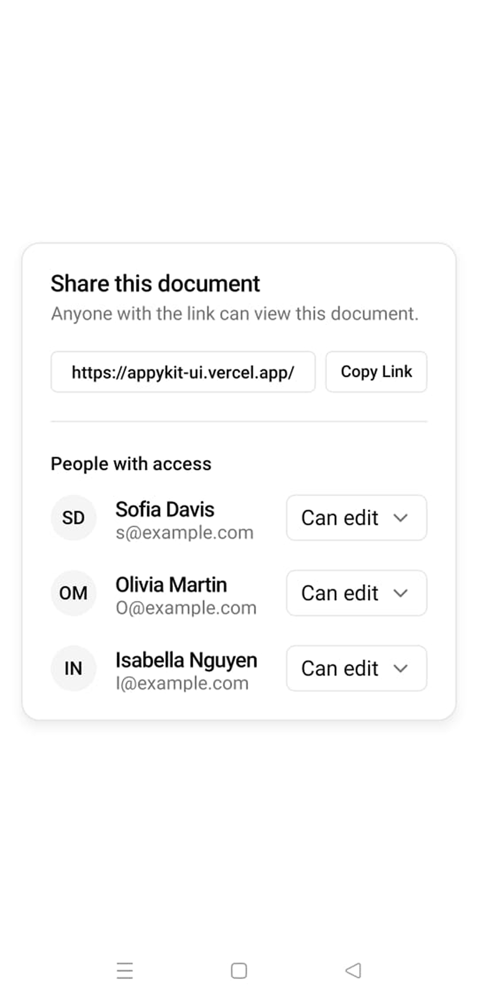
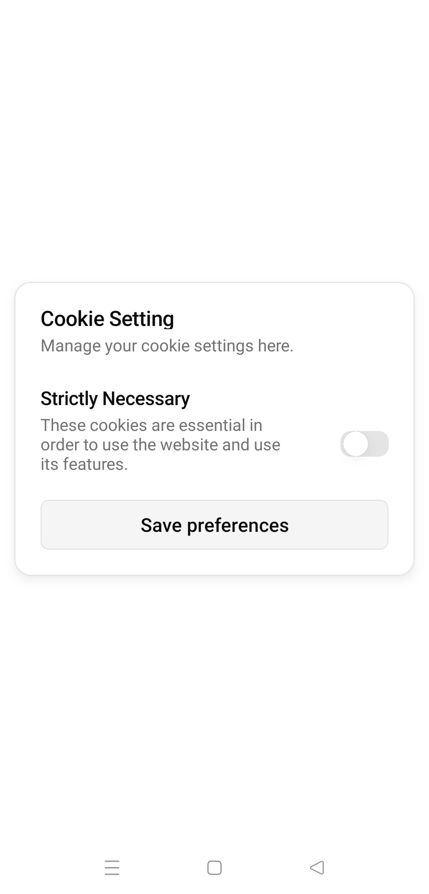
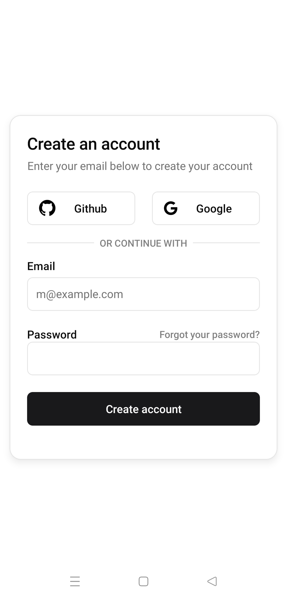
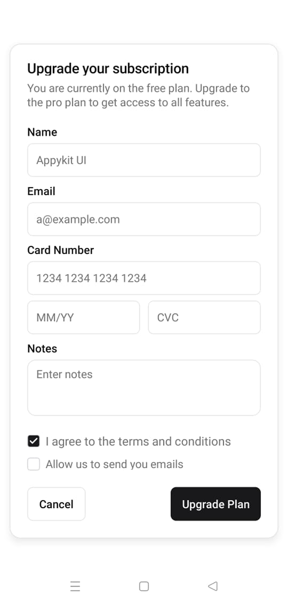
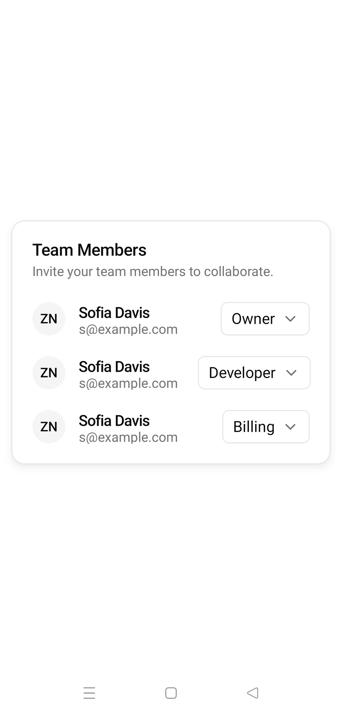

<BlocksHeroSection/ >


<div className='grid grid-cols-3 gap-4'>

<Tabs items={["preview", "code"]}>
  <Tab value="preview"></Tab>
  <Tab value="code">
```ts
import { SendIcon } from "lucide-react-native";
import React from "react";
import { ScrollView, View } from "react-native";
import {
  Card,
  CardContent,
  CardFooter,
  CardHeader,
} from "@/components/ui/card";
import { Avatar, AvatarFallback, AvatarImage } from "../ui/avatar";
import { Button } from "../ui/button";
import { Input } from "../ui/input";
import { Text } from "../ui/text";
const Block7 = () => {
  const GITHUB_AVATAR_URI = "https://github.com/mrzachnugent.png";
  const [value, setValue] = React.useState("");

  const onChangeText = (text: string) => {
    setValue(text);
  };
  return (
    <View>
      <Card className="w-full max-w-md  ">
        <CardHeader className="flex-col items-start ">
          <View className="flex flex-row items-center gap-4 justify-center">
            <Avatar alt="Appykit UI">
              <AvatarImage source={{ uri: GITHUB_AVATAR_URI }} />
              <AvatarFallback>
                <Text>AU</Text>
              </AvatarFallback>
            </Avatar>
            <View className="flex flex-col  ">
              <Text className="font-semibold text-[16px] tracking-tighter">
                Appykit UI
              </Text>
              <Text className="text-muted-foreground font-normal">
                appykit@ui.com
              </Text>
            </View>
          </View>
        </CardHeader>
        <ScrollView className="flex-col gap-6 max-h-[350px]" showsHorizontalScrollIndicator={true}>
          <CardContent className="flex-col gap-6 " >
          <View className="px-4 py-2 max-w-[80%] self-start bg-secondary rounded-lg">
            <Text className="font-normal" >Hi, how can I help you today?</Text>
          </View>
          <View className="px-4 py-2 max-w-[80%] self-end bg-secondary rounded-lg">
            <Text className="font-normal" >Hey, I'm having trouble with my account.</Text>
          </View>
          <View className="px-4 py-2 max-w-[80%] self-start bg-secondary rounded-lg">
            <Text className="font-normal" >What seems to be the problem?</Text>
          </View>
          <View className="px-4 py-2 max-w-[80%] self-end bg-secondary rounded-lg">
            <Text className="font-normal" >I can't log in.</Text>
          </View>
        </CardContent>
        </ScrollView>

        <CardFooter className="flex-row gap-3 items-center justify-between">
          <Input
          className="flex-1"
            placeholder="Type your message here..."
            value={value}
            onChangeText={onChangeText}
            aria-labelledby="inputLabel"
            aria-errormessage="inputError"
          />
          <Button className="bg-black/80" size={"icon"}>
            <SendIcon color={"white"} size={16} />
          </Button>
        </CardFooter>
      </Card>
    </View>
  );
};

export default Block7;

```
  </Tab>
</Tabs>

<Tabs items={["preview", "code"]}>
  <Tab value="preview"></Tab>
  <Tab value="code">
```ts
import React from "react";
import { StyleSheet, View } from "react-native";
import { useSafeAreaInsets } from "react-native-safe-area-context";
import {
  Card,
  CardContent,
  CardDescription,
  CardFooter,
  CardHeader,
  CardTitle,
} from "@/components/ui/card";
import { Button } from "../ui/button";
import { Input } from "../ui/input";
import {
  Select,
  SelectContent,
  SelectGroup,
  SelectItem,
  SelectLabel,
  SelectTrigger,
  SelectValue,
} from "../ui/select";
import { Text } from "../ui/text";
import { Textarea } from "../ui/textarea";
const Block6 = () => {
  const [value, setValue] = React.useState("");

  const insets = useSafeAreaInsets();
  const contentInsets = {
    top: insets.top,
    bottom: insets.bottom,
    left: 12,
    right: 12,
  };
  return (
    <View>
      <Card className="w-full max-w-sm ">
        <CardHeader className="flex-col items-start gap-2">
          <CardTitle className="font-semibold">Report an issue</CardTitle>
          <CardDescription className="text-start ">
            What area are you having problems with?
          </CardDescription>
        </CardHeader>
        <CardContent className="flex-col  gap-3">
          <View className="flex flex-col gap-6">
            <View className="grid gap-2">
              <Text className="font-semibold  ">Area</Text>
              <Select
                className=""
                defaultValue={{ value: "Billing", label: "Billing" }}
              >
                <SelectTrigger className="">
                  <SelectValue
                    className="text-foreground text-sm native:text-base "
                    placeholder="Select a Team"
                  />
                </SelectTrigger>
                <SelectContent insets={contentInsets} className="w-[250px]">
                  <SelectGroup>
                    <SelectLabel>Team</SelectLabel>
                    <SelectItem label="Billing" value="Billing">
                      Billing
                    </SelectItem>
                    <SelectItem label="Account" value="Account">
                      Account
                    </SelectItem>
                    <SelectItem label="Deployment" value="Deployment">
                      Deployment
                    </SelectItem>
                    <SelectItem label="Support" value="Support">
                      Support
                    </SelectItem>
                    
                  </SelectGroup>
                </SelectContent>
              </Select>
            </View>
          </View>
          <View className="flex flex-col gap-6">
            <View className="grid gap-2">
              <Text className="font-semibold  ">Security Level</Text>
              <Select
                className=""
                defaultValue={{ value: "Security 1", label: "Security 1" }}
              >
                <SelectTrigger className="">
                  <SelectValue
                    className="text-foreground text-sm native:text-base "
                    placeholder="Select a Team"
                  />
                </SelectTrigger>
                <SelectContent insets={contentInsets} className="w-[250px]">
                  <SelectGroup>
                    <SelectLabel>Team</SelectLabel>
                    <SelectItem label="Security 1" value="Security 1">
                      Security 1
                    </SelectItem>
                    <SelectItem label="Security 2" value="Security 2">
                      Security 2
                    </SelectItem>
                    <SelectItem label="Security 3" value="Security 3">
                      Security 3
                    </SelectItem>
                    <SelectItem label="Security 4" value="Security 4">
                      Security 4
                    </SelectItem>
                    
                  </SelectGroup>
                </SelectContent>
              </Select>
            </View>
          </View>
          
          <View className="grid gap-2">
              <Text className="font-semibold">Subject</Text>
              <Input
                keyboardType="email-address"
                autoCapitalize="none"
                autoCorrect={false}
                id="email"
                placeholder="I need help with..."
              />
            </View>
          <View className="flex flex-col gap-6">
            <View className="grid gap-2">
              <Text className="font-semibold">Description</Text>
              <Textarea
                className="min-h-20"
                placeholder="Please include all information relevant to your issue"
                value={value}
                onChangeText={setValue}
                aria-labelledby="textareaLabel"
              />
            </View>
          </View>
        </CardContent>

        <CardFooter className="flex-row  gap-3  w-full justify-end">
          <Button variant="outline" className="border-0">
            <Text className="text-[14px] ">Cancel</Text>
          </Button>
          <Button className=" ">
            <Text className="text-[14px] ">Submit</Text>
          </Button>
        </CardFooter>
      </Card>
    </View>
  );
};

export default Block6;

const styles = StyleSheet.create({});

```
  </Tab>
</Tabs>

<Tabs items={["preview", "code"]}>
  <Tab value="preview"></Tab>
  <Tab value="code">
```ts
import React from "react";
import { View } from "react-native";
import { useSafeAreaInsets } from "react-native-safe-area-context";
import {
  Card,
  CardContent,
  CardDescription,
  CardHeader,
  CardTitle,
} from "@/components/ui/card";
import { Avatar, AvatarFallback } from "../ui/avatar";
import { Button } from "../ui/button";
import {
  Select,
  SelectContent,
  SelectGroup,
  SelectItem,
  SelectTrigger,
  SelectValue
} from "../ui/select";
import { Separator } from "../ui/seperator";
import { Text } from "../ui/text";

const Block8 = () => {
  const GITHUB_AVATAR_URI = "https://github.com/mrzachnugent.png";
  const insets = useSafeAreaInsets();
  const contentInsets = {
    top: insets.top,
    bottom: insets.bottom,
    left: 14,
    right: 28,
  };
  return (
    <View>
      <Card className="w-full max-w-sm ">
        <CardHeader className="flex-col items-start ">
          <CardTitle>Share this document</CardTitle>
          <CardDescription>
            Anyone with the link can view this document.
          </CardDescription>
          <View className="flex-row gap-2 mt-4  items-center justify-between">
            <Button className="flex-1" size={"sm"} variant={"outline"}>
              <Text className="">
                https://appykit-ui.vercel.app/
              </Text>
            </Button>
            <Button className="" size={"sm"} variant={"outline"}>
              <Text className="">Copy Link</Text>
            </Button>
          </View>
        </CardHeader>
        <CardContent>
          <Separator className="" />
        </CardContent>
        <CardContent className="flex-col gap-4 ">
          <Text className="text-[14px]">People with access</Text>
          <View className="flex-col  gap-6">
            <View className="flex flex-row gap-6 items-center justify-between ">
              <View className="flex flex-row items-center gap-4 justify-center">
                <Avatar alt="Appykit UI">
                  {/* <AvatarImage source={{ uri: GITHUB_AVATAR_URI }} /> */}
                  <AvatarFallback>
                    <Text>SD</Text>
                  </AvatarFallback>
                </Avatar>
                <View className="flex flex-col  ">
                  <Text className="font-semibold text-[16px] tracking-tighter">
                    Sofia Davis
                  </Text>
                  <Text className="text-muted-foreground font-normal">
                    s@example.com
                  </Text>
                </View>
              </View>
              <Select
                className=""
                defaultValue={{ value: "Can edit", label: "Can edit" }}
              >
                <SelectTrigger className="">
                  <SelectValue
                    className="text-foreground text-sm native:text-lg "
                    placeholder="Select a option"
                  />
                </SelectTrigger>
                <SelectContent insets={contentInsets} className=" p-0">
                  <SelectGroup>
                    {/* <SelectLabel>Fruits</SelectLabel> */}
                    <SelectItem label="Can edit" value="Can edit">
                      Can edit
                    </SelectItem>
                    <SelectItem label="Can view" value="Can view">
                      Can view
                    </SelectItem>
                  </SelectGroup>
                </SelectContent>
              </Select>
            </View>
            <View className="flex flex-row gap-6 items-center justify-between">
              <View className="flex flex-row items-center gap-4 justify-center">
                <Avatar alt="Appykit UI">
                  {/* <AvatarImage source={{ uri: GITHUB_AVATAR_URI }} /> */}
                  <AvatarFallback>
                    <Text>OM</Text>
                  </AvatarFallback>
                </Avatar>
                <View className="flex flex-col  ">
                  <Text className="font-semibold text-[16px] tracking-tighter">
                    Olivia Martin
                  </Text>
                  <Text className="text-muted-foreground font-normal">
                    O@example.com
                  </Text>
                </View>
              </View>
              <Select
                className=""
                defaultValue={{ value: "Can edit", label: "Can edit" }}
              >
                <SelectTrigger className="">
                  <SelectValue
                    className="text-foreground text-sm native:text-lg "
                    placeholder="Select a option"
                  />
                </SelectTrigger>
                <SelectContent insets={contentInsets} className=" p-0">
                  <SelectGroup>
                    {/* <SelectLabel>Fruits</SelectLabel> */}
                    <SelectItem label="Can edit" value="Can edit">
                      Can edit
                    </SelectItem>
                    <SelectItem label="Can view" value="Can view">
                      Can view
                    </SelectItem>
                  </SelectGroup>
                </SelectContent>
              </Select>
            </View>
            <View className="flex flex-row gap-6 items-center justify-between">
              <View className="flex flex-row items-center gap-4 justify-center">
                <Avatar alt="Appykit UI">
                  {/* <AvatarImage source={{ uri: GITHUB_AVATAR_URI }} /> */}
                  <AvatarFallback>
                    <Text>IN</Text>
                  </AvatarFallback>
                </Avatar>
                <View className="flex flex-col  ">
                  <Text className="font-semibold text-[16px] tracking-tighter">
                    Isabella Nguyen
                  </Text>
                  <Text className="text-muted-foreground font-normal">
                    I@example.com
                  </Text>
                </View>
              </View>
              <Select
                className=""
                defaultValue={{ value: "Can edit", label: "Can edit" }}
              >
                <SelectTrigger className="">
                  <SelectValue
                    className="text-foreground text-sm native:text-lg "
                    placeholder="Select a option"
                  />
                </SelectTrigger>
                <SelectContent insets={contentInsets} className=" p-0">
                  <SelectGroup>
                    {/* <SelectLabel>Fruits</SelectLabel> */}
                    <SelectItem label="Can edit" value="Can edit">
                      Can edit
                    </SelectItem>
                    <SelectItem label="Can view" value="Can view">
                      Can view
                    </SelectItem>
                  </SelectGroup>
                </SelectContent>
              </Select>
            </View>
          </View>
        </CardContent>
      </Card>
    </View>
  );
};

export default Block8;

```
  </Tab>
</Tabs>

<Tabs items={["preview", "code"]}>
  <Tab value="preview"></Tab>
  <Tab value="code">
```ts
import React from "react";
import { StyleSheet, View } from "react-native";
import {
  Card,
  CardContent,
  CardDescription,
  CardFooter,
  CardHeader,
  CardTitle,
} from "@/components/ui/card";
import { Button } from "../ui/button";
import { Switch } from "../ui/switch";
import { Text } from "../ui/text";
const Block3 = () => {
  const [checked, setChecked] = React.useState(false);
  return (
    <View>
      <Card className="w-full max-w-sm ">
        <CardHeader className="flex-col items-start ">
          <CardTitle>Cookie Setting</CardTitle>
          <CardDescription>Manage your cookie settings here.</CardDescription>
        </CardHeader>
        <CardContent>
          <View className="flex-col items-start">
            <CardTitle className="text-[16px] leading-7">
              Strictly Necessary
            </CardTitle>

            <View className="flex-row items-center  justify-between w-full gap-10">
              <CardDescription className="flex-1 text-start  text-[14px]">
                These cookies are essential in order to use the website and use
                its features.
              </CardDescription>
              <Switch
                className=""
                checked={checked}
                onCheckedChange={setChecked}
                nativeID="airplane-mode"
              />
            </View>
          </View>
        </CardContent>
        <CardFooter className="flex-col gap-2">
          <Button variant="outline" className="w-full">
            <Text className="text-[16px] font-semibold ">Save preferences</Text>
          </Button>
        </CardFooter>
      </Card>
    </View>
  );
};

export default Block3;

const styles = StyleSheet.create({});

```
  </Tab>
</Tabs>

<Tabs items={["preview", "code"]}>
  <Tab value="preview"></Tab>
  <Tab value="code">
```ts
import FontAwesome from "@expo/vector-icons/FontAwesome";
import React from "react";
import { StyleSheet, View } from "react-native";
import {
  Card,
  CardContent,
  CardDescription,
  CardFooter,
  CardHeader,
  CardTitle,
} from "@/components/ui/card";
import { Button } from "../ui/button";
import { Input } from "../ui/input";
import { Separator } from "../ui/seperator";
import { Text } from "../ui/text";

const Block5 = () => {
  return (
    <View>
      <Card className="w-full max-w-sm ">
        <CardHeader className="flex-col items-start ">
          <CardTitle className="text-2xl">Create an account</CardTitle>
          <CardDescription>
            Enter your email below to create your account
          </CardDescription>
        </CardHeader>

        <CardContent className="flex-col gap-4">
          <View className="flex-row w-full gap-6">
            <Button variant="outline" className="flex-1 ">
              <FontAwesome name="github" size={24} color="black" />
              <Text className="text-[14px] ">Github</Text>
            </Button>
            <Button variant="outline" className="flex-1">
              <FontAwesome name="google" size={20} color="black" />
              <Text className="text-[14px] ">Google</Text>
            </Button>
          </View>
         <View  className="flex flex-row items-center justify-center gap-2 w-full ">
           <Separator className="flex-1" />
          <Text  className="text-[12px] text-black/50">
            OR CONTINUE WITH
          </Text>
           <Separator className="flex-1" />
         </View>
          <View className="flex flex-col gap-6">
            <View className="grid gap-2">
              <Text className="font-semibold">Email</Text>
              <Input
                keyboardType="email-address"
                autoCapitalize="none"
                autoCorrect={false}
                id="email"
                placeholder="m@example.com"
              />
            </View>
            <View className="">
              <View className="flex flex-row items-center justify-between">
                <Text className="font-semibold">Password</Text>
                <Text className="text-sm text-black/50">
                  Forgot your password?
                </Text>
              </View>
              <Input
                secureTextEntry
                autoCapitalize="none"
                autoCorrect={false}
                id="password"
              />
            </View>
          </View>
        </CardContent>

        <CardFooter className="">
          <Button className="w-full ">
            <Text className="text-[14px] ">Create account</Text>
          </Button>
        </CardFooter>
      </Card>
    </View>
  );
};

export default Block5;

const styles = StyleSheet.create({});

```
  </Tab>
</Tabs>

<Tabs items={["preview", "code"]}>
  <Tab value="preview"></Tab>
  <Tab value="code">
```ts
import React from "react";
import { StyleSheet, View } from "react-native";
import {
  Card,
  CardContent,
  CardDescription,
  CardFooter,
  CardHeader,
  CardTitle,
} from "@/components/ui/card";
import { Button } from "../ui/button";
import { Checkbox } from "../ui/checkbox";
import { Input } from "../ui/input";
import { Text } from "../ui/text";
import { Textarea } from "../ui/textarea";
const Block4 = () => {
  const [value, setValue] = React.useState("");
  const [checked, setChecked] = React.useState(false);
  const [checked2, setChecked2] = React.useState(true);
  return (
    <View>
      <Card className="w-full max-w-sm ">
        <CardHeader className="flex-col items-start gap-2">
          <CardTitle>Upgrade your subscription</CardTitle>
          <CardDescription className="text-start leading-5 ">
            You are currently on the free plan. Upgrade to the pro plan to get
            access to all features.
          </CardDescription>
        </CardHeader>
        <CardContent className="flex-col  gap-3">
          <View className="flex flex-col gap-6">
            <View className="grid gap-2">
              <Text className="font-semibold">Name</Text>
              <Input
                keyboardType="name-phone-pad"
                autoCapitalize="none"
                autoCorrect={false}
                id="name"
                placeholder="Appykit UI"
              />
            </View>
          </View>
          <View className="flex flex-col gap-6">
            <View className="grid gap-2">
              <Text className="font-semibold">Email</Text>
              <Input
                keyboardType="email-address"
                autoCapitalize="none"
                autoCorrect={false}
                id="email"
                placeholder="a@example.com"
              />
            </View>
          </View>
          <View className="flex flex-col gap-6 ">
            <View className="grid gap-2">
              <Text className="font-semibold">Card Number</Text>
              <Input
                keyboardType="name-phone-pad"
                autoCapitalize="none"
                autoCorrect={false}
                id="cardNumber"
                placeholder="1234 1234 1234 1234"
              />
              <View className="flex flex-row gap-3 w-full  ">
                <Input
                  className="flex-1 "
                  keyboardType="name-phone-pad"
                  autoCapitalize="none"
                  autoCorrect={false}
                  id="cardExpiry"
                  placeholder="MM/YY"
                />
                <Input
                  className="flex-1"
                  keyboardType="name-phone-pad"
                  autoCapitalize="none"
                  autoCorrect={false}
                  id="email"
                  placeholder="CVC"
                />
              </View>
            </View>
          </View>
          <View className="flex flex-col gap-6">
            <View className="grid gap-2">
              <Text className="font-semibold">Notes</Text>
              <Textarea
                className="min-h-20"
                placeholder="Enter notes"
                value={value}
                onChangeText={setValue}
                aria-labelledby="textareaLabel"
              />
            </View>
          </View>
        </CardContent>
        <CardContent>
          <View className="flex flex-col gap-3">
            <View className="flex flex-row items-center gap-2">
              <Checkbox checked={checked} onCheckedChange={setChecked} />
              <Text className="text-[15px] font-normal text-muted-foreground ">
                I agree to the terms and conditions
              </Text>
            </View>
            <View className="flex flex-row items-center gap-2">
              <Checkbox checked={checked2} onCheckedChange={setChecked2} />
              <Text className=" font-normal text-muted-foreground">
               Allow us to send you emails 
              </Text>
            </View>
          </View>
        </CardContent>
        <CardFooter className="flex-row gap-2 justify-between">
          <Button variant="outline" className="">
            <Text className="text-[14px] ">Cancel</Text>
          </Button>
          <Button className=" ">
            <Text className="text-[14px] ">Upgrade Plan</Text>
          </Button>
        </CardFooter>
      </Card>
    </View>
  );
};

export default Block4;

const styles = StyleSheet.create({});

```
  </Tab>
</Tabs>

<Tabs items={["preview", "code"]}>
  <Tab value="preview"></Tab>
  <Tab value="code">
```ts
import React from "react";
import { StyleSheet, View } from "react-native";
import {
  Card,
  CardContent,
  CardDescription,
  CardFooter,
  CardHeader,
  CardTitle,
} from "@/components/ui/card";
import { Button } from "../ui/button";
import { Input } from "../ui/input";
import { Text } from "../ui/text";
const Block1 = () => {
  return (
    <View>
      <Card className="w-full max-w-sm ">
        <CardHeader className="">
          <CardTitle>Login to your account</CardTitle>
          <CardDescription>
            Enter your email below to login to your account
          </CardDescription>
        </CardHeader>
        <CardContent>
          <View className="flex flex-col gap-6">
            <View className="grid gap-2">
              <Text className="font-semibold">Email</Text>
              <Input
                keyboardType="email-address"
                autoCapitalize="none"
                autoCorrect={false}
                id="email"
                placeholder="m@example.com"
              />
            </View>
            <View className="">
              <View className="flex flex-row items-center justify-between">
                <Text className="font-semibold">Password</Text>
                <Text className="text-sm text-black/50">
                  Forgot your password?
                </Text>
              </View>
              <Input
                secureTextEntry
                autoCapitalize="none"
                autoCorrect={false}
                id="password"
              />
            </View>
          </View>
        </CardContent>
        <CardFooter className="flex-col gap-2">
          <Button className="w-full ">
            <Text className="text-[14px] ">Login</Text>
          </Button>
          <Button variant="outline" className="w-full">
            <Text className="text-[14px] ">Login with Google</Text>
          </Button>
        </CardFooter>
      </Card>
    </View>
  );
};

export default Block1;

const styles = StyleSheet.create({});

```
  </Tab>
</Tabs>

<Tabs items={["preview", "code"]}>
  <Tab value="preview"></Tab>
  <Tab value="code">
```ts
import React from "react";
import { View } from "react-native";
import { useSafeAreaInsets } from "react-native-safe-area-context";
import {
  Card,
  CardContent,
  CardDescription,
  CardHeader,
  CardTitle,
} from "@/components/ui/card";
import { Avatar, AvatarFallback } from "../ui/avatar";
import {
  Select,
  SelectContent,
  SelectGroup,
  SelectItem,
  SelectLabel,
  SelectTrigger,
  SelectValue
} from "../ui/select";
import { Text } from "../ui/text";
const Block2 = () => {
  const GITHUB_AVATAR_URI = "https://github.com/mrzachnugent.png";
  const insets = useSafeAreaInsets();
  const contentInsets = {
    top: insets.top,
    bottom: insets.bottom,
    left: 12,
    right: 12,
  };
  return (
    <View>
      <Card className="w-full max-w-sm ">
        <CardHeader className="flex-col items-start ">
          <CardTitle>Team Members</CardTitle>
          <CardDescription>
            Invite your team members to collaborate.
          </CardDescription>
        </CardHeader>
        <CardContent>
          <View className="flex flex-row gap-6 items-center justify-between ">
            <View className="flex flex-row items-center gap-4 justify-center">
              <Avatar alt="Appykit UI">
              {/* <AvatarImage source={{ uri: GITHUB_AVATAR_URI }} /> */}
              <AvatarFallback>
                <Text>ZN</Text>
              </AvatarFallback>
            </Avatar>
            <View className="flex flex-col  ">
              <Text className="font-semibold text-[16px] tracking-tighter">
                Sofia Davis
              </Text>
              <Text className="text-muted-foreground font-normal">
                s@example.com
              </Text>
            </View>
            </View>
            <Select className="" defaultValue={{ value: "Owner", label: "Owner" }}>
              <SelectTrigger className="">
                <SelectValue
                  className="text-foreground text-sm native:text-lg "
                  placeholder="Select a fruit"
                />
              </SelectTrigger>
              <SelectContent insets={contentInsets} className="w-[250px]">
                <SelectGroup>
                  <SelectLabel>Fruits</SelectLabel>
                  <SelectItem label="Owner" value="Owner">
                    Owner
                  </SelectItem>
                  <SelectItem label="Banana" value="banana">
                    Banana
                  </SelectItem>
                  <SelectItem label="Blueberry" value="blueberry">
                    Blueberry
                  </SelectItem>
                  <SelectItem label="Grapes" value="grapes">
                    Grapes
                  </SelectItem>
                  <SelectItem label="Pineapple" value="pineapple">
                    Pineapple
                  </SelectItem>
                </SelectGroup>
              </SelectContent>
            </Select>
          </View>
        </CardContent>
        <CardContent>
          <View className="flex flex-row gap-6 items-center justify-between">
            <View className="flex flex-row items-center gap-4 justify-center">
              <Avatar alt="Appykit UI">
              {/* <AvatarImage source={{ uri: GITHUB_AVATAR_URI }} /> */}
              <AvatarFallback>
                <Text>ZN</Text>
              </AvatarFallback>
            </Avatar>
            <View className="flex flex-col  ">
              <Text className="font-semibold text-[16px] tracking-tighter">
                Sofia Davis
              </Text>
              <Text className="text-muted-foreground font-normal">
                s@example.com
              </Text>
            </View>
            </View>
            <Select className="" defaultValue={{ value: "Developer", label: "Developer" }}>
              <SelectTrigger className="">
                <SelectValue
                  className="text-foreground text-sm native:text-lg "
                  placeholder="Select a fruit"
                />
              </SelectTrigger>
              <SelectContent insets={contentInsets} className="w-[250px]">
                <SelectGroup>
                  <SelectLabel>Fruits</SelectLabel>
                  <SelectItem label="Developer" value="Developer">
                    Developer
                  </SelectItem>
                  <SelectItem label="Banana" value="banana">
                    Banana
                  </SelectItem>
                  <SelectItem label="Blueberry" value="blueberry">
                    Blueberry
                  </SelectItem>
                  <SelectItem label="Grapes" value="grapes">
                    Grapes
                  </SelectItem>
                  <SelectItem label="Pineapple" value="pineapple">
                    Pineapple
                  </SelectItem>
                </SelectGroup>
              </SelectContent>
            </Select>
          </View>
        </CardContent>
        <CardContent>
          <View className="flex flex-row gap-6 items-center justify-between">
            <View className="flex flex-row items-center gap-4 justify-center">
              <Avatar alt="Appykit UI">
              {/* <AvatarImage source={{ uri: GITHUB_AVATAR_URI }} /> */}
              <AvatarFallback>
                <Text>ZN</Text>
              </AvatarFallback>
            </Avatar>
            <View className="flex flex-col  ">
              <Text className="font-semibold text-[16px] tracking-tighter">
                Sofia Davis
              </Text>
              <Text className="text-muted-foreground font-normal">
                s@example.com
              </Text>
            </View>
            </View>
            <Select className="" defaultValue={{ value: "Billing", label: "Billing" }}>
              <SelectTrigger className="">
                <SelectValue
                  className="text-foreground text-sm native:text-lg "
                  placeholder="Select a fruit"
                />
              </SelectTrigger>
              <SelectContent insets={contentInsets} className="w-[250px]">
                <SelectGroup>
                  <SelectLabel>Fruits</SelectLabel>
                  <SelectItem label="Billing" value="Billing">
                    Billing
                  </SelectItem>
                  <SelectItem label="Banana" value="banana">
                    Banana
                  </SelectItem>
                  <SelectItem label="Blueberry" value="blueberry">
                    Blueberry
                  </SelectItem>
                  <SelectItem label="Grapes" value="grapes">
                    Grapes
                  </SelectItem>
                  <SelectItem label="Pineapple" value="pineapple">
                    Pineapple
                  </SelectItem>
                </SelectGroup>
              </SelectContent>
            </Select>
          </View>
        </CardContent>
      </Card>
    </View>
  );
};

export default Block2;

```
  </Tab>
</Tabs>


</div>


