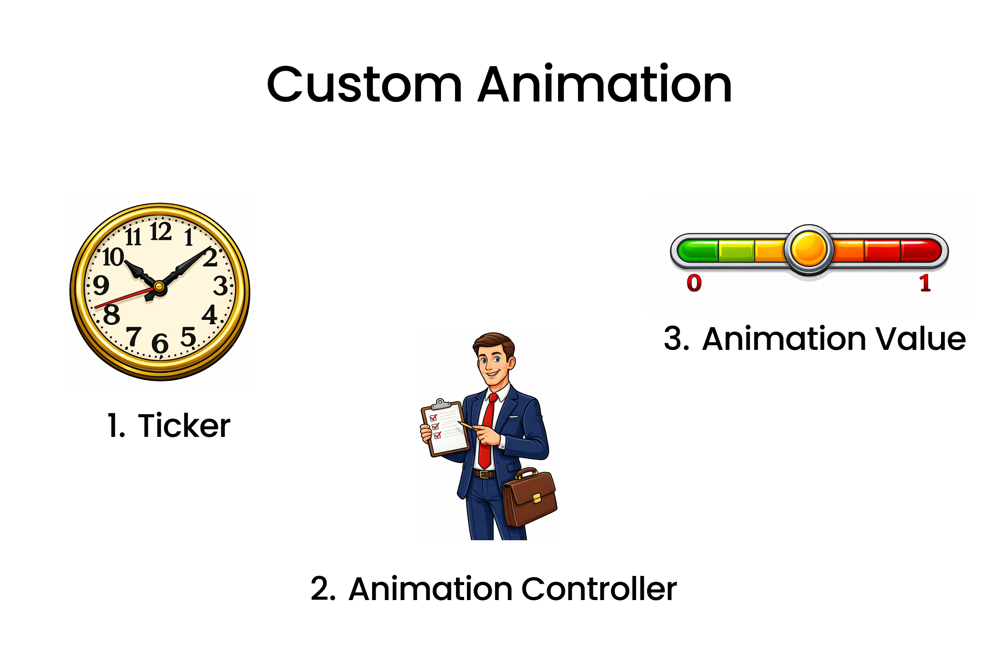

import { Step, Steps } from 'fumadocs-ui/components/steps';
import { DynamicCodeBlock } from 'fumadocs-ui/components/dynamic-codeblock';
import { ImageZoom } from 'fumadocs-ui/components/image-zoom';

<iframe
  width="100%" 
  height="400"
  src="https://www.youtube.com/embed/eiJoL_HNdN0"
  title="Hero Animation in Flutter"
  frameBorder="0"
  allow="accelerometer; autoplay; clipboard-write; encrypted-media; gyroscope; picture-in-picture"
  allowFullScreen
/>


<Callout type="info">
In this post, I’ll explore how to implement custom animations in Flutter to create engaging and smooth transitions between screens.
</Callout>

## What is Custom Animation?
Custom Animation in Flutter allows developers to create unique and engaging animations that enhance the user experience. Unlike predefined animations, custom animations give you full control over the animation's behavior, timing, and appearance.

## Main Components of Custom Animation
- To implement Custom Animation in your Flutter app, you need to understand the following main components:

1. `Ticker`: Its like a tick / count of clock that for each tick it triggers a animation frame.
2. `AnimationController`: It is like manager of the animation. It controls the animation's duration, start, stop, and reverse.
3. `Animation Value`: It represents the current value of the animation at any given frame.Value is between 0.0 to 1.0.

## Implementing Custom Animation
<Steps>

<Step>
### Define the Animation Controller

```dart
// Inside your StatefulWidget
class _AnimationidgetState extends State<AnimationWidget> with SingleTickerProviderStateMixin {
  late AnimationController _controller;

  @override
  void initState() {
    super.initState();
    _controller = AnimationController(
      duration: const Duration(seconds: 2),
      vsync: this,
      lowerBound: 0.0,
      upperBound: 1.0,
    );
  }
  _controller.forward(); // Start the animation
  
  _controller.addListener(() {
    setState(() {
      // Update UI
    });
    print(_controller.value); // Print the current animation value
  });

  @override
  void dispose() {
    _controller.dispose();
    super.dispose();
  }
}

```

- Create a variable of type `AnimationController` called `_controller`.
- Initialize the controller in `initState` method and `AnimationController` requires `duration` and `vsync` properties.
- `duration`: Specifies how long the animation will run.
- `vsync`: Needs a `TickerProvider`, which will be most of time the `State` object itself. So we add `with SingleTickerProviderStateMixin` to the State class to provide the ticker.
- `lowerBound` and `upperBound`: Define the range of values for the animation.
- `this` refers to the current State object.
- As far now we got the animation controller ready and the ticker is also set up.
- To start the animation we call `_controller.forward()`.
- If u want to see how values are changing during the animation we can add a listener to the controller using `_controller.addListener()`.In console we can see the values changing from 0.0 to 1.0 during the animation.
- And also we have included  setState() inside the listener to update the UI on each frame.
- Finally, we dispose the controller in the `dispose` method to free up resources.

</Step>

<Step >
### Using Animation Value to Animate Widget Properties

```dart
// Inside your build method
@override
Widget build(BuildContext context) {
  return Scaffold(
    body: Center(
      child: Container(
        width: 100 + (_controller.value * 100), // Animate width from 100 to 200
        height: 100 + (_controller.value * 100), // Animate height from 100 to 200
        color: Colors.blue,
      ),
    ),
  );
}
```
- In the `build` method, we create a `Container` widget.
- We use the `_controller.value` to animate the `width` and `height` properties of the Container.
- As the animation progresses, the width and height of the Container will increase from 100 to 200.

</Step>

<Step>
### Full Code Example
```dart
import 'package:flutter/material.dart';

class AnimationWidget extends StatefulWidget {
  const AnimationWidget({super.key});

  @override
  State<AnimationWidget> createState() => _AnimationidgetState();
}

class _AnimationidgetState extends State<AnimationWidget>
    with SingleTickerProviderStateMixin {
  late AnimationController _controller;
  @override
  void initState() {
    super.initState();
    _controller = AnimationController(
      vsync: this,
      duration: Duration(seconds: 4),
      lowerBound: 0.0,
      upperBound: 1.0,
    );
    _controller.forward(); // Start the animation

    _controller.addListener(() {
      setState(() {
        // Update UI
      });
      print(_controller.value); // Print the current animation value
    });
  }

  @override
  void dispose() {
    super.dispose();
    _controller.dispose();
  }

  Widget build(BuildContext context) {
    return Scaffold(
      body: Center(
        child: Container(
          width:
              100 + (_controller.value * 100), // Animate width from 100 to 200
          height:
              100 + (_controller.value * 100), // Animate height from 100 to 200
          color: Colors.blue,
        ),
      ),
    );
  }
}
```

<video  autoplay muted loop playsInline preload="auto" controls width="100%">
  <source src="/videos/customAnimation1.mp4" type="video/mp4" />
  Your browser does not support the video tag.
</video>

</Step>

<Step>
### How to reverse the Animation 
```dart
// To reverse the animation
_controller.reverse(from : 1);
```
- Instead of using `_controller.forward()` to start the animation, you can use `_controller.reverse()` to reverse the animation from the end to the beginning.
- Its important to define `from` property to specify the starting point of the reverse animation.
</Step>

<Step>
### How to Loop the Animation
- In order to loop the animation , we need to know when the animation is completed or dismissed.
```dart
_controller.addStatusListener((status) {
  if (status == AnimationStatus.completed) {
    _controller.reverse();
  } else if (status == AnimationStatus.dismissed) {
    _controller.forward();
  }
});
```
- We can use `addStatusListener` method of the controller to listen for animation status changes.
- When the animation status is `completed`, we call `_controller.reverse()` to reverse the animation
- When the animation status is `dismissed`, we call `_controller.forward()` to start the animation again.


</Step>

</Steps>

## Curve animations
- As far now we have seen linear animations where the animation progresses at a constant rate.
- But in real world most of the animations are not linear, they have acceleration and deceleration effects.
- Flutter provides `CurvedAnimation` class to apply different easing curves to the animation.

<Steps>
<Step>
### Using CurvedAnimation
```dart
// Inside your StatefulWidget
late Animation _animation;
@override
void initState() {
  super.initState();
  _controller = AnimationController(
    duration: const Duration(seconds: 2),
    vsync: this,
  );

  _animation = CurvedAnimation(
    parent: _controller,
    curve: Curves.easeInOut, // Apply easeInOut curve
  );

  _controller.forward();
}
```
- We create a variable of type `Animation` called `_animation`.
- We initialize the `_animation` using `CurvedAnimation` class.
- `parent`: We pass the `_controller` as the parent of the curved animation.
- `curve`: We specify the easing curve we want to apply. In this case, we use `Curves.easeInOut` for a smooth acceleration and deceleration effect.
- we cannot use `lowerBound` and `upperBound` properties with `CurvedAnimation`, because the curve itself defines the range of values.So we remove those properties from the `AnimationController`.
- Check [Curves Documentation](https://api.flutter.dev/flutter/animation/Curves-class.html) 
</Step>
</Steps>

## Tween Animation.
- Tween stands for "in-between" and it defines how to transition from a starting value to an ending value.
- Tween animations are useful when you want to animate properties that are not just simple numeric values, such as colors, sizes, or positions.
<Steps>
<Step>
### Using Tween Animation
```dart
// Inside your StatefulWidget
late Animation<Color?> _colorAnimation;
@override
void initState() {
  super.initState();
  _controller = AnimationController(
    duration: const Duration(seconds: 2),
    vsync: this,
  );

  _colorAnimation = ColorTween(
    begin: Colors.red,
    end: Colors.blue,
  ).animate(_controller);

  _controller.forward();
}
```
- We create a variable of type `Animation<Color?>` called `_colorAnimation`.
- We initialize the `_colorAnimation` using `ColorTween` class.
- `begin`: We specify the starting color of the animation.
- `end`: We specify the ending color of the animation.
- We call the `animate` method on the `ColorTween` and pass the `_controller` to link the tween animation with the animation controller.
</Step>
<Step>
### Using Tween Animation Value in Widget
```dart
// Inside your build method
@override
Widget build(BuildContext context) {
  return Scaffold(
    body: Center(
      child: Container(
        width: 100,
        height: 100,
        color: _colorAnimation.value, // Use the tween animation value
      ),
    ),
  );
}
```
- In the `build` method, we create a `Container` widget.
- We use the `_colorAnimation.value` to set the `color` property of the Container
- As the animation progresses, the color of the Container will transition from red to blue.
- There are many tween classes available in Flutter like `SizeTween`, `RectTween`, `IntTween`, `Tween<double>`, etc. You can choose the appropriate tween class based on the property you want to animate.


<video  autoplay muted loop playsInline preload="auto" controls width="100%">
  <source src="/videos/colorTween.mp4" type="video/mp4" />
  Your browser does not support the video tag.
</video>
</Step> 
</Steps>

