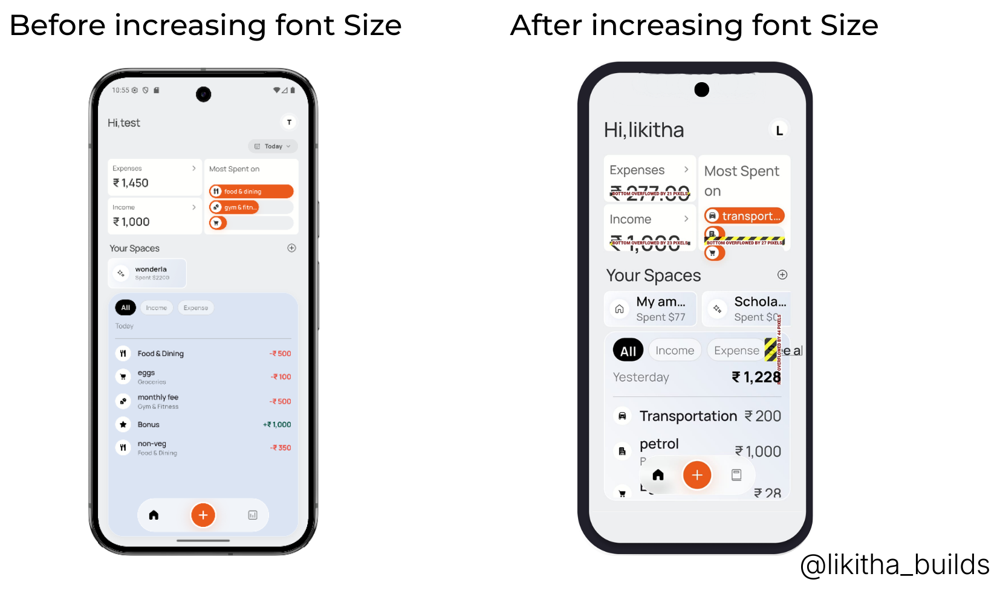

import { Step, Steps } from 'fumadocs-ui/components/steps';
import { DynamicCodeBlock } from 'fumadocs-ui/components/dynamic-codeblock';
import { ImageZoom } from 'fumadocs-ui/components/image-zoom';

<iframe
  width="100%" 
  height="400"
  src="https://www.youtube.com/embed/Depfd8QhnYY"
  title="Why Swiggy Font Doesn’t Change"
  frameBorder="0"
  allow="accelerometer; autoplay; clipboard-write; encrypted-media; gyroscope; picture-in-picture"
  allowFullScreen
/>

<Callout type="info">
In this post, we’ll compare a typical Flutter app with Swiggy when system font size increases — and understand what textScaleFactor actually does.
</Callout>

<Steps>

<Step>

## The Problem: Your App Breaks When Font Size Increases

Your Flutter app looks perfect.

Clean layout.  
Perfect spacing.  
Everything aligned.

But the moment you increase font size in system settings…

Your UI breaks.

- Text overflows  
- Cards expand incorrectly  
- Layout looks ugly  

Now here’s the interesting part:

Swiggy doesn’t break.

Why?

</Step>

<Step>

## What Actually Happens When Font Size Increases?

When a user increases font size in phone settings, Android changes something called **textScaleFactor**.

Flutter automatically reads this value and multiplies all text sizes by it.

For example:

| Font Size | System Scale | Final Size |
|-----------|--------------|------------|
| 16        | 1.3          | 20.8       |

So if your layout was designed for 16…

It is now rendering text at 20.8.

And that’s when:

- Overflow happens  
- Layout breaks  
- UI becomes inconsistent  




</Step>

<Step>

## Why Swiggy Doesn’t Break

Swiggy overrides the scaling.

Instead of allowing Flutter to use the system’s textScaleFactor, they force it to stay at `1.0`.

This means:

- 16 stays 16  
- No multiplication  
- No unexpected layout expansion  

Here’s what that looks like in Flutter:

```
MediaQuery(
  data: MediaQuery.of(context).copyWith(textScaleFactor: 1.0),
  child: MyApp(),
);
```

By wrapping the app with a modified MediaQuery, scaling is locked.

No matter what the system font size is — the app remains visually stable.

</Step>

<Step>

## Should You Always Override textScaleFactor?

This is where things get important.

By overriding textScaleFactor:

- You gain layout control  
- You prevent overflow  
- Your UI remains consistent  

But…

You reduce accessibility.

Users who increase font size usually need better readability — especially elderly users.

If your app depends on accessibility, overriding scaling may not be the best choice.

</Step>

<Step>

## The Better Alternative: Build Flexible Layouts

Instead of disabling scaling, you can design your layout to handle it properly.

That means:

- Avoid fixed heights  
- Let text wrap naturally  
- Use Flexible and Expanded correctly  
- Test your UI with large font sizes  

When your layout is flexible, increasing font size will:

- Expand naturally  
- Maintain structure  
- Improve accessibility  

Instead of breaking.

</Step>

</Steps>


