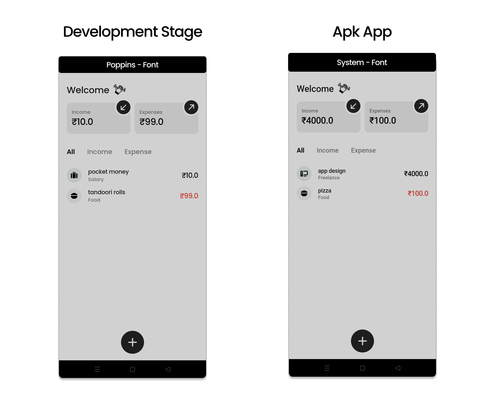
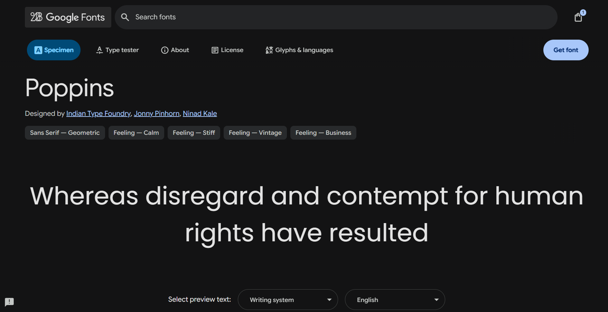
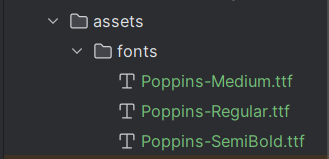
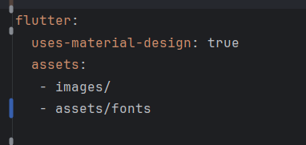

import { Step, Steps } from 'fumadocs-ui/components/steps';
import { DynamicCodeBlock } from 'fumadocs-ui/components/dynamic-codeblock';
import { ImageZoom } from 'fumadocs-ui/components/image-zoom';

<iframe
  width="100%" 
  height="400"
  src="https://www.youtube.com/embed/0DyQi6CDHOY"
  title="Understanding Hive in Flutter"
  frameBorder="0"
  allow="accelerometer; autoplay; clipboard-write; encrypted-media; gyroscope; picture-in-picture"
  allowFullScreen
/>


<Callout type="info">
In this post, I’ll share my experience with a common Flutter pitfall where custom fonts work in debug mode but break in the release APK, and how I resolved it.
</Callout>

<Steps>

<Step>
## What is the Problem we are trying to solve?
When I started using custom fonts in Flutter, everything looked perfect in debug mode.
But the moment I installed the release APK, my app silently fell back to the default system font(Roboto).

No errors. No warnings. Just… wrong fonts.

</Step>

<Step>
## Why did this happen?
The issue comes from how the google_fonts package works.

| In Debug Mode | In Release Mode |
|---------|----------|
| Fonts can be downloaded at runtime | Fonts may not be bundled inside the APK | 
| Internet is usually available | App may start offline |
| Fonts get cached automatically | Runtime font fetching can fail | 
| Everything looks fine | Flutter falls back to the system font | 



<Callout type="info">
In Development/Debug mode , i wanted to use `poppins` font from google_fonts package. It worked perfectly as the app could download the font at runtime.

But in Release mode/apk, the app couldn’t fetch the font (maybe due to no internet or other reasons), so it defaulted to Roboto.
</Callout>
</Step>


<Step>
## The Beginner Mistake I Made
- We usually use a package like google_fonts to easily use custom fonts.
- Big Mistake  we often do is ** not reading the package documentation carefully **.
- The google_fonts package documentation clearly states that for release builds, you should bundle the fonts with your app to avoid runtime fetching issues.
<Callout type="info">
google_fonts  : https://pub.dev/packages/google_fonts
</Callout>

</Step>


<Step>
## How to Fix It?
- The solution is to `google_fonts` + bundled assets/fonts.

<Accordions >
<Accordion  title="Steps 1: Download Only the Required Font Weights">
```
I was using these font weights in my app:

`FontWeight.w400`

`FontWeight.w500`

`FontWeight.w600`
```

```
So I downloaded only these files from Google Fonts:

`Poppins-Regular.ttf`

`Poppins-Medium.ttf`

`Poppins-SemiBold.ttf`
```

- Downloading unnecessary weights increases APK size.



</Accordion>

<Accordion title="Steps 2: Add Fonts to Assets Folder">
- Created a folder `assets/fonts` in my Flutter project.
- Placed the downloaded `.ttf` font files into this folder.



<Callout type="info">
- Do NOT rename the files
- File names must match Google Fonts naming exactly
- Case and hyphens matter
</Callout>
</Accordion>


<Accordion title="Steps 3: Declare Assets in pubspec.yaml">
- Opened `pubspec.yaml`.
- Added the following under `flutter` section:
- Run `flutter pub get` to update dependencies.



<Callout type="info">
- Do NOT add a fonts: section
- Do NOT list individual font files
- When using google_fonts with bundled assets, fonts should be declared under assets only.
</Callout>
</Accordion>


</Accordions>

</Step>

<Callout type="success">
You can continue using:
```dart
Text(
  'Hello, World!',
  style: GoogleFonts.poppins(
    fontWeight: FontWeight.w500,
    fontSize: 20,
  ),
);
``` 
And now, in release builds, the app will use the bundled Poppins font files instead of trying to fetch them at runtime.
</Callout>

</Steps>