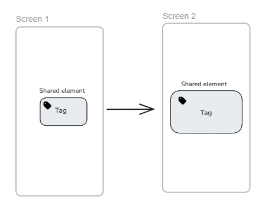
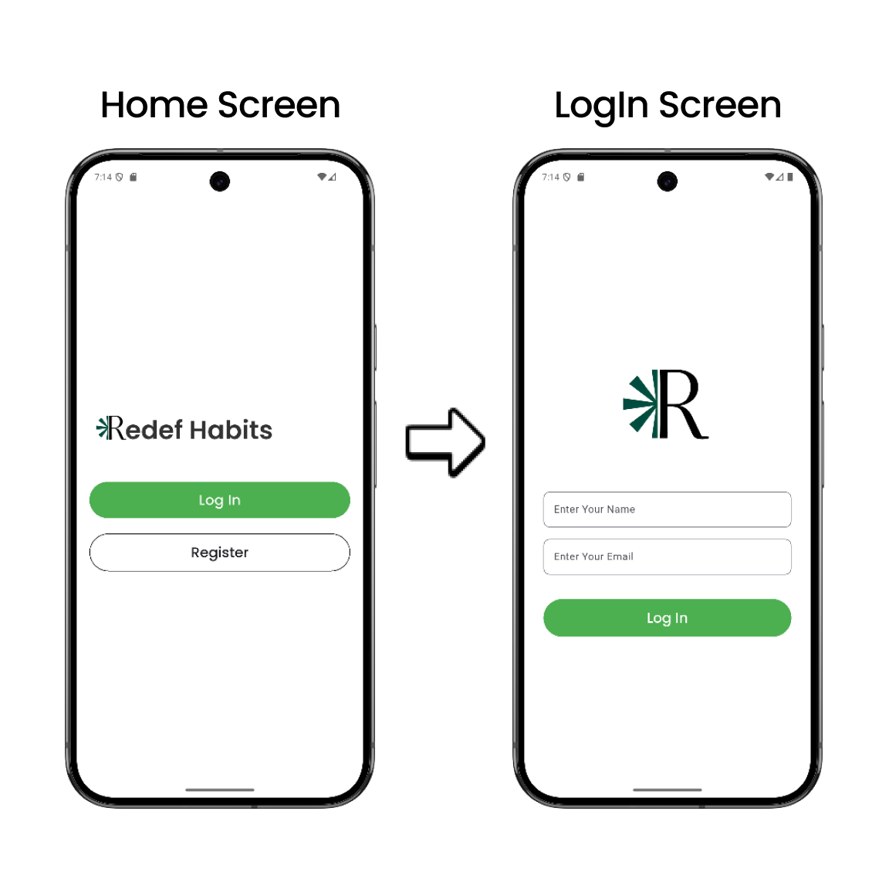

import { Step, Steps } from 'fumadocs-ui/components/steps';
import { DynamicCodeBlock } from 'fumadocs-ui/components/dynamic-codeblock';
import { ImageZoom } from 'fumadocs-ui/components/image-zoom';

<iframe
  width="100%" 
  height="400"
  src="https://www.youtube.com/embed/3eoXXQHQCII"
  title="Hero Animation in Flutter"
  frameBorder="0"
  allow="accelerometer; autoplay; clipboard-write; encrypted-media; gyroscope; picture-in-picture"
  allowFullScreen
/>


<Callout type="info">
In this post, I’ll explore how to implement Hero animations in Flutter to create engaging and smooth transitions between screens.
</Callout>

## What is Hero Animation?
Hero Animation in FLutter is a powerful feature that allows for smooth transitions between screens by animating shared elements. 

When navigating from one screen to another, the Hero widget animates the transition of a widget from its position on the first screen to its position on the second screen, creating a visually appealing effect.
Examples : Amazon app, Google Photos app.


## Main 3 Components of Hero Animation
- To implement Hero Animation in your Flutter app, you need to understand the following main components:


1. Shared Widget: This widget is used to define the shared element that will be animated between screens. It requires a unique tag to identify the Hero across different screens.
2. A Shared Tag: The tag is a unique identifier that links the Hero widgets on different screens. Both Hero widgets must have the same tag for the animation to work.
3. Navigation: You need to navigate between screens using Flutter's Navigator class to trigger the Hero animation.


## Implementing Hero Animation
- Look at the example that we are implementing Hero Animation.

- We have 2 Screen in this example:
1. Home Screen
2. Login Screen
- Both Screen have one common Shared Widget (Image) with different `height` property.

<Steps>

<Step>
### Define the Shared Widget
- In the example, we are using an Image as the shared widget. We wrap the Image widget with the Hero widget and provide a unique tag.

- `Hero` widget is from Flutter material package and it has required property `tag` which is used to identify the Hero widget across different screens.

```dart
// Home Screen
Hero(
  tag: 'logo',
  child: Image.asset(
    'assets/logo.png',
    height: 60.0, // Different height in Home Screen
  ),
);
```

```dart
// Login Screen
Hero(
  tag: 'logo',
  child: Image.asset(
    'assets/logo.png',
    height: 120.0, // Different height in Login Screen
  ),
);
```
<Callout type="info">
- Ensure that the `tag` property is the same in both Hero widgets to link them together for the animation.
</Callout>


</Step>


<Step>
### Navigate Between Screens
- Use Flutter's Navigator class to navigate between the Home Screen and Login Screen. This will trigger the Hero animation.

```dart
// Navigate to Login Screen
Navigator.push(
  context,
  MaterialPageRoute(builder: (context) => LoginScreen()),
);
```

</Step>

<Step>
### Result
<video  autoplay muted loop playsInline preload="auto" controls width="100%">
  <source src="/videos/hero_animation.mp4" type="video/mp4" />
  Your browser does not support the video tag.
</video>

</Step>

</Steps>


