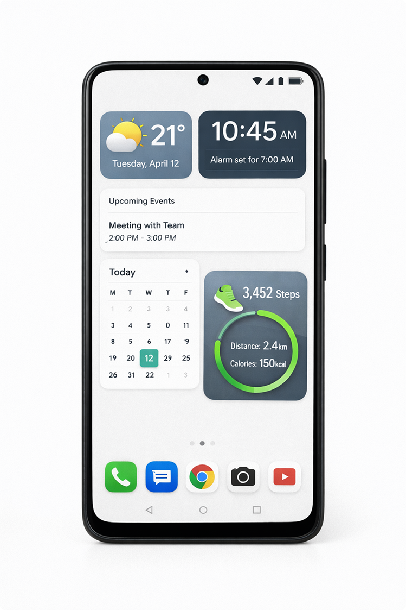
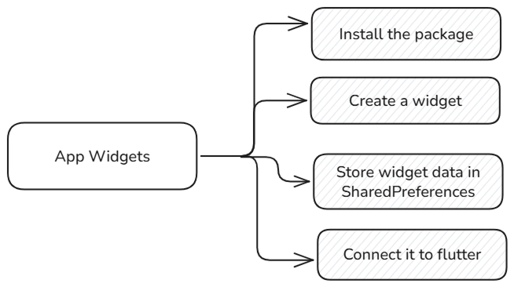
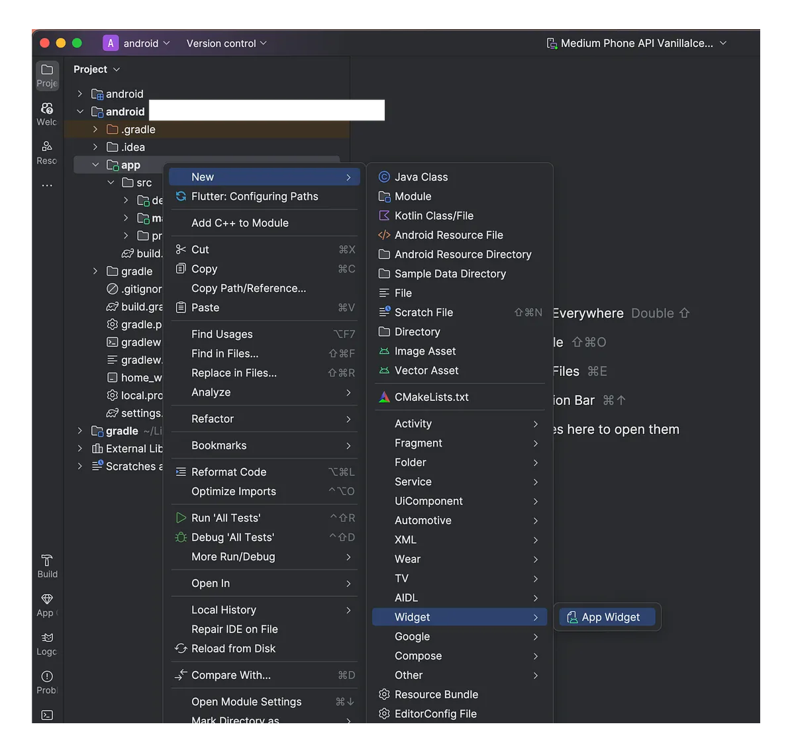
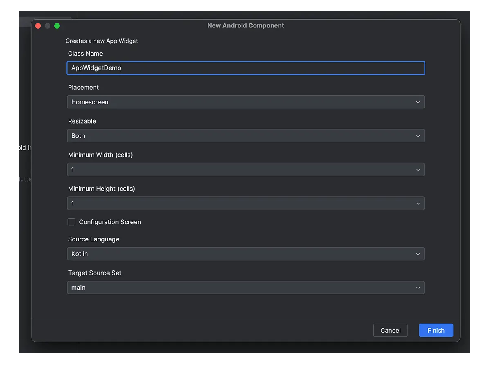
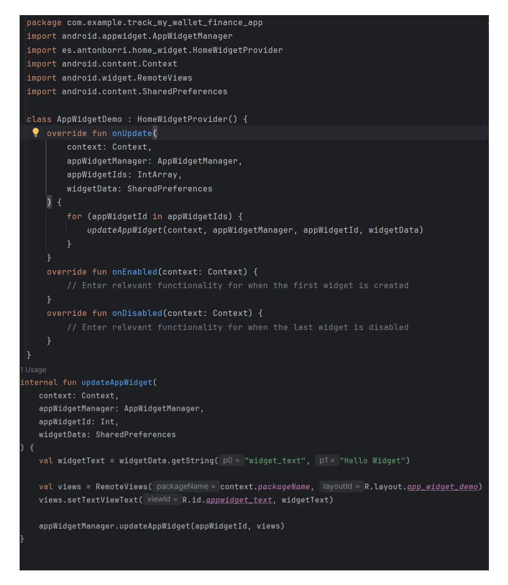

import { Step, Steps } from 'fumadocs-ui/components/steps';
import { DynamicCodeBlock } from 'fumadocs-ui/components/dynamic-codeblock';
import { ImageZoom } from 'fumadocs-ui/components/image-zoom';

<iframe
  width="100%" 
  height="400"
  src="https://www.youtube.com/embed/7ENWCt601Q0"
  title="Understanding Hive in Flutter"
  frameBorder="0"
  allow="accelerometer; autoplay; clipboard-write; encrypted-media; gyroscope; picture-in-picture"
  allowFullScreen
/>


<Callout type="info">
In this post, I’ll share how to set up home_widget in your Flutter application to create interactive home screen widgets for Android .
</Callout>


## What is Widget?
Widgets are small app views that can be added to the home screen of a device. They provide quick access to information and functionality without needing to open the full app. In Flutter, the home_widget package allows developers to create and manage these widgets for Android devices.




## Implementing the home_widget package
- To implement home_widget in your Flutter app, follow these steps:


<Callout type="info">

Official home_widget package documentation:

https://pub.dev/packages/home_widget/install  
</Callout>

 <Steps>

<Step>
## Step 1 - Install the home_widget package

<DynamicCodeBlock
  lang="dart"
  code={
    `
    flutter pub add home_widget
    `
  }
  options={{
    themes: {
      light: 'github-light',
      dark: 'github-dark',
    },
    showCopyButton: true,
    
  }}
/>


<Callout type="info">
Add the following import statement to your Dart file where you want to use the home_widget package:
```dart
import 'package:home_widget/home_widget.dart';
```

</Callout>

</Step>

<Step>
## Step 2 - Create a app widget
- Open the Android folder of your Flutter project in Android Studio.
- Create a new App Widget by right-clicking on the `res` folder and selecting >New > Widget > App Widget.
- Give a name to your widget.





## Three Main Files Created

1. **XML Layout File**: Defines the layout of the widget.
2. **AppWidget Provider (Kotlin class)**: Manages the widget's behavior.
3. **AppWidget Info XML**: Contains metadata about the widget.
</Step>


<Step>
### Step 3 - Store widget data in SharedPreferences
To update the widget's content, you can use SharedPreferences to store data that the widget will display.
- In XML Layout File,update the code 



<Callout type="info">

SharedPreferences allows you to store key-value pairs of data that can be accessed by both your Flutter app and the widget. This is essential for updating the widget's content dynamically based on user interactions within the app.

The widget does not automatically listen to SharedPreferences; it reads data from SharedPreferences only when its lifecycle method (onUpdate) is triggered.

</Callout>

</Step>


<Step>
## Connect to Flutter app
- In your Flutter app, use the home_widget package to update the widget's data.
- Add a following code snippet to home Screen init state


<DynamicCodeBlock
  lang="dart"
  code={
    `
    @override
    void initState() {
      super.initState();
      _updateHomeWidget();
    }
    Future<void> _updateHomeWidget() async {
      await HomeWidget.saveWidgetData(
        'widget_text',
        "Welcome to Flutter Series ",
      );

      await HomeWidget.updateWidget(
        name: 'AppWidgetDemo',
      );
    }
    `
  }
  options={{
    themes: {
      light: 'github-light',
      dark: 'github-dark',
    },
    showCopyButton: true,
    
  }}
  />
<Callout type="info">
This code snippet demonstrates how to update the home screen widget with new data when the Flutter app's home screen initializes.
- The `_updateHomeWidget` function saves a string "Welcome to Flutter Series " to SharedPreferences with the key 'widget_text'.
- It then calls `HomeWidget.updateWidget` to refresh the widget named 'AppWidgetDemo
-` widget_text` should match the key used in the widget provider (Kotlin file) when reading from SharedPreferences.
</Callout>

</Step>

<Step>

## Final Step - Run the app
- Run your Flutter app on an Android device.
- Add the widget to your home screen by long-pressing on the home screen, selecting Widgets, and choosing your app's widget.
- The widget should now display the data you set from your Flutter app.


</Step>


</Steps>