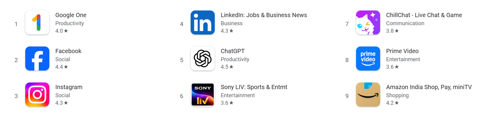
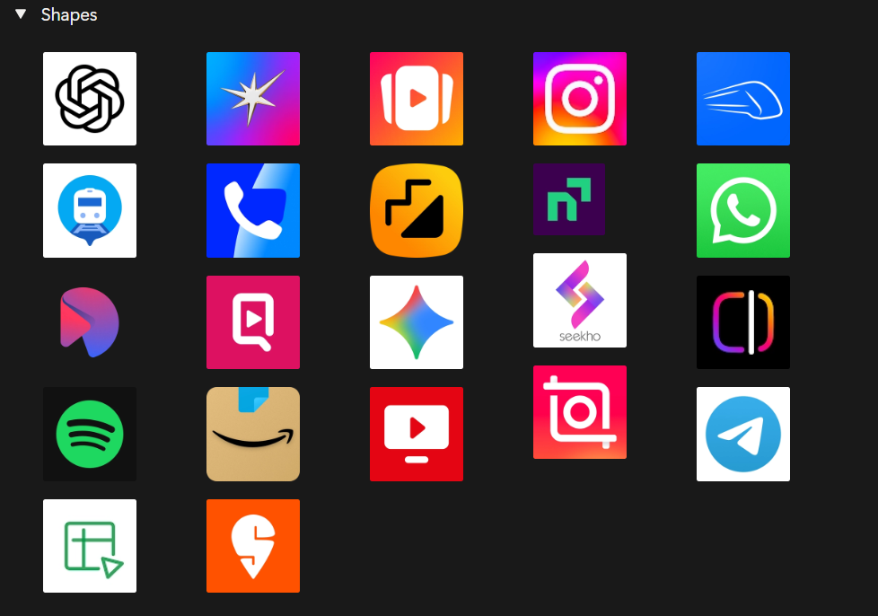
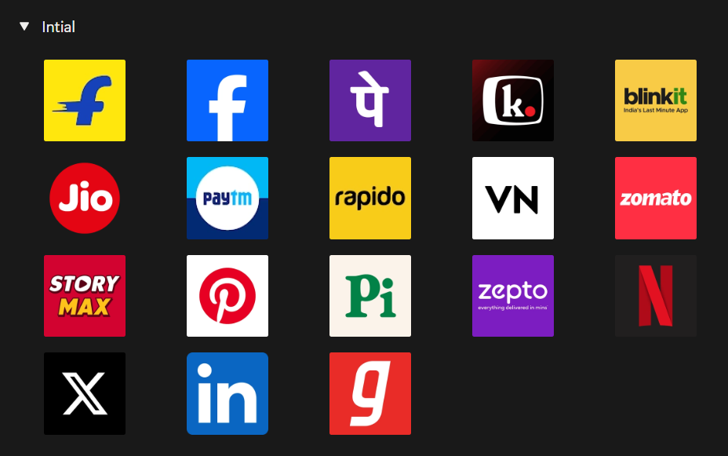
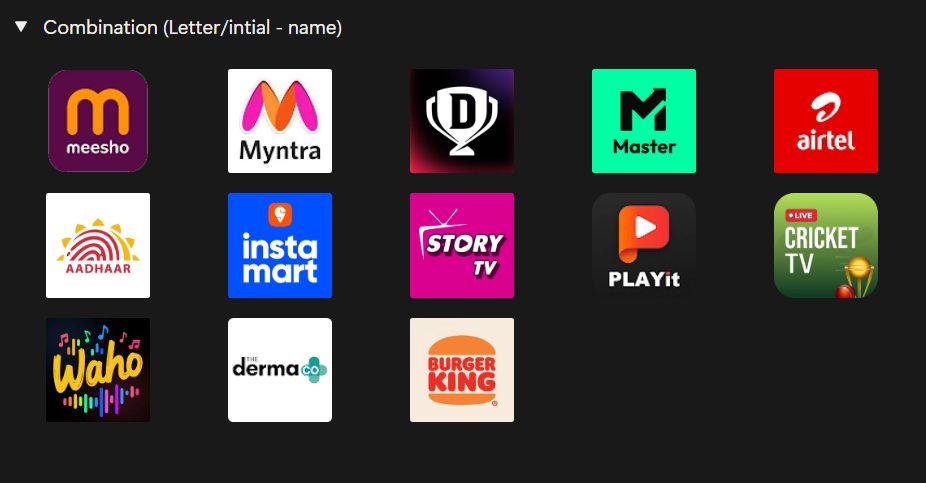
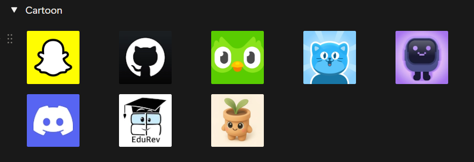

import { Step, Steps } from 'fumadocs-ui/components/steps';
import { DynamicCodeBlock } from 'fumadocs-ui/components/dynamic-codeblock';
import { ImageZoom } from 'fumadocs-ui/components/image-zoom';

<iframe
  width="100%" 
  height="400"
  src="https://www.youtube.com/embed/dxpesuwIZe4"
  title="How I Find Logo Inspiration"
  frameBorder="0"
  allow="accelerometer; autoplay; clipboard-write; encrypted-media; gyroscope; picture-in-picture"
  allowFullScreen
/>

<Callout type="info">
Most people start with logo generators. But tools only give options, they don’t decide what your logo should represent.  
If your logo feels random, it’s usually because there’s no clear direction behind it.
</Callout>

<Steps>

<Step>

## Understand Before Designing
- A logo is not just a design.  
- It’s the first impression of your app.  

<Callout type="warning">
- Before opening any tool like Figma or a generator, first understand what your app represents.  
- Ask simple questions:
  - What does my app do?
  - What feeling should it give?
</Callout>

</Step>

<Step>

## Most Logos Follow Patterns
- When you observe real apps, you’ll notice something simple. Most logos fall into just a few common types. Once you see these patterns, it becomes much easier to decide your direction.

</Step>

<Step>

## 4 Common Types of Logos

### 1. Shape-Based Logos
- Simple, minimal, and abstract.  
- Works well for modern apps like tech or finance.

### 2. Initial-Based Logos
- One or two letters.  
- Clean, simple, and easy to remember.

### 3. Combination Logos
- Icon along with the name.  
- Helps users recognize your brand faster.

### 4. Cartoon or Character Logos
- Fun and expressive.  
- Best for playful or community-driven apps.

</Step>

<Step>

## Pick a Direction
- You don’t need many options.  
- You just need one clear direction.  

<Callout type="info">
- Instead of trying random logos:
  - Pick one type  
  - Take references  
  - Then start designing  
</Callout>

</Step>

<Step>

## Common Mistake
- Starting directly with tools.  

- Generators can give ideas,  
  but they cannot decide what fits your app.

<Callout type="warning">
- If you skip the thinking part,  
  you’ll end up with logos that look good but don’t mean anything.
</Callout>

</Step>

</Steps>