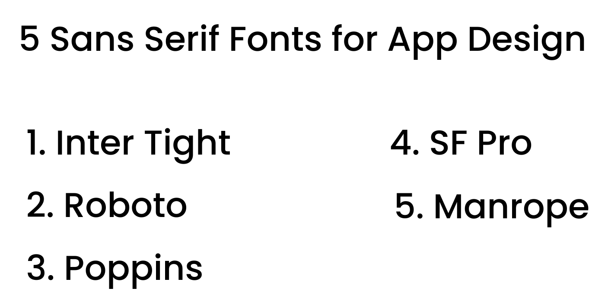
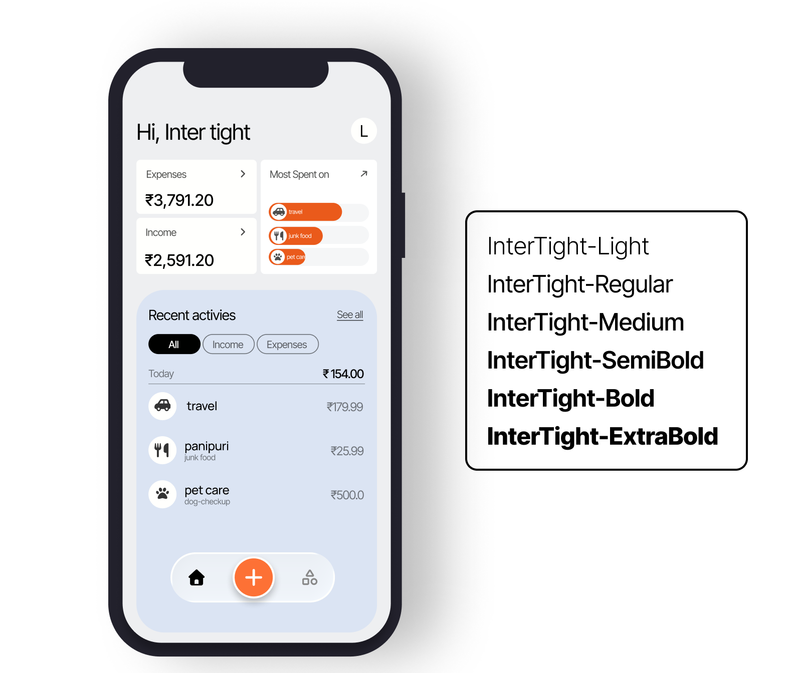
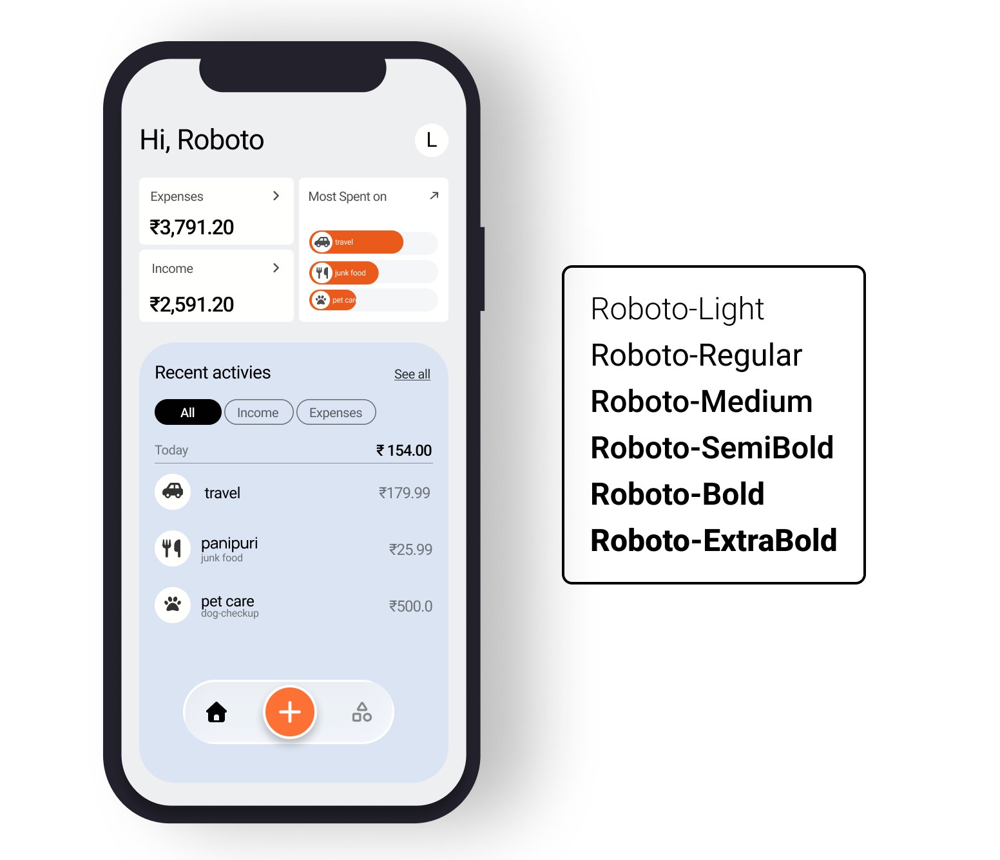
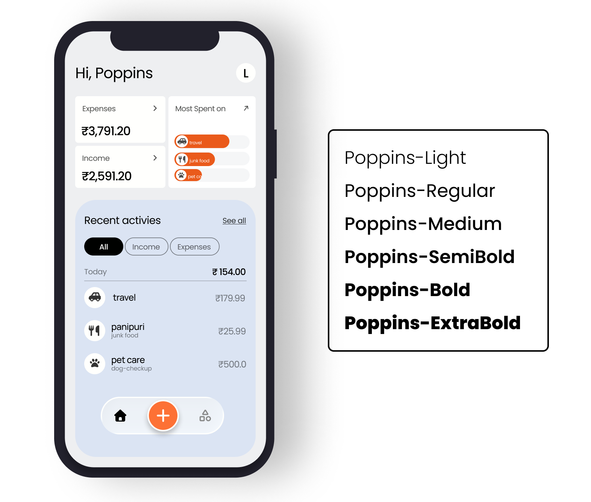
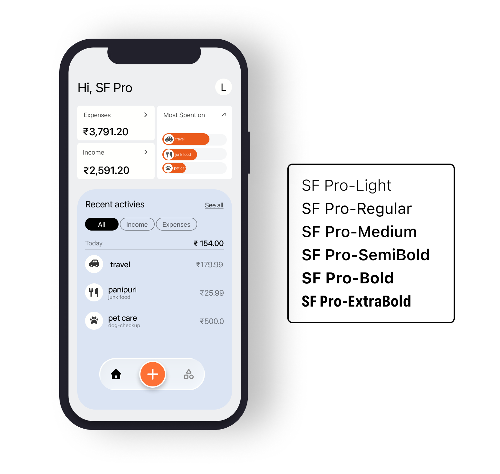
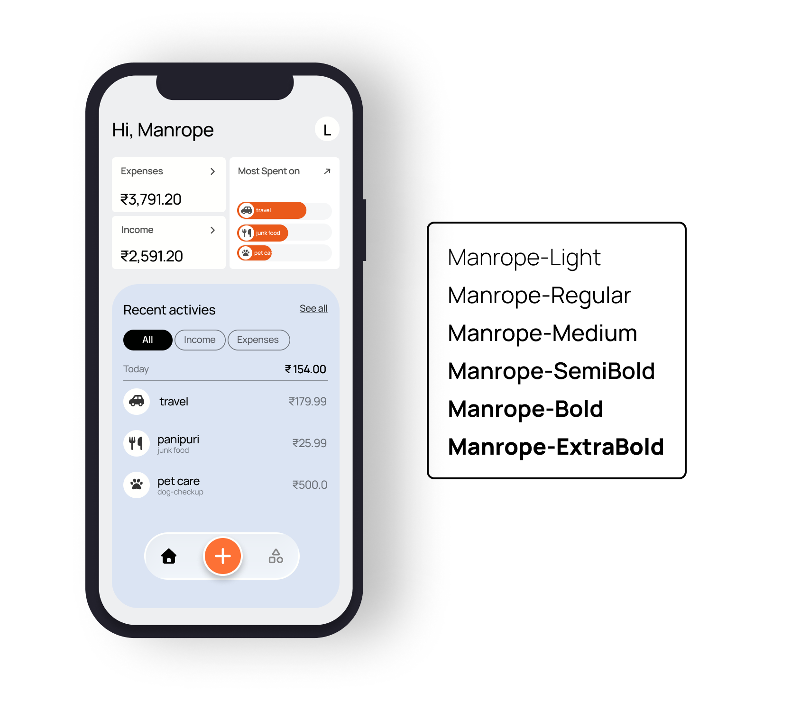

import { Step, Steps } from 'fumadocs-ui/components/steps';
import { DynamicCodeBlock } from 'fumadocs-ui/components/dynamic-codeblock';
import { ImageZoom } from 'fumadocs-ui/components/image-zoom';

<iframe
  width="100%" 
  height="400"
  src="https://www.youtube.com/embed/9RrAPBlBqw0"
  title="Hero Animation in Flutter"
  frameBorder="0"
  allow="accelerometer; autoplay; clipboard-write; encrypted-media; gyroscope; picture-in-picture"
  allowFullScreen
/>

<Callout type="info"> In this post, I tested 5 popular sans-serif fonts on the same mobile expense screen to understand why most successful apps prefer sans-serif fonts. </Callout>

<Steps>

<Step>
## The Problem
There are thousands of fonts available today, and if you search online, every designer seems to recommend a different “best” font, which honestly made me confused while building my own apps. However, when I started observing successful mobile applications more closely, I noticed something interesting most of them consistently use sans-serif fonts in their interface. Apps like Swiggy, YouTube, WhatsApp, and X mainly rely on sans-serif typography for their UI. So instead of continuing to depend on other people’s suggestions, I decided to test this myself and understand why.
</Step>

<Step>
## The Experiment
- To keep this experiment fair, I designed mobile screen of the app that i was develpoping i.e [PaisaLogr]("https://www.appykit-ui.com/appGallery/paisa-logr") and decided to change only the font across different versions. I did not modify the layout, spacing, alignment, or colors, because I wanted typography to be the only variable in this test.

- I selected five popular sans-serif fonts that are commonly used in mobile and product design:

1. Inter Tight

2. Roboto

3. Poppins

4. SF Pro Display

5. Manrope

</Step>

<Step>
## What I Was Looking For

While comparing these fonts, I focused on four important aspects that matter in real product design:

- Readability on small mobile screens
- The personality the font brings to the interface
- How numbers appear, since this is a finance screen
- The overall product feel

</Step>

<Step>
## Inter Tight

- Inter Tight feels modern and slightly compact when applied to a mobile interface. The letters appear sharp, and the spacing feels tight but still controlled and clean.
- It gives a strong tech-focused impression, which makes it suitable for dashboards, SaaS products, or data-heavy applications. It feels structured and efficient.
</Step>

<Step>
## Roboto

- Roboto feels very familiar because it is widely used across Android systems. It is simple, readable, and safe for most applications.
- However, it also feels slightly default, and it does not add a strong personality to the interface. While it works well for utility-based apps, it may not stand out in branding.
</Step>

<Step>
## Poppins

- Poppins feels more rounded and friendly compared to the others. It gives a modern startup vibe and looks clean on mobile screens.

- However, I have personally used Poppins many times before, and it has become very common in product design. It still works well, but it does not feel unique anymore.
</Step>

<Step>
## SF Pro 

- SF Pro feels very balanced and polished. The spacing looks natural, and the overall UI appears refined.

It gives a premium feeling, especially for iOS applications, since it aligns closely with Apple’s system typography. The design feels smooth and well-adjusted.
</Step>

<Step>
## Manrope

- Manrope surprised me the most during this comparison. It feels clean like Inter, but slightly softer in appearance.

- It is not too sharp, and it is not too playful. It feels modern, but at the same time slightly premium. That balance between clarity and refinement made it stand out for me.
</Step>

</Steps>

<Callout type="success">
After testing all five fonts, I realized something important. Most modern sans-serif fonts are already well-optimized for mobile apps, and the differences between them are not dramatic.

The real challenge is not finding the perfect font. The real challenge is making a clear decision and staying consistent across projects.
</Callout>
