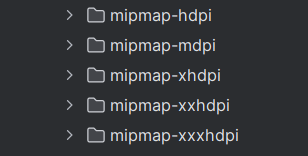
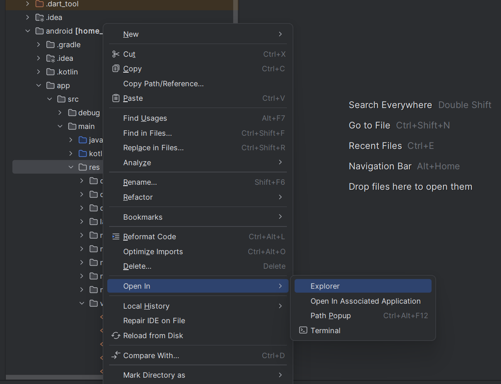

import { Step, Steps } from 'fumadocs-ui/components/steps';
import { DynamicCodeBlock } from 'fumadocs-ui/components/dynamic-codeblock';
import { ImageZoom } from 'fumadocs-ui/components/image-zoom';

<iframe
  width="100%" 
  height="400"
  src="https://www.youtube.com/embed/AUqIpAt0chk"
  title="How to Change App Icon in Flutter"
  frameBorder="0"
  allow="accelerometer; autoplay; clipboard-write; encrypted-media; gyroscope; picture-in-picture"
  allowFullScreen
/>

<Callout type="info">
In this post, I’ll share how to set up the app icon. I have divided the whole process into 5 steps. Let’s learn each one.
</Callout>

## App Icons
- Usually, when you download any app from the Play Store, the app will have its own icon that represents its category.

<Steps>

<Step>
## Locate the App Icon Files
- When we create a new Flutter project, it comes with a default Flutter icon. So first, we need to understand where these icons are stored.

<Callout type="info">
- The icons are located in `android/app/src/res`.  
- You can see 5 folders with the same icon in different resolutions. These files are responsible for the app icon.  
- The reason why there are 5 different resolutions for the same icon is because Android apps run on many devices with different screen sizes and pixel densities.  
- This helps avoid situations where the app icon looks good on some phones and blurry on others.

</Callout>

</Step>

<Step>
## Generate App Icon
- Some people design their own app icons.  
- If you don’t have one, you can use tools like `https://logoipsum.com/` to generate an icon and modify it later.

</Step>

<Step>
## Generate Icon Files
- Now we know the location and we have an icon.  
- Next, we need to generate different resolutions of the icon to replace the default one.  
- To generate app icon files, use `https://www.appicon.co/` to get different sizes for your app icon.

</Step>

<Step>
## Replace the App Icon Files
- Once the app icons are generated, open the folder.  
- You will find the files inside the `android` folder. Copy them.  
- Go back to your code editor, right-click on the `res` folder and open it in the file explorer.  
- Delete the default app icon files and replace them with the new files you copied.

</Step>

<Step>
## Restart the App
- After adding the new app icon files, restart your app.  
- Let it reload the icons.  
- Once it is done, you will see your new app icon.

</Step>

</Steps>
