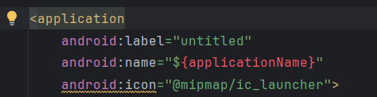
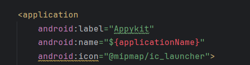
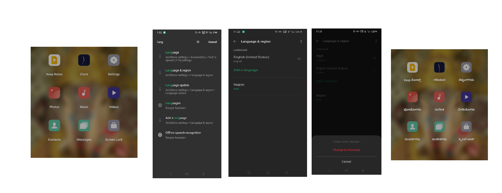
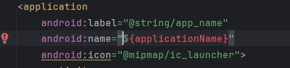

import { Step, Steps } from 'fumadocs-ui/components/steps';
import { DynamicCodeBlock } from 'fumadocs-ui/components/dynamic-codeblock';
import { ImageZoom } from 'fumadocs-ui/components/image-zoom';

<iframe
  width="100%" 
  height="400"
  src="https://www.youtube.com/embed/tdi5Rpysweo"
  title="How to Change App Name in Flutter"
  frameBorder="0"
  allow="accelerometer; autoplay; clipboard-write; encrypted-media; gyroscope; picture-in-picture"
  allowFullScreen
/>

## App Name
- Usually, when you download any app from the Play Store, the app will have its own unique name for identification.


<Steps>

<Step>
## Locate Where the App Name Comes From
- When we create a new project, the app name is the same as the project name.  
- So first, we need to understand where this name comes from.

<Callout type="info">
- The app name is defined in `android/app/src/AndroidManifest.xml`.  
- In the `AndroidManifest.xml` file, under the `<application>` tag, you will see `android:label`.  
- This value is your app name.


</Callout>

</Step>

<Step>
## Change the App Name
- There are two ways to change the app name:  
1. `Direct way`  
2. `Efficient way`

### Direct Way
- Just assign the app name directly to `android:label`, like this:  
  `android:label="Appykit"`



### Efficient Way
- Instead of directly assigning the name, we should think about scalability and other use cases.

<Callout type="info">
- Quick activity: Go to your phone settings and change the language.  
- After the language is changed, come back and check the app names.  
- You will see that system apps and some other apps show names in the selected language.  
- This is possible only when the app name is stored in a separate file and linked indirectly in `AndroidManifest.xml`.


</Callout>

## Create a File to Hold the App Name
- Navigate to `android/app/src/res/values`.  
- Right-click on the `values` folder and create a new file named `strings.xml`.  
- Inside the file, add the below lines and put your app name inside the `<string>` tag.

```xml
<?xml version="1.0" encoding="utf-8"?>
<resources>
    <string name="app_name">Appykit</string>
</resources>

```
---

## Link to `AndroidManifest.xml` File
- Link `android:label` to respective path as `android:label="@string/app_name"`




</Step>


</Steps>
