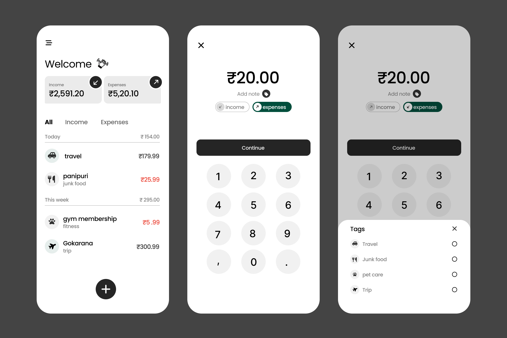
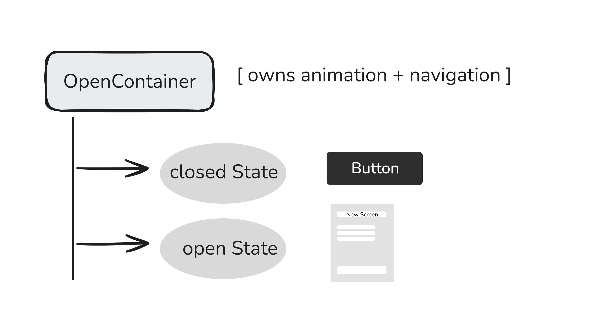
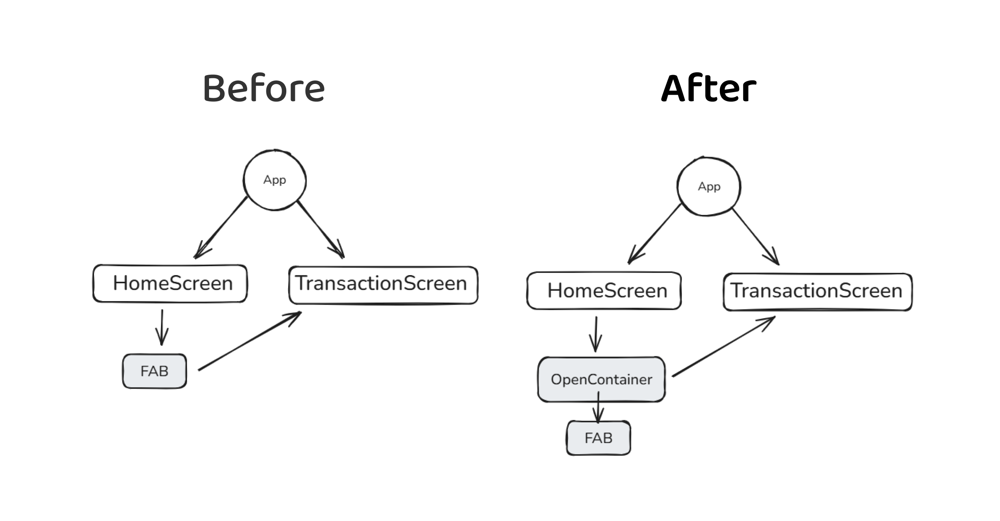

import { Step, Steps } from 'fumadocs-ui/components/steps';
import { DynamicCodeBlock } from 'fumadocs-ui/components/dynamic-codeblock';
import { ImageZoom } from 'fumadocs-ui/components/image-zoom';

<iframe
  width="100%" 
  height="400"
  src="https://www.youtube.com/embed/URobybtrFjw"
  title="Understanding Hive in Flutter"
  frameBorder="0"
  allow="accelerometer; autoplay; clipboard-write; encrypted-media; gyroscope; picture-in-picture"
  allowFullScreen
/>

<Callout type="info">
In this post, I’ll share how I learned to animate a Floating Action Button (FAB) into a full-screen page using Flutter’s animations package — step by step, as a beginner.
</Callout>

<Steps>

<Step>
## What is the Problem we are trying to solve?
I am building a Simple Finance App in Flutter , which track my income and expenses.
It had a simple Flow
- Home Screen with a FAB to add a new transaction
- Clicking the FAB opens a full screen form to add transaction details

It was too plane without any animations.So i wanted to add a smooth transition animation from the FAB to the full screen form.

<Callout type="info">
FAB = Floating Action Button
</Callout>
</Step>

<Step>
## Discovering Material Motion
Flutter provides a package called animations, which implements Material Motion patterns.

One pattern stood out for my use case:

- Container Transform
This pattern animates a container (like a FAB) transforming into a new screen, perfectly matching my need to animate the FAB expanding into a full screen form.

<video  autoplay muted loop playsInline preload="auto" controls width="100%">
  <source src="/videos/animation.mp4" type="video/mp4" />
  Your browser does not support the video tag.
</video>

<Callout type="info">
Animation Package : https://pub.dev/packages/animations
</Callout>
</Step>

<Step>
## Implementing the Animation
<Accordions type="single">
<Accordion title="Install the animations package">

<DynamicCodeBlock
  lang="dart"
  code={
    `
    flutter pub add animations
    `
  }
  options={{
    themes: {
      light: 'github-light',
      dark: 'github-dark',
    },
    showCopyButton: true,
    
  }}
/>

Import the package in your Dart file:

`
import 'package:animations/animations.dart';
`
</Accordion>

<Accordion title="Where the animation should live">
<Callout type="info" >
The animation belongs where navigation starts.
</Callout >
- That means animation code should be in the Home Screen where the FAB is located, not in the destination screen.

## OpenContainer Widget
The OpenContainer widget from the animations package handles the container transform animation.

It has two main properties:
- closedBuilder: Builds the closed state (the FAB)
- openBuilder: Builds the open state (the full screen form)

</Accordion>

<Accordion title="Putting it all together" >

<DynamicCodeBlock
  lang="dart"
  code={
    `
OpenContainer(
  transitionType: ContainerTransitionType.fadeThrough,
  closedBuilder: (context, openContainer) {
    return FloatingActionButton(
      onPressed: openContainer,
      child: Icon(Icons.add),
    );
  },
  openBuilder: (context, closeContainer) {
    return NextScreen();
  },
);
    `
  }
  options={{
    themes: {
      light: 'github-light',
      dark: 'github-dark',
    },
    showCopyButton: true,
    
  }}
/>

<Callout type="info" >
- Before : The FAB directly navigated to NextScreen on press.
- After : The FAB is wrapped in OpenContainer, which handles the animation to NextScreen.
- `openContainer` is a callback that triggers the animation to open the new screen.
It takes two parameters: `context` and `closeContainer`. 
`closeContainer` is a callback to close the screen with animation.
- `closeContainer` can be used in the destination screen to close it with animation.
It also takes `context` and `openContainer` as parameters.
`openContainer` can be used to reopen the screen with animation.

</Callout >
</Accordion>

</Accordions>

<Step>
### Result
When you run the app and tap the FAB, it smoothly expands into the full screen form!
<video  autoplay muted loop playsInline preload="auto" controls width="50%">
  <source src="/videos/animationResult.mp4" type="video/mp4" />
  Your browser does not support the video tag.
</video>
</Step>

<Step>
## Conclusion
Using the animations package made it straightforward to implement a polished FAB to full-screen transition in Flutter. The Container Transform pattern provided a smooth and visually appealing effect that enhanced the user experience of my finance app.
I hope this breakdown helps other Flutter beginners looking to add similar animations to their apps!
</Step>

</Step>

</Steps>