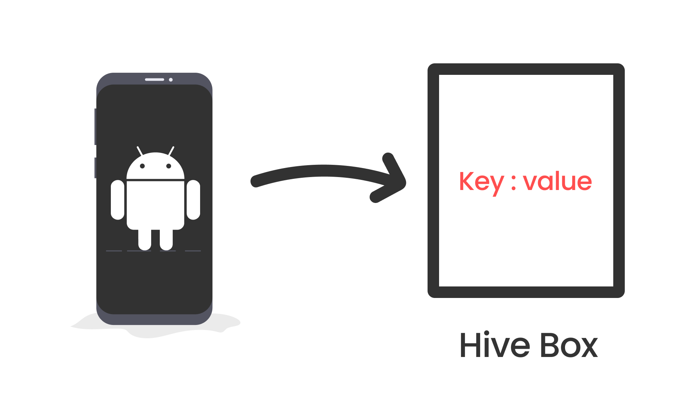
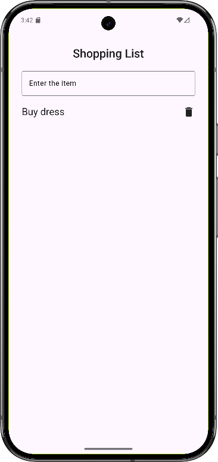
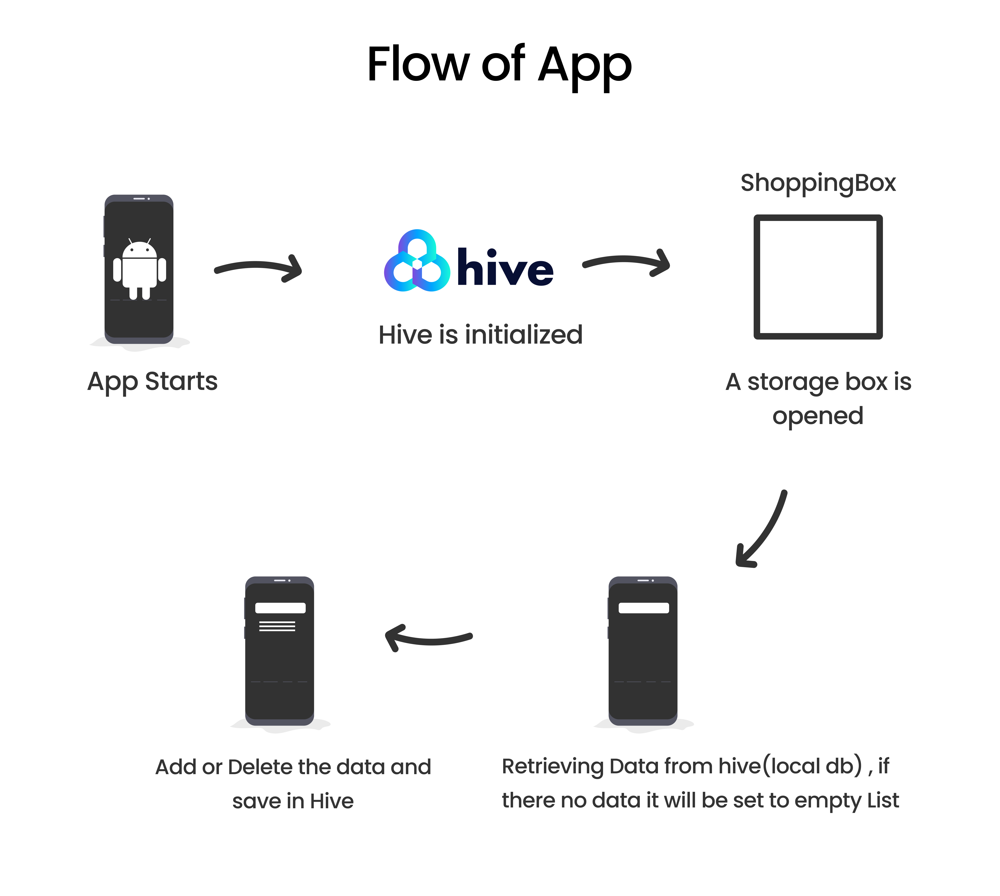
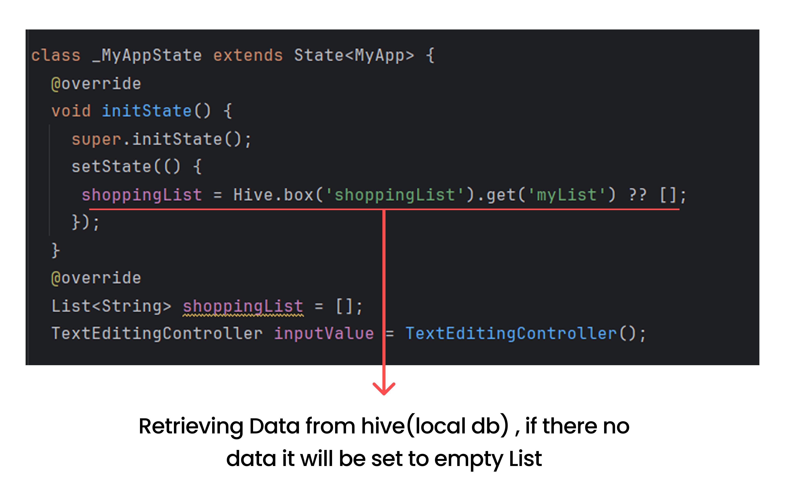
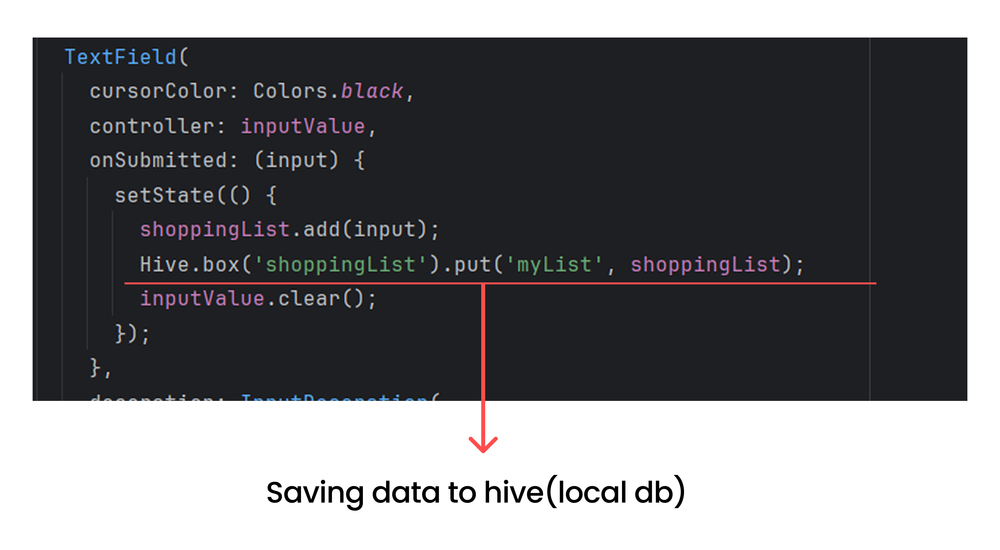
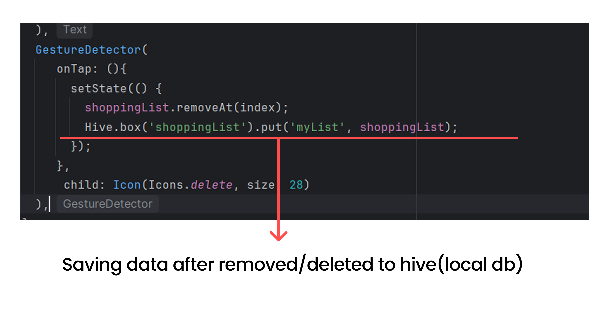

import { Step, Steps } from 'fumadocs-ui/components/steps';
import { DynamicCodeBlock } from 'fumadocs-ui/components/dynamic-codeblock';
import { ImageZoom } from 'fumadocs-ui/components/image-zoom';

<iframe
  width="100%" 
  height="400"
  src="https://www.youtube.com/embed/_1FvZ-hDHEc"
  title="Understanding Hive in Flutter"
  frameBorder="0"
  allow="accelerometer; autoplay; clipboard-write; encrypted-media; gyroscope; picture-in-picture"
  allowFullScreen
/>

In this guide, we’ll understand how apps store data locally using Hive in Flutter.
We’ll build a simple shopping list app to learn how data can persist even after the app is closed.

By the end, you’ll understand:
- What Hive is
- How key–value storage works
- How to add, delete, and persist data

---

<Steps>
<Step >
## What is the Problem we are trying to solve?
Some apps work even when there is no internet.

For example, Notes apps, To-Do lists, etc.

You can add notes or tasks, and they stay there even after you close the app.
To achieve this, apps need to store data locally on your device.

</Step>

<Step >
## What is Hive?
Hive is a local database used in Flutter apps.

Think of it as a box that holds the user's data on their device.Data is stored in key-value pairs, similar to a dictionary/Objects. 

</Step >

<Step >
## Setting up Hive in a Flutter App
1. Add Hive dependencies to your `pubspec.yaml` file :
 
<Callout type="info">
  Run `flutter pub get` to install the packages.
</Callout>
<DynamicCodeBlock
  lang="dart"
  code={
    `
    dependencies:
      hive: ^2.2.3
      hive_flutter: ^1.1.0
    `
  }
  options={{
    themes: {
      light: 'github-light',
      dark: 'github-dark',
    },
    showCopyButton: true,
    
  }}
/>

2. Import Hive and initialize it in your `main.dart` file:
- hive_flutter package gives the file system path to store the data.
- Initialize Hive before running the app.
- `WidgetsFlutterBinding.ensureInitialized()` ensures that Flutter is fully initialized before we use Hive. If you want to study 5-6 hours a day, you need to prepare your study space first.So before starting the app, we need to set up Hive.
- We are using `async` and `await` because initializing Hive is an asynchronous operation. Which means it might take some time to complete, and we don't want to block the app from starting while we wait for it to finish.

<DynamicCodeBlock
  lang="dart"
  code={
    `
    import 'package:flutter/material.dart';
    import 'package:hive_flutter/hive_flutter.dart';

    void main() async {
      await WidgetsFlutterBinding.ensureInitialized();
      await Hive.initFlutter();
      runApp(MyApp());
    }
    `
  }
  options={{
    themes: {
      light: 'github-light',
      dark: 'github-dark',
    },
    showCopyButton: true,
    
  }}
/>
</Step>

<Step >
## Create a Box to Store Data
- A Box in Hive is like a container that holds your data.
- You can think of it as a folder where you keep related files together.

1. Open a Box in your `main.dart` file before running the app:

<DynamicCodeBlock
  lang="dart"
  code={
    `
    void main() async {
      await WidgetsFlutterBinding.ensureInitialized();
      await Hive.initFlutter();
      await Hive.openBox('shoppingList');
      runApp(MyApp());
    }
    `
  }
  options={{
    themes: {
      light: 'github-light',
      dark: 'github-dark',
    },
    showCopyButton: true,
    
  }}
/>

</Step >

<Step >

## Adding and Retrieving Data
1. To add an item to the shopping list, use the `put` method.
- `put` method takes two arguments: a key and a value.
-  The key is a unique identifier for the item (like 'item1').
-  The value is the actual item you want to store (like 'Apples').

<DynamicCodeBlock
  lang="dart"
  code={
    `
    var box = Hive.box('shoppingList');
    box.put('item1', 'Apples');
    `
  }
  options={{
    themes: {
      light: 'github-light',
      dark: 'github-dark',
    },
    showCopyButton: true,
    
  }}
/>
</Step  >

2. To retrieve an item from the shopping list, use the `get` method.

<DynamicCodeBlock
  lang="dart"
  code={
    `
    var box = Hive.box('shoppingList');
    var item = box.get('item1'); // item will be 'Apples'
    `
  }
  options={{
    themes: {
      light: 'github-light',
      dark: 'github-dark',
    },
    showCopyButton: true,
    
  }}
/>

<Step >
## Deleting Data
1. To delete an item from the shopping list, use the `delete` method.

<DynamicCodeBlock
  lang="dart"
  code={
    `
    var box = Hive.box('shoppingList');
    box.delete('item1'); // Deletes the item with key 'item1'
    `
  }
  options={{
    themes: {
      light: 'github-light',
      dark: 'github-dark',
    },
    showCopyButton: true,
    
  }}
/>

</Step >

## Shopping List App Example
Here is a simple example of a shopping list app using Hive:
<Callout type="info">
https://gist.github.com/likithanagaraj/31d676a63f21523f4534873a0eff9f84
</Callout>

## App Flow

When the app starts, Hive is initialized and a storage box (shoppingBox) is opened before the UI loads. As soon as the app is ready, it tries to read a saved shopping list (myList) from Hive; if this is the first time the app is opened, it simply starts with an empty list. When a user enters an item and submits it, the item is added to the in-memory list (shoppingList), and the entire updated list is immediately saved back to Hive. If the user deletes an item, it is removed from the list and the updated list is saved again. Because Hive always stores the latest version of the shopping list, the data remains available even after the app is closed and reopened, allowing the app to work fully offline.

## Retrieving Data
- When the app starts, it retrieves the saved shopping list from Hive and displays it.If there is no saved list, it starts with an empty list.

## Adding Items
- As soon as the user adds an item, it is appended to the list and saved to Hive.

## Deleting Items
- When user clicks the delete Icon next to an item, it is removed from the list and the updated list is saved to Hive.

</Steps>