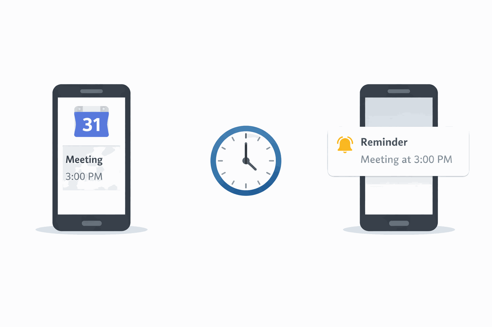
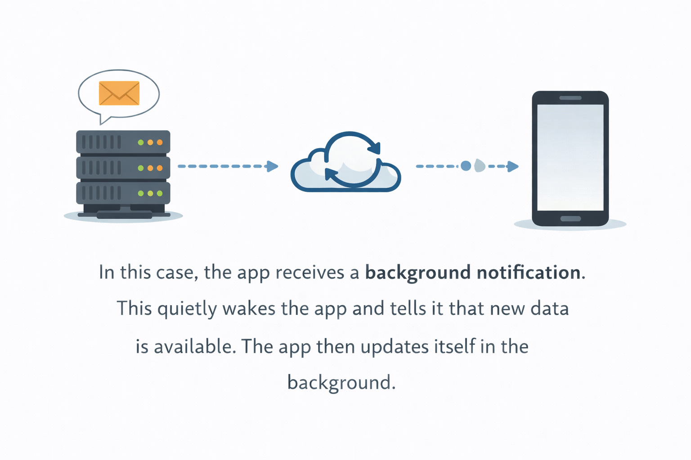

import { Step, Steps } from 'fumadocs-ui/components/steps';
import { DynamicCodeBlock } from 'fumadocs-ui/components/dynamic-codeblock';
import { ImageZoom } from 'fumadocs-ui/components/image-zoom';

<iframe
  width="100%" 
  height="400"
  src="https://www.youtube.com/embed/sw03JqbS8_I"
  title="Understanding Notification Types in Mobile Apps"
  frameBorder="0"
  allow="accelerometer; autoplay; clipboard-write; encrypted-media; gyroscope; picture-in-picture"
  allowFullScreen
/>

<Callout type="info">

Notifications appear everywhere in modern apps.

You receive messages, reminders, delivery updates, and many other alerts throughout the day.

Even though all notifications look similar on your phone, they don’t always work the same way behind the scenes.

For developers, understanding **how notifications are triggered and delivered** is important when designing app behavior.

In this article we’ll break down the **three main notification types used in mobile apps** and when each one should be used.

</Callout>

<Steps>

<Step>

## Step 1 — Push Notifications

Push notifications are the most common type.

They occur when an event happens on the **server**, and the server sends a notification to the user’s device through the internet.

For example:

- A friend sends you a message on **WhatsApp**
- Someone likes your photo on **Instagram**
- A new video is uploaded on **YouTube**
- A delivery update appears in **Uber or Swiggy**

In all of these cases, the event happens on the server first, and then the notification is delivered to your phone.

This is why push notifications are widely used in:

- Chat apps  
- Social media platforms  
- Delivery apps  
- Streaming apps  
- E-commerce apps  

Whenever something new happens online, push notifications help inform the user immediately.

<video  autoplay muted loop playsInline preload="auto" controls width="100%">
  <source src="/videos/iNotifications-Stack.mp4" type="video/mp4" autoplay= "true" />
  Your browser does not support the video tag.
</video>
</Step>

<Step>

## Step 2 — Local Notifications

Local notifications work differently.

Instead of coming from the internet, they are **scheduled directly on the user’s device**.

For example:

- A reminder in **Google Calendar**
- A task notification in **Todoist**
- A daily habit reminder in **TickTick**
- An alarm notification

In these cases, the reminder time is already saved on the device.

When that time arrives, the phone itself triggers the notification.

Because everything is stored locally, these notifications can still appear even if the phone has **no internet connection**.

This makes local notifications very useful for apps that rely on:

- Reminders  
- Task scheduling  
- Habit tracking  
- Offline-first experiences  

</Step>

<Step>

## Step 3 — Background / Silent Notifications

There is another type that many users never notice.

Sometimes apps update their data **without showing a visible notification**.

For example:

- When you open **Gmail**, new emails are already synced
- When you open **WhatsApp**, new messages are already loaded
- News apps often refresh their articles in the background

This happens because the app receives a **background notification**.

The notification quietly wakes the app and tells it that new data is available.

The app then refreshes its content without interrupting the user.

These notifications are commonly used for:

- Data synchronization  
- Feed updates  
- Message syncing  

</Step>

<Step>

## Step 4 — Choosing the Right Notification Type

When building an app, the notification type depends on **what your app needs to do**.

If something happens online and the user should know immediately, apps typically use **push notifications**.

If the notification is based on a **scheduled time or reminder**, apps rely on **local notifications**.

If the app needs to quietly refresh its data, **background notifications** help keep the app updated.

In real-world applications, it’s very common to use **multiple notification types together**.

For example:

- **WhatsApp**
  - Push notifications for new messages  
  - Background notifications for syncing chats

- **Calendar apps**
  - Local notifications for reminders

Understanding these patterns helps developers design apps that communicate effectively with users.
<video  autoplay muted loop playsInline preload="auto" controls width="100%">
  <source src="/videos/Video_Ready_Notification.mp4" type="video/mp4" autoplay= "true" />
  Your browser does not support the video tag.
</video>

</Step>

</Steps>

## Final Thoughts

Notifications play a major role in how apps interact with users.

Choosing the right type helps ensure that notifications feel **useful instead of intrusive**.

When used correctly, notifications can improve engagement, keep users informed, and make apps feel more responsive.

As you build and scale your app, understanding how these notification systems work will help you design a much better user experience.