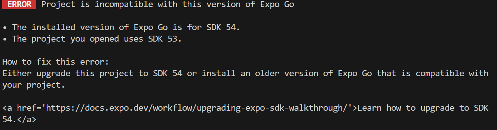
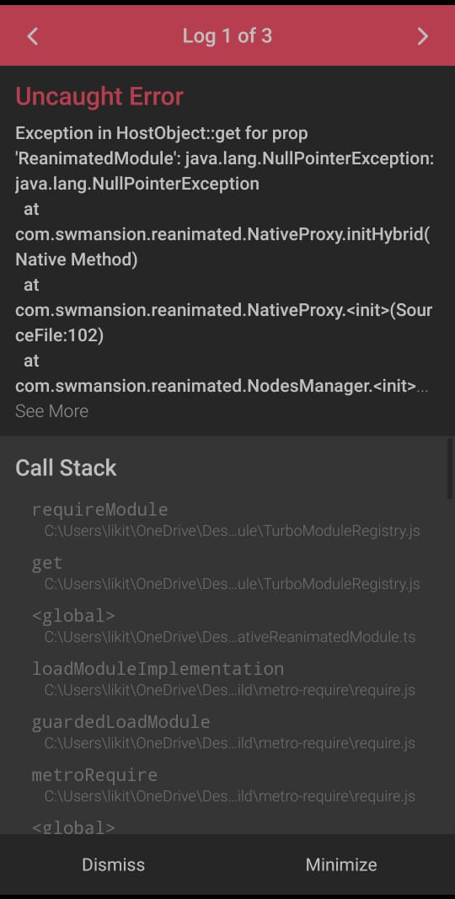

## 1. SDK Error



- **Cause**: This error occurs when your project is outdated with the latest React Native SDK.
- **Solution**: Update your project to the latest React Native SDK version. You can do this by running
  ```bash
  npm install expo@^54.0.0
  ```
  or by following the [official upgrade guide](https://docs.expo.dev/workflow/upgrading-expo-sdk-walkthrough/).

## 2. Cannot find module 'react-native-reanimated'



- **Cause**: This error occurs when the `react-native-reanimated` package is not installed in your project.
  - **Solution**: Install the `react-native-reanimated` package by running the following command:
    ```bash
    expo install react-native-reanimated
    ```
