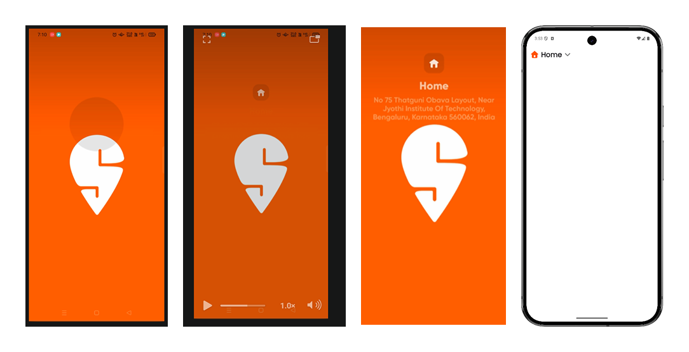

import { Step, Steps } from 'fumadocs-ui/components/steps';
import { DynamicCodeBlock } from 'fumadocs-ui/components/dynamic-codeblock';
import { ImageZoom } from 'fumadocs-ui/components/image-zoom';

<iframe
  width="100%" 
  height="400"
  src="https://www.youtube.com/embed/AXqU6lNBVzA"
  title="Splash Animation in Flutter"
  frameBorder="0"
  allow="accelerometer; autoplay; clipboard-write; encrypted-media; gyroscope; picture-in-picture"
  allowFullScreen
/>


<Callout type="info">
In this post, I will explain how to build a production style splash screen animation in Flutter.
</Callout>

<Steps>

<Step>
## Spliting of Animation

1. The Scaling of the glass container (big → normal)
2. The icon fade in (delayed)
3. The text fade + slide in (delayed)
4. Transition to Home Screen (with Hero)
</Step>

<Step>
## Designing the splash screen UI first
- Before animating anything, I built a static UI.


</Step>


<Step>
## AnimationController: the timeline manager

``` dart
late AnimationController controller;

controller = AnimationController(
  vsync: this,
  duration: Duration(seconds: 1),
);
```

<Callout>
Think of the controller as: A timeline that moves from 0 → 1
- All animations are mapped onto this timeline.
</Callout>


</Step>

<Step>
## Scaling the glass container (big → normal)
- The first animation was scaling the glass container.

``` dart
scaleAnimation = Tween<double>(
  begin: 5.0,
  end: 1.0,
).animate(
  CurvedAnimation(
    parent: controller,
    curve: Curves.easeInOut,
  ),
);

```
<Callout>
- At time `0` → scale is `5.0`
- At time `1` → scale is `1.0`
- The Tween does value mapping, not timing.
</Callout>

</Step>

<Step>
## Why Transform.scale is used
```
Transform.scale(
  scale: scaleAnimation.value,
  child: ...
)

```
<Callout>
- Transform changes how a widget is drawn, not how it is laid out.
This is important because:
- Layout doesn’t break
- No overflow issues
- Smooth GPU-friendly animation
</Callout>

</Step>

<Step>
## Using AnimatedBuilder (and why it matters)
Instead of calling `setState()` on every frame, I used:

``` dart
AnimatedBuilder(
  animation: controller,
  builder: (context, _) {
    return Transform.scale(...);
  },
);

```

<Callout>
AnimatedBuilder is more efficient than setState because:
- It only rebuilds the specific widget being animated.
- It avoids unnecessary rebuilds of the entire widget tree.
</Callout>

</Step>

<Step>
## Delaying the icon appearance using Interval
- The icon should not appear immediately.
- So I used Interval to delay its opacity animation.
``` dart
opacityAnimation = Tween<double>(
  begin: 0.0,
  end: 1.0,
).animate(
  CurvedAnimation(
    parent: controller,
    curve: Interval(0.9, 1.0, curve: Curves.easeOut),
  ),
);
```

<Callout>
- Icon opacity starts animating at 90% of the timeline
- Before that, it stays invisible
`Interval` slices the timeline, not the value.
</Callout>

</Step>


<Step>
## Animating text (fade + slide, not scale)
``` dart
textOpacity = Tween<double>(0.0, 1.0).animate(
  CurvedAnimation(
    parent: controller,
    curve: Interval(0.85, 1.0),
  ),
);

textSlide = Tween<double>(12.0, 0.0).animate(
  CurvedAnimation(
    parent: controller,
    curve: Interval(0.85, 1.0),
  ),
);
```
- And applied it using:

``` dart
Transform.translate(
  offset: Offset(0, textSlide.value),
  child: Opacity(
    opacity: textOpacity.value,
    child: ...
  ),
);
```

</Step>


<Step>
## Transitioning to Home Screen (correct way)
- Instead of using Future.delayed, I listened to animation status:
``` dart
controller.addStatusListener((status) {
  if (status == AnimationStatus.completed) {
    Navigator.pushReplacement(
      context,
      PageRouteBuilder(
        pageBuilder: (_, _, _) => HomeScreen(),
      ),
    );
  }
});
```
<Callout>
This approach is more reliable than using Future.delayed because it ensures the transition happens only after the animation is fully completed.
</Callout>

</Step>

<Step>
## Shared element transition using Hero
The home icon moves from Splash → AppBar using `Hero`.

``` dart
Hero(
  tag: 'hero',
  child: Icon(...)
)

```
</Step>

<Step>

##  Making the Hero movement curved (premium feel)
- By default, Hero moves linearly. To add a natural curve, I used:
``` dart
createRectTween: (begin, end) {
  return MaterialRectArcTween(begin: begin, end: end);
},

```
<Callout>
This follows Material Design motion rules and feels much smoother.
</Callout>
</Step>

</Steps>
