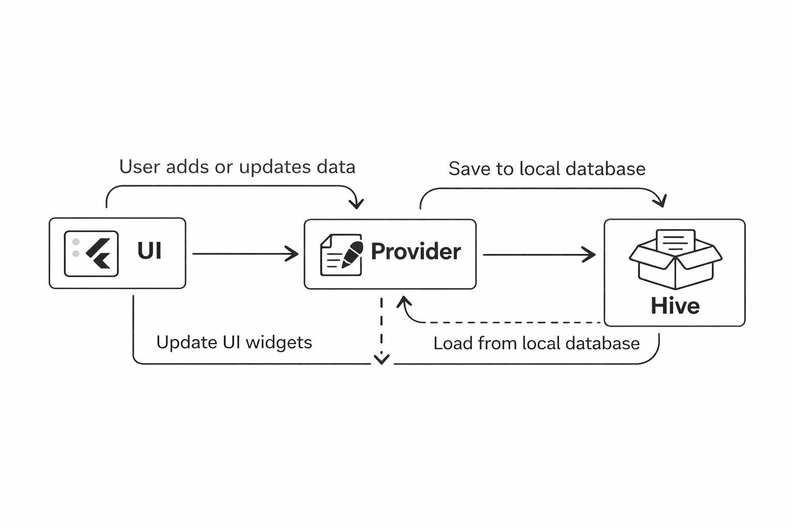

import { Step, Steps } from 'fumadocs-ui/components/steps';
import { DynamicCodeBlock } from 'fumadocs-ui/components/dynamic-codeblock';
import { ImageZoom } from 'fumadocs-ui/components/image-zoom';
import { TypeTable } from 'fumadocs-ui/components/type-table';

<iframe
  width="100%" 
  height="400"
  src="https://www.youtube.com/embed/JC_voHN5GoU"
  title="Understanding Hive in Flutter"
  frameBorder="0"
  allow="accelerometer; autoplay; clipboard-write; encrypted-media; gyroscope; picture-in-picture"
  allowFullScreen
/>

## Introduction
When learning Flutter, most of us start with `setState`.
It works well for small demos, but as soon as the app grows, managing state inside widgets becomes difficult.

In this blog, we’ll build a simple guest list app with `setState` and gradually improve it:

- Then replacing it with Provider.
- Finally persisting the state using Hive.


<Steps>

<Step>
### Managing state using `setState`
Let’s start with the simplest approach.

We take input from a `TextField` and add it to a list using `setState`.

```dart
class MyHomePage extends StatefulWidget {
  @override
  State<MyHomePage> createState() => _MyHomePageState();
}

class _MyHomePageState extends State<MyHomePage> {
  List<String> guestList = [];
  final TextEditingController _controller = TextEditingController();

  @override
  Widget build(BuildContext context) {
    return Scaffold(
      body: Column(
        children: [
          TextField(
            controller: _controller,
            onSubmitted: (value) {
              setState(() {
                guestList.add(value);
                _controller.clear();
              });
            },
          ),
          Expanded(
            child: ListView(
              children: guestList
                  .map((e) => ListTile(title: Text(e)))
                  .toList(),
            ),
          ),
        ],
      ),
    );
  }
}
```
<Accordions type = "single">
<Accordion title="Advantages of using setState">
- Simple
- Easy to understand
- Pefect for small apps

</Accordion>

<Accordion title="DisAdvantages of using setState">
- State lives inside UI components
- Hard to share state between widgets
- App scalability issues
- Difficult to persist state

</Accordion>
</Accordions>

</Step>


<Step>

### Managing state using Provider 
Instead of keeping data inside the widget, we move it into a separate class.

#### 1. Create a Provider 
```dart
class GuestProvider extends ChangeNotifier {
  List<String> guestList = [];

  void addGuest(String name) {
    guestList.add(name);
    notifyListeners();
  }
}
```
<Callout type="info">
This Class extends ChangeNotifier which provides the notifyListeners() method to notify all the listeners about the changes in the state.
It holds the guest list and has a method to add a guest.
</Callout>


#### 2. Provide the state to the widget tree
```dart
void main() {
  runApp(
    ChangeNotifierProvider<GuestProvider>(
      create: (_) => GuestProvider(),
      child: const MyApp(),
    ),
  );
}
```
<Callout type="info">
Here, we wrap the main app with ChangeNotifierProvider to provide the GuestProvider state to the entire widget tree.
</Callout>

#### 3. Access the state in widgets
```dart
TextField(
  onSubmitted: (value) {
    context.read<GuestProvider>().addGuest(value);
  },
)
```
<Callout type="info">
In the TextField, we access the GuestProvider using context.read and call the addGuest method to add a new guest.
</Callout>

```dart
Expanded(
  child: ListView(
    children: context
        .watch<GuestProvider>()
        .guestList
        .map((e) => ListTile(title: Text(e)))
        .toList(),
  ),
)
```
<Callout type="info">
In the ListView, we use context.watch to listen for changes in the GuestProvider and rebuild the list whenever a new guest is added.
</Callout>
</Step>

<Step>
### Problem with provider alone
If you close the app and reopen it, the guest list is gone.

Why?

Because Provider keeps data in memory only.To persist data across app restarts, we need local storage.

#### 1. Add Hive for local storage | Initialize Hive
Hive is a lightweight and fast key-value database written in pure Dart.

```dart
void main() async {
  WidgetsFlutterBinding.ensureInitialized();
  await Hive.initFlutter();

  runApp(const MyApp());
}
```
<Callout>
Here, we initialize Hive before running the app.So that we can use it for local storage.
</Callout>

#### 2. Connect Hive with Provider | Update GuestProvider
Instead of letting UI talk to Hive, Provider handles everything.

```dart
class GuestProvider extends ChangeNotifier {
  List<String> guestList = [];
  late Box box;

  GuestProvider() {
    _loadGuests();
  }

  Future<void> _loadGuests() async {
    box = await Hive.openBox('guestBox');
    guestList = List<String>.from(
      box.get('guest', defaultValue: []),
    );
    notifyListeners();
  }

  void addGuest(String name) {
    guestList.add(name);
    box.put('guest', guestList);
    notifyListeners();
  }
}
```
<Callout>
- When the provider is created, it opens a Hive box and loads the guest list from local storage.
- When a new guest is added, it updates both the in-memory list and the Hive box to persist the data.
- This way, the guest list is saved locally and will be available even after app restarts.
- Each time data is added, notifyListeners() is called to update the UI.
</Callout>

</Step>

### The Data Flow


</Steps>