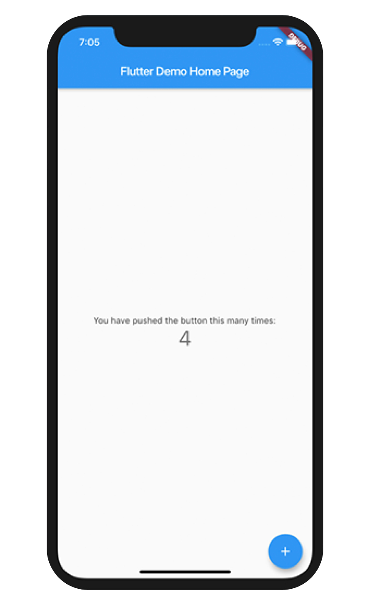
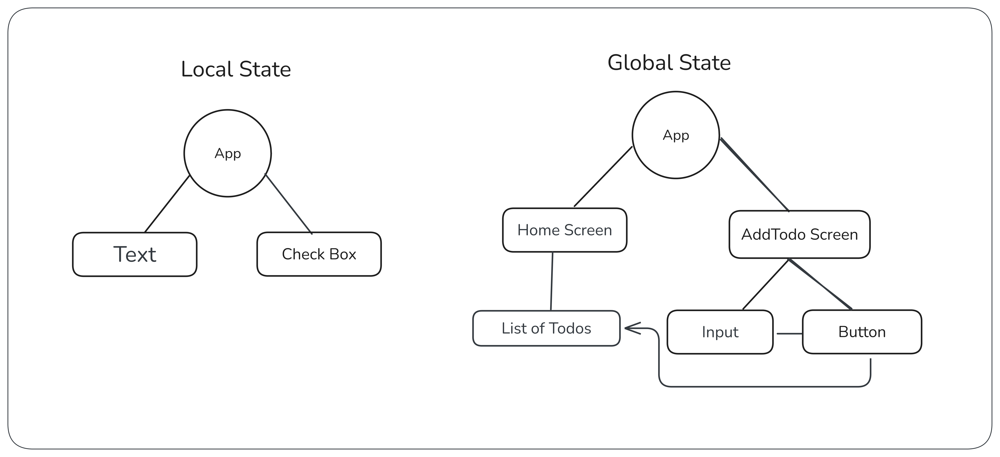
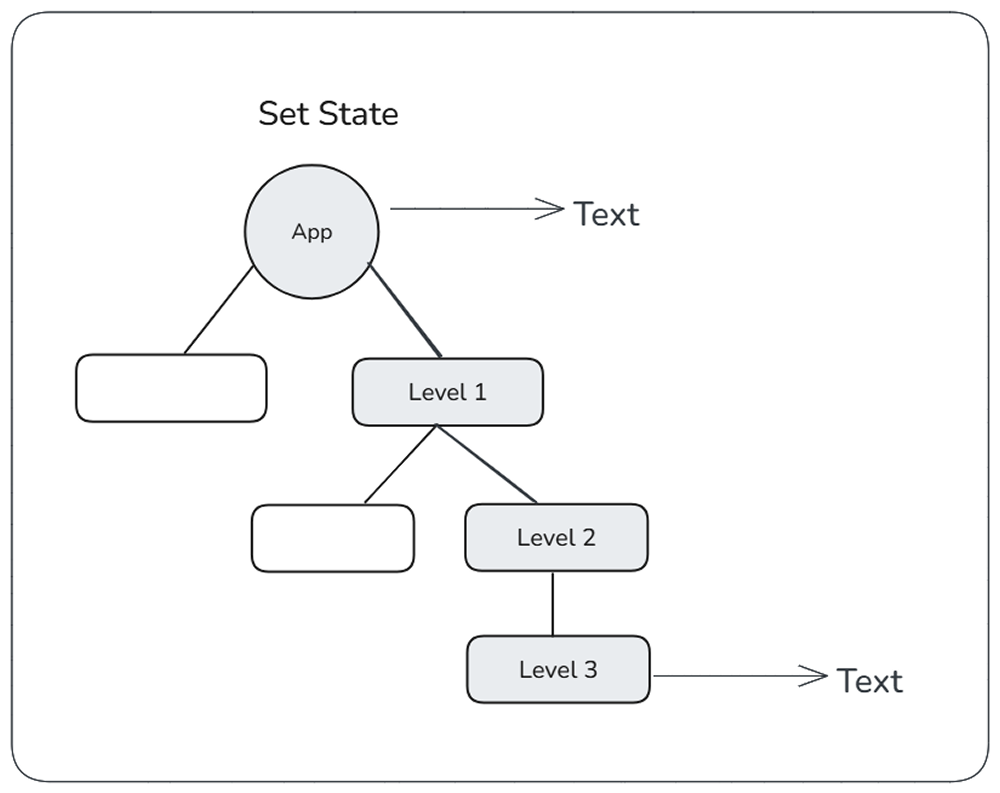
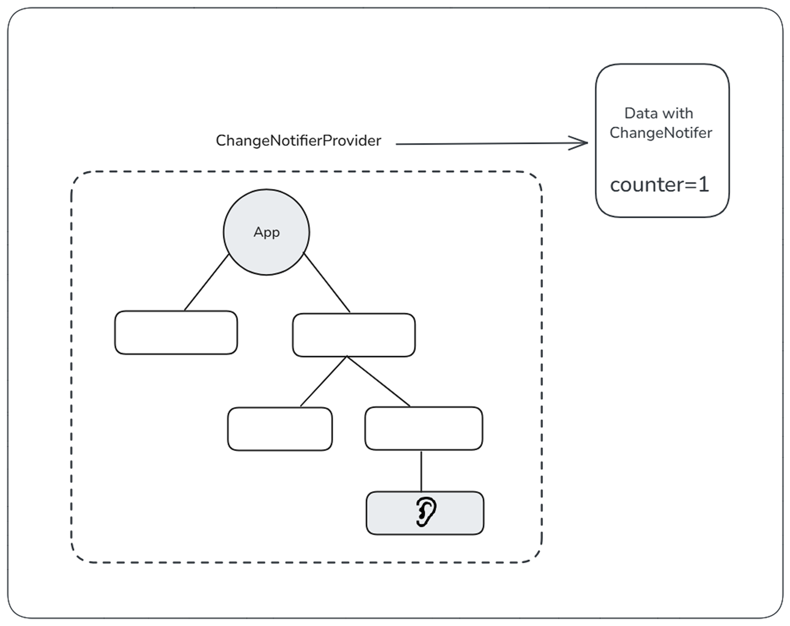

import { Step, Steps } from 'fumadocs-ui/components/steps';
import { DynamicCodeBlock } from 'fumadocs-ui/components/dynamic-codeblock';
import { ImageZoom } from 'fumadocs-ui/components/image-zoom';

<iframe
  width="100%" 
  height="400"
  src="https://www.youtube.com/embed/w3jr0SJbEfc"
  title="Understanding Hive in Flutter"
  frameBorder="0"
  allow="accelerometer; autoplay; clipboard-write; encrypted-media; gyroscope; picture-in-picture"
  allowFullScreen
/>

In this guide, we’ll to learn how to manage state in a Flutter application using the Provider package, which is a popular and beginner-friendly approach. 

State management is a crucial aspect of app development, as it helps in maintaining and updating the UI based on user interactions and data changes.

By the end, you'll Understand:
- What is state management in Flutter?
- Why use the Provider package for state management?
- How to implement state management using Provider in a simple Flutter app.

<Steps>

<Step>
## What is the State ?
- When you take a fresh new Flutter app, it has a default counter app that increments the counter value when you press the button. Here, the counter value is a piece of state that changes when you interact with the button.
- State refers to the data that can change over time in your application. It can be anything from user inputs, fetched data, or UI elements that need to be updated based on certain actions.



</Step>

<Step>
## Two Types of State in Flutter
1. Local State: This type of state is confined to a single widget. For example, the counter value in the default Flutter app is a local state.
2. Global State: This type of state is shared across multiple widgets in the application. For example, user authentication status or theme settings that need to be accessed by various parts of the app.


</Step>

<Step>
## Why not setState()
- Using setState() is suitable for small applications with minimal state management needs. However, as the application grows in complexity, managing state using setState() can lead to code that is hard to maintain and scale.
- It results in prop drilling, where you have to pass state down through multiple widget layers, making the code cumbersome and less readable.
- It can lead to performance issues, as unnecessary widget rebuilds may occur when the state changes.

### Example to illustrate prop drilling:
```dart
class AppLevel extends StatelessWidget {
  @override
  Widget build(BuildContext context) {
    String text = "Prop Drilling Example";
    return MaterialApp(
      home: Level1(data : text),
    );
  }
}

class Level1 extends StatelessWidget {
  final String data;
  Level1({required this.data});
  @override
  Widget build(BuildContext context) {
    return Scaffold(
      body: Level2(data: data),
    );
  }
}

class Level2 extends StatelessWidget {
  final String data;
  Level2({required this.data});
  @override
  Widget build(BuildContext context) {
    return Center(
      child: Level3(data : data),
    );
  }
}

class Level3 extends StatelessWidget {
  final String data;
  Level2({required this.data});
  @override
  Widget build(BuildContext context) {
    return Center(
      child: Text(data),
    );
  }
}

```

<Callout type="info">
In above example if we have to pass data from AppLevel to Level2 we have to pass it through Level1 this is called prop drilling which can be avoided using state management solutions like Provider.
</Callout>

</Step>

<Step>
## Solve with Provider
- Provider is a popular state management solution in Flutter that simplifies the process of managing and sharing state across the application.
- Instead of passing data through multiple widget layers, Provider allows you to create a centralized state that can be accessed by any widget in the widget tree.

<Callout>
In above diagram, the AppLevel widget provides the state using Provider, and Level3 can directly access the state without needing to go through Level1 and Level3.
</Callout>
</Step>

<Step>
## Setting up Provider in a Flutter App

1. Add the Provider package to your pubspec.yaml file:
```yaml
pub add provider
```
2. Create a data model class that extends ChangeNotifier:
```dart
import 'package:flutter/foundation.dart';
class Data extends ChangeNotifier {
  String text = "Provider Example";
}
```
3. Wrap your main app with ChangeNotifierProvider to provide the state to the widget tree:
```dart
import 'package:provider/provider.dart';
void main() {
  runApp(
    ChangeNotifierProvider<Data>(
      create: (context) => Data(),
      child: MyApp(),
    ),
  );
}
```
4. Access the state in any widget using Provider.of or Consumer:
```dart
class Level3 extends StatelessWidget {
  @override
  Widget build(BuildContext context) {
    String data = context.watch<Data>().text;
    return Center(
      child: Text(data),
    );
  }
}
```

### Difference Between Watch and Read
- `context.watch<T>()`: This method listens for changes in the provided data of type T. When the data changes, the widget that calls this method will rebuild to reflect the updated state.
- `context.read<T>()`: This method retrieves the provided data of type T without listening for changes. It is typically used when you want to access the data once, such as in event handlers, without causing the widget to rebuild on data changes.

### Conclusion
Using Provider for state management in Flutter simplifies the process of sharing and managing state across your application. 

It helps avoid prop drilling, improves code maintainability, and enhances performance by reducing unnecessary widget rebuilds.

As your application grows, adopting a state management solution like Provider becomes essential for building scalable and efficient Flutter apps.


</Step>

</Steps>

