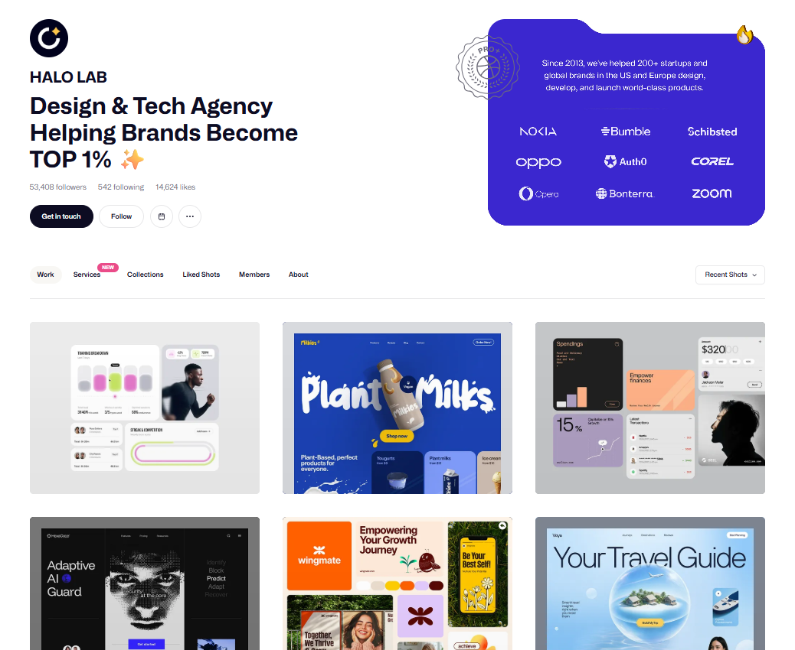
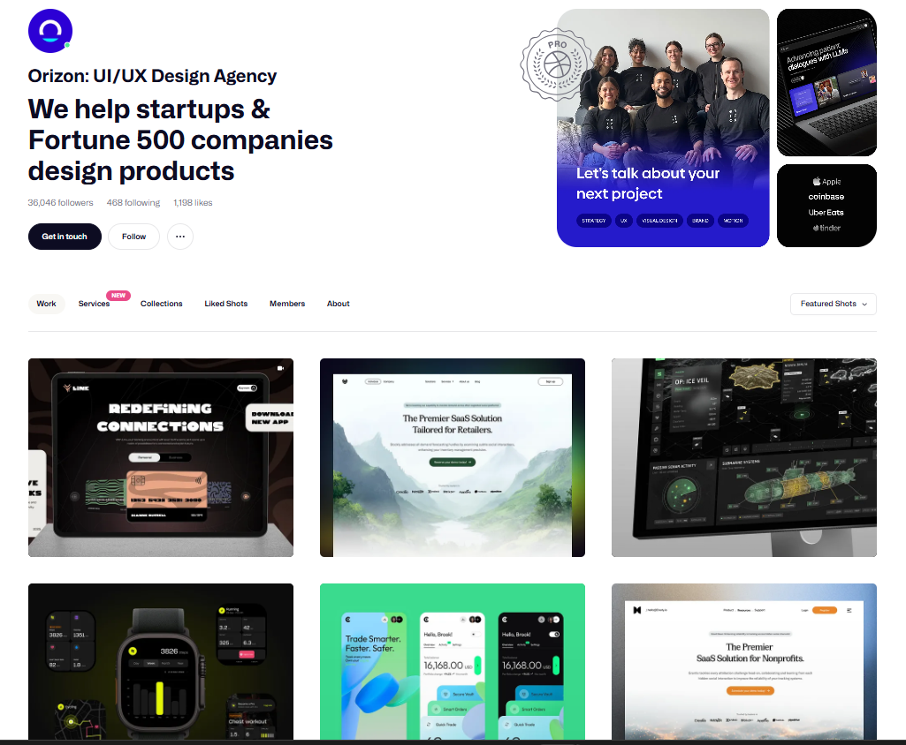
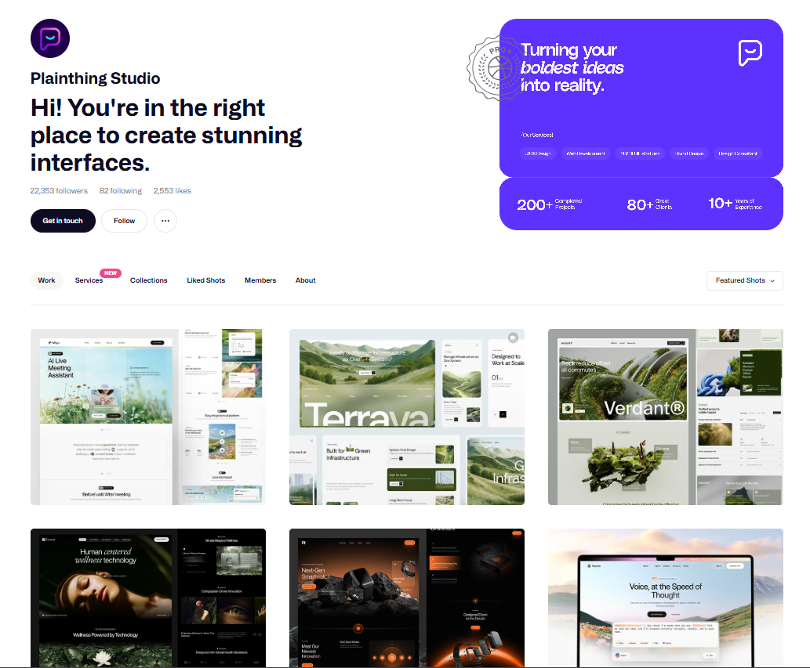
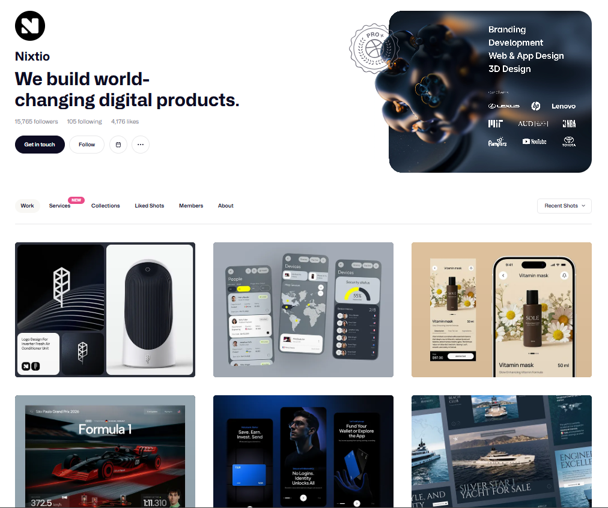
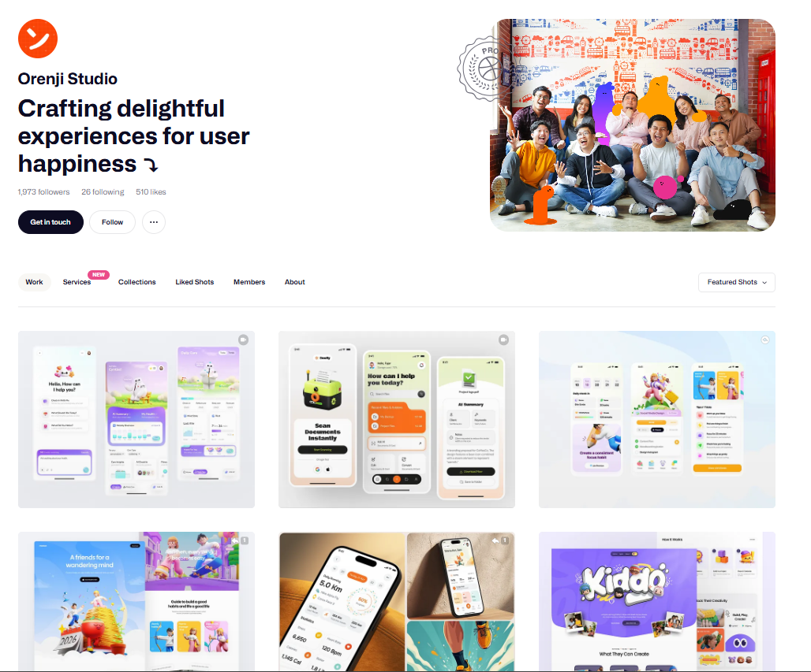

import { Step, Steps } from 'fumadocs-ui/components/steps';
import { DynamicCodeBlock } from 'fumadocs-ui/components/dynamic-codeblock';
import { ImageZoom } from 'fumadocs-ui/components/image-zoom';

<iframe
  width="100%" 
  height="400"
  src="https://www.youtube.com/embed/3ymEMvVU8e0"
  title="5 Dribbble Design Studios Every UI & Product Designer Should Study."
  frameBorder="0"
  allow="accelerometer; autoplay; clipboard-write; encrypted-media; gyroscope; picture-in-picture"
  allowFullScreen
/>

<Callout type="info">
There are thousands of UI tutorials online.But most beginners make one mistake:
They consume content without improving their design taste.If you really want to level up as a UI or product designer,you must study great designers consistently.

Today, we’ll break down 5 powerful Dribbble studios and what exactly you can learn from each of them.

Not to copy.But to understand patterns.
</Callout>

<Steps>
<Step>
## HALO LAB

- Halo Lab is perfect if you want to learn how to use brand colors properly.
- Notice how their designs feel cinematic almost like a movie poster.
- Their layouts are bold, confident, and very startup-focused.
- If you're building a product and want it to look premium, study their spacing, typography scale, and color balance.
</Step>

<Step>
## ORIZON

- Orizon is known for modern and elegant product design.
- If you look closely, their typography is extremely clean. They use fonts beautifully, proper weight, spacing, and hierarchy.
- Their designs are minimal but powerful.
- If you want inspiration for both web and mobile apps, Orizon is one of the best references.
</Step>

<Step>
## Plainthing Studio

- Plainthing Studio focuses on simplicity.
- Their designs are not overly flashy.They are practical.
- These are the kind of designs that developers can actually build.
- If you’re learning product design and want realworld UI inspiration,this is a great profile to study.

</Step>

<Step>
## Nixtio

- Nixtio has a strong modern vibe.
- Their color combinations are excellent, bold but controlled.
- They understand visual energy.
- If you want your design to feel current and trendy, Nixtio is a great inspiration source.

</Step>

<Step>
## Orenji Studio

- Orenji Studio brings personality into design.
- Their work feels joyful, playful, and expressive.
- They use illustrations and characters beautifully.
- If you're designing for consumer apps, ed-tech, or playful brands, this kind of inspiration is very valuable.

</Step>

</Steps>

