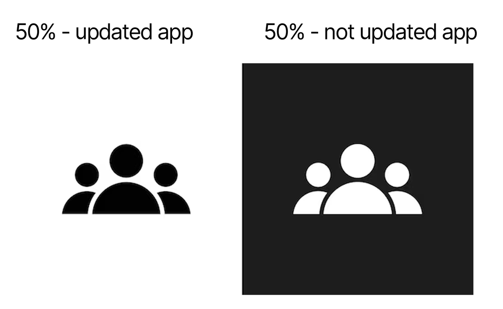
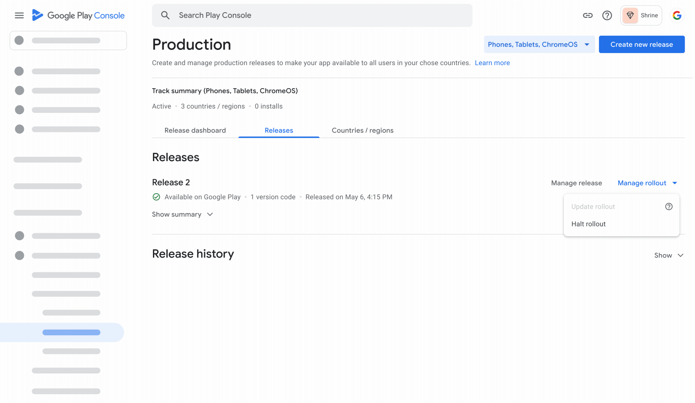
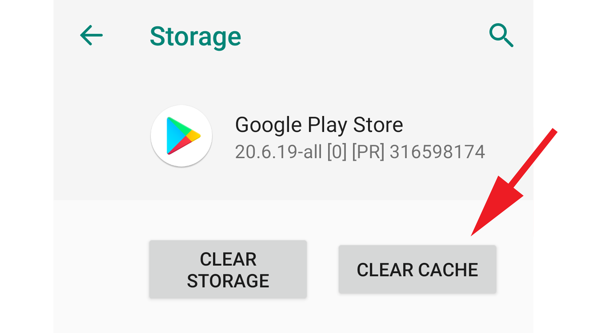
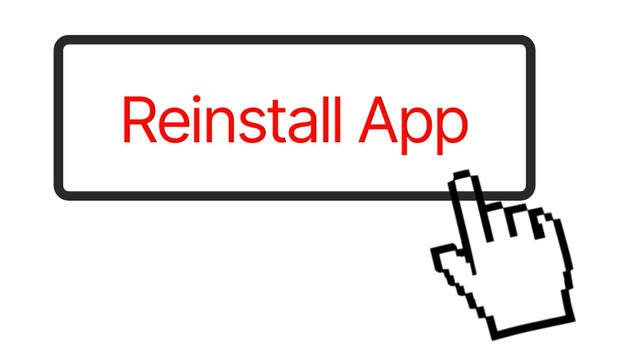

import { Step, Steps } from 'fumadocs-ui/components/steps';
import { DynamicCodeBlock } from 'fumadocs-ui/components/dynamic-codeblock';
import { ImageZoom } from 'fumadocs-ui/components/image-zoom';

<iframe
  width="100%" 
  height="400"
  src="https://www.youtube.com/embed/Ks_Nqpgjz1M"
  title="What To Do If Your Play Store App Breaks After an Update"
  frameBorder="0"
  allow="accelerometer; autoplay; clipboard-write; encrypted-media; gyroscope; picture-in-picture"
  allowFullScreen
/>

<Callout type="info">

Publishing updates to production always feels routine until something breaks.

Recently, I pushed an update to my app on the Play Store and within a few hours the app stopped working properly.

The issue turned out to be a **very small bug I forgot to fix before publishing**.  
But by the time I realized it, many users had already updated the app.

Situations like this can feel stressful, but luckily the Play Store provides tools that help you control the rollout and reduce the damage.

Here’s exactly what happened and how I handled it.

</Callout>

<Steps>

<Step>

## Step 1 — The Problem After Publishing

After publishing the update, the bug started affecting users.

Imagine the situation like this:

- Around **50% of the users already updated the app**
- The **remaining 50% had not updated yet**

If nothing is done, the broken update will continue spreading to the rest of the users.

So the **first priority is to stop the update from reaching more users**.

</Step>

<Step>

## Step 2 — Halt the Play Store Rollout

Fortunately, the Play Store provides a feature called **Halt Rollout** inside the Play Console.

Using this option immediately stops the update from spreading further.

What happens when you halt rollout:

- The broken version stops reaching new users
- Users who haven't updated yet will **not receive the faulty version**
- The situation stops getting worse

This step is critical because it prevents the problem from affecting more users.

</Step>

<Step>

## Step 3 — What About Users Who Already Updated?

Now comes the next question:

What about the users who already installed the broken update?

For those users, there is a simple workaround.

They can:

- Go to the **Play Store**
- Clear the **Play Store cache**
- Reinstall the app again

Once they reinstall, the Play Store will provide the **previous stable version** instead of the broken update.

This allows users to continue using the app normally.

</Step>

<Step>

## Step 4 — Use This Time to Fix the Issue

Once the rollout is halted and the update stops spreading, the pressure reduces.

Now you have some breathing room to:

- Identify the issue
- Fix the bug properly
- Test the build again
- Publish a corrected update

Instead of rushing another broken release, you can safely push a stable version.

</Step>

<Step>

## Step 5 — Lesson Learned

This experience highlighted an important lesson.

Even a **small bug can cause major issues once it reaches production**.

Before publishing updates:

- Always test the production build
- Consider using **staged rollout**
- Monitor crash reports after release

Many teams release updates to **10% of users first**, then gradually increase the rollout once the update proves stable.

This reduces the risk of large-scale failures.

</Step>

</Steps>

## Final Thoughts

Mistakes like this can happen to any developer.

What matters is **how quickly you respond and limit the impact**.

Knowing how to use tools like **Play Store rollout control** can make a huge difference when something goes wrong in production.

If you're building apps and publishing updates regularly, understanding these safety mechanisms is extremely valuable.
