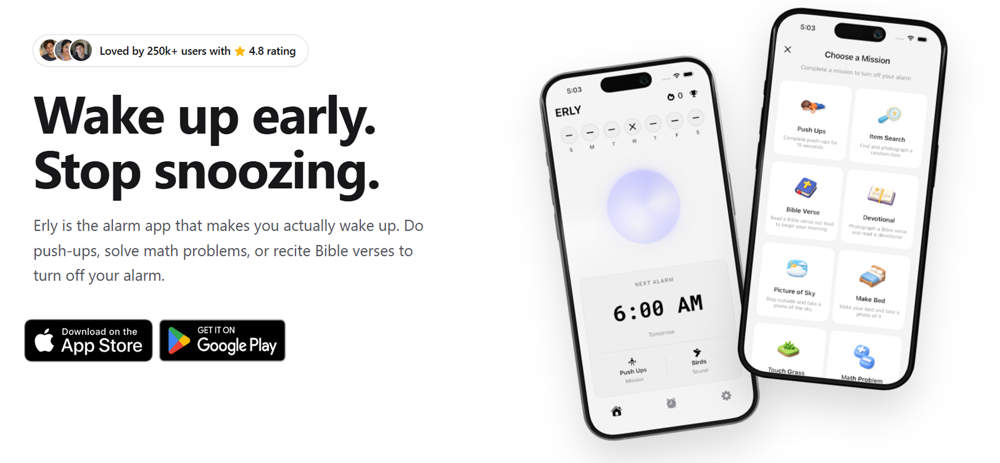

import { Step, Steps } from 'fumadocs-ui/components/steps';
import { Callout } from 'fumadocs-ui/components/callout';

<iframe
  width="100%"
  height="400"
  src="https://www.youtube.com/embed/gdNxwUksFSs"
  title="Finally, An Alarm That Actually Wakes You Up"
  frameBorder="0"
  allow="accelerometer; autoplay; clipboard-write; encrypted-media; gyroscope; picture-in-picture"
  allowFullScreen
/>

<Callout type="info">
This isn't an app review. It's a simple lesson in product thinking and how one small shift in perspective can completely change a solution.
</Callout>

<Steps>

<Step>

## We Were Solving the Wrong Problem

Every night, millions of people set an alarm with complete confidence. We tell ourselves, *"Tomorrow, I'm definitely waking up at 6 AM."* But when morning comes, something strange happens. The alarm rings, we open our eyes, tap the dismiss button, and convince ourselves that five more minutes won't hurt. Before we know it, we've overslept.

For years, alarm apps have tried to solve this problem by becoming better alarms. They added louder sounds, more aggressive ringtones, stronger vibrations, and endless customization options. On paper, those improvements make sense. If people aren't waking up, surely a louder alarm will help.

But what if that was never the real problem?

</Step>

<video  autoplay muted loop playsInline preload="auto" controls width="30%">
  <source src="/videos/snooze.mp4" type="video/mp4" autoplay= "true" />
  Your browser does not support the video tag.
</video>

<Step>

## The Question That Changed Everything

I recently came across an app called **Erly**, and what caught my attention wasn't the technology—it was the way the creators looked at the problem.

Instead of asking, *"How do we build a better alarm?"* they asked something much more interesting:

> **"How do we make sure someone actually gets out of bed?"**

That one question completely changed the solution.

Instead of letting you stop the alarm with a single tap, the app asks you to complete a challenge. It could be doing 15 push-ups, solving a puzzle, or finishing another task before the alarm finally turns off. In some cases, it even uses your camera to verify that you've actually completed the challenge.

The alarm itself didn't become smarter. The thinking behind it did.

</Step>
<video  autoplay muted loop playsInline preload="auto" controls width="100%">
  <source src="/videos/erlyapp.mp4" type="video/mp4" autoplay= "true" />
  Your browser does not support the video tag.
</video>

<Step>

## That's What Creativity Looks Like

What I loved about this idea wasn't the push-ups, and it definitely wasn't the technology. It was realizing that creativity isn't always about inventing something completely new. Sometimes it's about looking at an old problem from a different angle.

Most people focused on helping users wake up. The creators of Erly realized users were already waking up they just kept going back to sleep. That's a completely different problem, which naturally leads to a completely different solution.

It's such a small shift in perspective, but it changes everything.

</Step>

<Step>

## A Lesson Every Builder Should Remember

Whether you're designing an app, building a product, or solving everyday problems, it's worth pausing for a moment and asking yourself one simple question:

> **Am I solving the right problem?**

We often rush into improving existing solutions without questioning whether we're solving the correct problem in the first place. The best products aren't always the ones with the most features—they're the ones that understand people the best.

Sometimes, all it takes is one better question to discover a much better answer.

</Step>

</Steps>

## Final Thoughts

The next time you come across a product that feels surprisingly clever, don't just ask *"How did they build this?"* Ask *"What problem did they actually decide to solve?"*

More often than not, that's where the real innovation begins.