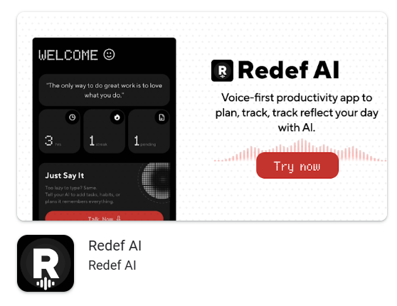
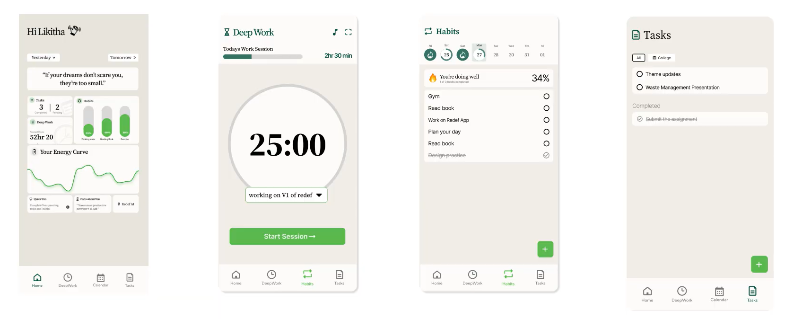
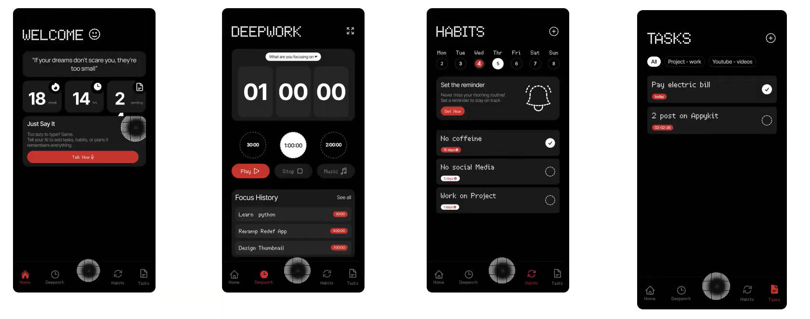

import { Step, Steps } from 'fumadocs-ui/components/steps';
import { ImageZoom } from 'fumadocs-ui/components/image-zoom';

<iframe
  width="100%" 
  height="400"
  src="https://www.youtube.com/embed/LI9jeuNLsh0"
  title="How I Improved My App Design"
  frameBorder="0"
  allow="accelerometer; autoplay; clipboard-write; encrypted-media; gyroscope; picture-in-picture"
  allowFullScreen
/>

## The Problem

- I always thought I needed a perfect design before I start building my app.  
- It had to look polished, complete… almost like a finished product.  

- Because of that, I stayed stuck.  
- I would open Figma, try a few things… and stop.  

<Callout type="info">
I think a lot of developers get stuck here, especially when they’re not confident in design.  
</Callout>

---

## The Shift

- At some point, I realized this was just an excuse. So I decided to start building anyway.

- I started working on my app: **Redef AI**  
- It’s a voice-first productivity tool that helps me:
  - Stay on track  
  - Manage tasks  
  - Build consistency  
  

---

<Steps>

<Step>

## Starting with a Basic Design

- When I started, the UI was very plain. It felt like a template.No identity, no personality. 

- Earlier, I would stop here and try to fix everything.  
- But this time, I kept going.

</Step>

<Step>

## Learning Through Inspiration

- Instead of chasing perfection, I started exploring designs.  

- I began:
  - Looking at apps I liked  
  - Imagining my app in those styles  
  - Picking elements like colors, fonts, layouts  

- I even copied parts of those designs.  

<Callout type="info">
- At first, it felt like cheating.  
- But that’s how I actually learned design.  
</Callout>

</Step>

<Step>

## Exploring a Style

- One thing I kept thinking was:  
  “What if my app had a dark theme?”  

- I was also inspired by Nothing-style fonts and visuals. So I tried it. It wasn’t perfect… but it felt better.

</Step>

<Step>

## Iterating Over Time

- From there, I kept improving:
  - Small changes  
  - New variations  
  - Removing what didn’t work  

- Over multiple iterations, the design evolved.

- It started feeling like a real product.

</Step>

<Step>

## There Is No Final Design

- Even now, the design is not final. Every time I use it or get feedback, find something to improve. And I update it again. 

<Callout type="info">
- There is no perfect design.  
- Good design comes from continuous iteration.  
</Callout>

</Step>

</Steps>

---

## Final Thoughts

- If you’re waiting to design something perfect before starting…  
  that might be what’s holding you back.  

- Start simple ,  Build something basic, Improve it step by step. 

---

## About the App

- **Redef AI** is live on the Play Store.I’ll be sharing more about how it works in upcoming videos.
