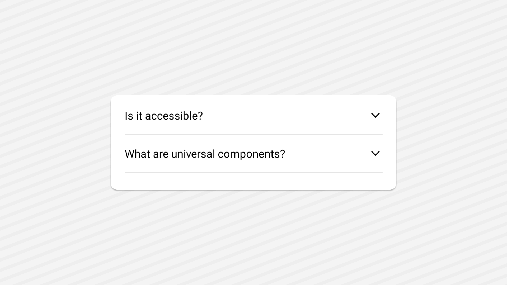

<Tabs items={['preview', 'code']}>
  <Tab value="preview">
  <div>
    
  </div>
  </Tab>
  <Tab value="code">
    ```tsx
    import React from 'react';
import { Text, View } from 'react-native';
import {
  Accordion,
  AccordionContent,
  AccordionItem,
  AccordionTrigger,
} from '@/components/ui/accordion';
export default function AccordionDemo() {
  return (
    <View className="flex-1  justify-center items-center p-6  bg-white">
      <Accordion
        type='multiple'
        collapsible
        defaultValue={['item-1']}
        className='w-full max-w-sm native:max-w-md'
      >
        <AccordionItem value='item-1'>
          <AccordionTrigger>
            <Text>Is it accessible?</Text>
          </AccordionTrigger>
          <AccordionContent>
            <Text>Yes. It adheres to the WAI-ARIA design pattern.</Text>
          </AccordionContent>
        </AccordionItem>
        <AccordionItem value='item-2'>
          <AccordionTrigger>
            <Text>What are universal components?</Text>
          </AccordionTrigger>
          <AccordionContent>
            <Text>
              In the world of React Native, universal components are components that work on both
              web and native platforms.
            </Text>
          </AccordionContent>
        </AccordionItem>
      </Accordion>
    </View>
  );
}

    ```

  </Tab>
</Tabs>

## Installation

<Tabs items={['cli','manual', ]}>
 
  <Tab value="cli">
  ```bash
npx appykit@latest add accordion
```
  </Tab>
  <Tab value="manual">
   
<Steps>

<Step>
Install the following dependencies:
```bash
npx expo install @rn-primitives/accordion
```

</Step>
<Step>
Create a folder named `ui` under component folder in your project and add the following code in a file named `accordion.tsx`:
```tsx
import { Icon } from '@/components/ui/icon';
import { TextClassContext } from '@/components/ui/text';
import { cn } from '@/lib/utils';
import * as AccordionPrimitive from '@rn-primitives/accordion';
import { ChevronDown } from 'lucide-react-native';
import { Platform, Pressable, View } from 'react-native';
import Animated, {
  FadeOutUp,
  LayoutAnimationConfig,
  LinearTransition,
  useAnimatedStyle,
  useDerivedValue,
  withTiming,
} from 'react-native-reanimated';
 
function Accordion({
  children,
  ...props
}: Omit<AccordionPrimitive.RootProps, 'asChild'> &
  React.RefAttributes<AccordionPrimitive.RootRef>) {
  return (
    <LayoutAnimationConfig skipEntering>
      <AccordionPrimitive.Root
        {...(props as AccordionPrimitive.RootProps)}
        asChild={Platform.OS !== 'web'}>
        <Animated.View layout={LinearTransition.duration(200)}>{children}</Animated.View>
      </AccordionPrimitive.Root>
    </LayoutAnimationConfig>
  );
}
 
function AccordionItem({
  children,
  className,
  value,
  ...props
}: AccordionPrimitive.ItemProps & React.RefAttributes<AccordionPrimitive.ItemRef>) {
  return (
    <AccordionPrimitive.Item
      className={cn(
        'border-border border-b',
        Platform.select({ web: 'last:border-b-0' }),
        className
      )}
      value={value}
      asChild
      {...props}>
      <Animated.View
        className="native:overflow-hidden"
        layout={Platform.select({ native: LinearTransition.duration(200) })}>
        {children}
      </Animated.View>
    </AccordionPrimitive.Item>
  );
}
 
const Trigger = Platform.OS === 'web' ? View : Pressable;
 
function AccordionTrigger({
  className,
  children,
  ...props
}: AccordionPrimitive.TriggerProps & {
  children?: React.ReactNode;
} & React.RefAttributes<AccordionPrimitive.TriggerRef>) {
  const { isExpanded } = AccordionPrimitive.useItemContext();
 
  const progress = useDerivedValue(
    () => (isExpanded ? withTiming(1, { duration: 250 }) : withTiming(0, { duration: 200 })),
    [isExpanded]
  );
  const chevronStyle = useAnimatedStyle(
    () => ({
      transform: [{ rotate: `${progress.value * 180}deg` }],
    }),
    [progress]
  );
 
  return (
    <TextClassContext.Provider
      value={cn(
        'text-left text-sm font-medium',
        Platform.select({ web: 'group-hover:underline' })
      )}>
      <AccordionPrimitive.Header>
        <AccordionPrimitive.Trigger {...props} asChild>
          <Trigger
            className={cn(
              'flex-row items-start justify-between gap-4 rounded-md py-4 disabled:opacity-50',
              Platform.select({
                web: 'focus-visible:border-ring focus-visible:ring-ring/50 flex flex-1 outline-none transition-all hover:underline focus-visible:ring-[3px] disabled:pointer-events-none [&[data-state=open]>svg]:rotate-180',
              }),
              className
            )}>
            <>{children}</>
            <Animated.View style={chevronStyle}>
              <Icon
                as={ChevronDown}
                size={16}
                className={cn(
                  'text-muted-foreground shrink-0',
                  Platform.select({
                    web: 'pointer-events-none translate-y-0.5 transition-transform duration-200',
                  })
                )}
              />
            </Animated.View>
          </Trigger>
        </AccordionPrimitive.Trigger>
      </AccordionPrimitive.Header>
    </TextClassContext.Provider>
  );
}
 
function AccordionContent({
  className,
  children,
  ...props
}: AccordionPrimitive.ContentProps & React.RefAttributes<AccordionPrimitive.ContentRef>) {
  const { isExpanded } = AccordionPrimitive.useItemContext();
  return (
    <TextClassContext.Provider value="text-sm">
      <AccordionPrimitive.Content
        className={cn(
          'overflow-hidden',
          Platform.select({
            web: isExpanded ? 'animate-accordion-down' : 'animate-accordion-up',
          })
        )}
        {...props}>
        <Animated.View
          exiting={Platform.select({ native: FadeOutUp.duration(200) })}
          className={cn('pb-4', className)}>
          {children}
        </Animated.View>
      </AccordionPrimitive.Content>
    </TextClassContext.Provider>
  );
}
 
export { Accordion, AccordionContent, AccordionItem, AccordionTrigger };

````

</Step>


<Step>
Create a file named `icon.tsx` under Component/ui folder in your project and add the following code:
```tsx
import { cn } from '@/lib/utils';
import type { LucideIcon, LucideProps } from 'lucide-react-native';
import { cssInterop } from 'nativewind';

type IconProps = LucideProps & {
  as: LucideIcon;
};

function IconImpl({ as: IconComponent, ...props }: IconProps) {
  return <IconComponent {...props} />;
}

cssInterop(IconImpl, {
  className: {
    target: 'style',
    nativeStyleToProp: {
      height: 'size',
      width: 'size',
    },
  },
});

/**
 * A wrapper component for Lucide icons with Nativewind `className` support via `cssInterop`.
 *
 * This component allows you to render any Lucide icon while applying utility classes
 * using `nativewind`. It avoids the need to wrap or configure each icon individually.
 *
 * @component
 * @example
 * ```tsx
 * import { ArrowRight } from 'lucide-react-native';
 * import { Icon } from '@/registry/components/ui/icon';
 *
 * <Icon as={ArrowRight} className="text-red-500" size={16} />
 * ```
 *
 * @param {LucideIcon} as - The Lucide icon component to render.
 * @param {string} className - Utility classes to style the icon using Nativewind.
 * @param {number} size - Icon size (defaults to 14).
 * @param {...LucideProps} ...props - Additional Lucide icon props passed to the "as" icon.
 */
function Icon({ as: IconComponent, className, size = 14, ...props }: IconProps) {
  return (
    <IconImpl
      as={IconComponent}
      className={cn('text-foreground', className)}
      size={size}
      {...props}
    />
  );
}

export { Icon };
````

</Step>
<Step>
This component depends on the `Text` component.
Please follow the installation guide [here](/components/text) before using the `Accordion`.

</Step>
<Step>
Update the import paths to match your project setup.
</Step>

</Steps>
  
  </Tab>

</Tabs>

## Usage

```tsx
import {
  Accordion,
  AccordionContent,
  AccordionItem,
  AccordionTrigger,
} from "@/components/ui/accordion";+
import { Text } from "@/components/ui/text";
```

```tsx
<Accordion type="single" collapsible className="w-full">
  <AccordionItem value="item-1">
    <AccordionTrigger>
      <Text>Is it accessible?</Text>
    </AccordionTrigger>
    <AccordionContent>
      <Text>Yes. It adheres to the WAI-ARIA design pattern.</Text>
    </AccordionContent>
  </AccordionItem>
</Accordion>
```
