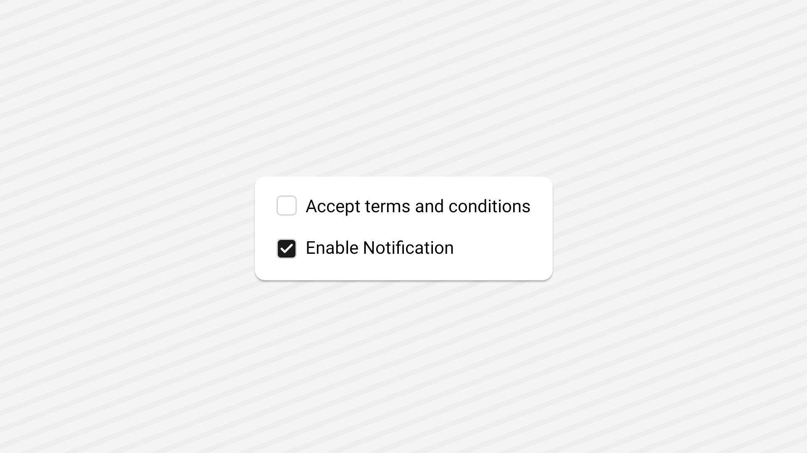

<Tabs items={['preview', 'code']}>
  <Tab value="preview">
    
  </Tab>
  <Tab value="code">
    ```ts
    import { Checkbox } from "@/components/ui/checkbox";
import React from "react";
import { Text, View } from "react-native";

export default function CheckDemo() {
  const [checked, setChecked] = React.useState(false);
  const [checked2, setChecked2] = React.useState(false);
  return (
    <View className="flex-1   gap-4 justify-center items-start  bg-background p-20">
      <View className="flex-row items-center gap-2">
        <Checkbox checked={checked} onCheckedChange={setChecked} />
        <Text>Accept terms and conditions</Text>
      </View>
      <View className="flex-row    items-end gap-2">
        <Checkbox checked={checked2} onCheckedChange={setChecked2} />
        <Text>Enable Notification</Text>
      </View>
    </View>
  );
}
    ```
  </Tab>
</Tabs>

## Installation

<Tabs items={['cli','manual', ]}>
 
  <Tab value="cli">
  ```ts
npx appykit@latest add checkbox
```
  </Tab>
  <Tab value="manual">
   
<Steps>

<Step>
Install the following dependencies:
```shell
npx expo install @rn-primitives/checkbox
```

</Step>
<Step>
Create a folder named `ui` under component folder in your project and add the following code in a file named `checkbox.tsx`:
```ts
import { Icon } from '@/components/ui/icon';
import { cn } from '@/lib/utils';
import * as CheckboxPrimitive from '@rn-primitives/checkbox';
import { Check } from 'lucide-react-native';
import { Platform } from 'react-native';
 
const DEFAULT_HIT_SLOP = 24;
 
function Checkbox({
  className,
  checkedClassName,
  indicatorClassName,
  iconClassName,
  ...props
}: CheckboxPrimitive.RootProps &
  React.RefAttributes<CheckboxPrimitive.RootRef> & {
    checkedClassName?: string;
    indicatorClassName?: string;
    iconClassName?: string;
  }) {
  return (
    <CheckboxPrimitive.Root
      className={cn(
        'border-input dark:bg-input/30 size-4 shrink-0 rounded-[4px] border shadow-sm shadow-black/5',
        Platform.select({
          web: 'focus-visible:border-ring focus-visible:ring-ring/50 aria-invalid:ring-destructive/20 dark:aria-invalid:ring-destructive/40 aria-invalid:border-destructive peer cursor-default outline-none transition-shadow focus-visible:ring-[3px] disabled:cursor-not-allowed',
          native: 'overflow-hidden',
        }),
        props.checked && cn('border-primary', checkedClassName),
        props.disabled && 'opacity-50',
        className
      )}
      hitSlop={DEFAULT_HIT_SLOP}
      {...props}>
      <CheckboxPrimitive.Indicator
        className={cn('bg-primary h-full w-full items-center justify-center', indicatorClassName)}>
        <Icon
          as={Check}
          size={12}
          strokeWidth={Platform.OS === 'web' ? 2.5 : 3.5}
          className={cn('text-primary-foreground', iconClassName)}
        />
      </CheckboxPrimitive.Indicator>
    </CheckboxPrimitive.Root>
  );
}
 
export { Checkbox };

````

</Step>


<Step>
Update the import paths to match your project setup.
</Step>

</Steps>

  </Tab>


</Tabs>

## Usage

```tsx
import { Checkbox } from "@/components/ui/checkbox";
````

```tsx
function CheckboxDemo() {
  const [checked, setChecked] = React.useState(false);
  return <Checkbox checked={checked} onCheckedChange={setChecked} />;
}
```
