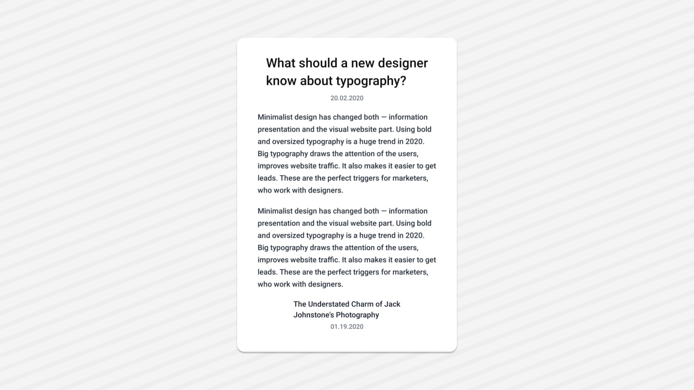

<Tabs items={['preview', 'code']}>
  <Tab value="preview">
    
  </Tab>
  <Tab value="code">
    ```ts
   import { Text } from "@/components/ui/text";
import React from "react";
import { View } from "react-native";
export default function TextDemo() {

  return (
    <View className="flex-1  justify-center items-center p-6 bg-white">
      <Text className="text-2xl font-semibold leading-snug mb-2 text-black">
        What should a new designer{'\n'}know about typography?
      </Text>

      <Text className="text-xs text-gray-500 mb-4">20.02.2020</Text>

      <Text className="text-sm text-gray-800 mb-4 leading-relaxed">
        Minimalist design has changed both — information{'\n'}
        presentation and the visual website part. Using bold{'\n'}
        and oversized typography is a huge trend in 2020.{'\n'}
        Big typography draws the attention of the users,{'\n'}
        improves website traffic. It also makes it easier to get{'\n'}
        leads. These are the perfect triggers for marketers,{'\n'}
        who work with designers.
      </Text>

      <Text className="text-sm text-gray-800 mb-4 leading-relaxed">
        Minimalist design has changed both — information{'\n'}
        presentation and the visual website part. Using bold{'\n'}
        and oversized typography is a huge trend in 2020.{'\n'}
        Big typography draws the attention of the users,{'\n'}
        improves website traffic. It also makes it easier to get{'\n'}
        leads. These are the perfect triggers for marketers,{'\n'}
        who work with designers.
      </Text>

      <Text className="text-sm font-semibold text-gray-900 mb-1">
        The Understated Charm of Jack{'\n'}Johnstone's Photography
      </Text>

      <Text className="text-xs text-gray-500">01.19.2020</Text>
    </View>
  );
}
    ```
  </Tab>
</Tabs>

## Installation

<Tabs items={['cli','manual', ]}>
 
  <Tab value="cli">
  ```ts
npx appykit@latest add text
```
  </Tab>
  <Tab value="manual">
   
<Steps>

<Step>
Install the following dependencies:
```shell
npx expo install @rn-primitives/types
npx expo install @rn-primitives/slot
```

</Step>
<Step>
Create a folder named `ui` under component folder in your project and add the following code in a file named `text.tsx`:
```ts
import { cn } from '@/lib/utils';
import * as Slot from '@rn-primitives/slot';
import { cva, type VariantProps } from 'class-variance-authority';
import * as React from 'react';
import { Platform, Text as RNText, type Role } from 'react-native';
 
const textVariants = cva(
  cn(
    'text-foreground text-base',
    Platform.select({
      web: 'select-text',
    })
  ),
  {
    variants: {
      variant: {
        default: '',
        h1: cn(
          'text-center text-4xl font-extrabold tracking-tight',
          Platform.select({ web: 'scroll-m-20 text-balance' })
        ),
        h2: cn(
          'border-border border-b pb-2 text-3xl font-semibold tracking-tight',
          Platform.select({ web: 'scroll-m-20 first:mt-0' })
        ),
        h3: cn('text-2xl font-semibold tracking-tight', Platform.select({ web: 'scroll-m-20' })),
        h4: cn('text-xl font-semibold tracking-tight', Platform.select({ web: 'scroll-m-20' })),
        p: 'mt-3 leading-7 sm:mt-6',
        blockquote: 'mt-4 border-l-2 pl-3 italic sm:mt-6 sm:pl-6',
        code: cn(
          'bg-muted relative rounded px-[0.3rem] py-[0.2rem] font-mono text-sm font-semibold'
        ),
        lead: 'text-muted-foreground text-xl',
        large: 'text-lg font-semibold',
        small: 'text-sm font-medium leading-none',
        muted: 'text-muted-foreground text-sm',
      },
    },
    defaultVariants: {
      variant: 'default',
    },
  }
);
 
type TextVariantProps = VariantProps<typeof textVariants>;
 
type TextVariant = NonNullable<TextVariantProps['variant']>;
 
const ROLE: Partial<Record<TextVariant, Role>> = {
  h1: 'heading',
  h2: 'heading',
  h3: 'heading',
  h4: 'heading',
  blockquote: Platform.select({ web: 'blockquote' as Role }),
  code: Platform.select({ web: 'code' as Role }),
};
 
const ARIA_LEVEL: Partial<Record<TextVariant, string>> = {
  h1: '1',
  h2: '2',
  h3: '3',
  h4: '4',
};
 
const TextClassContext = React.createContext<string | undefined>(undefined);
 
function Text({
  className,
  asChild = false,
  variant = 'default',
  ...props
}: React.ComponentProps<typeof RNText> &
  TextVariantProps &
  React.RefAttributes<RNText> & {
    asChild?: boolean;
  }) {
  const textClass = React.useContext(TextClassContext);
  const Component = asChild ? Slot.Text : RNText;
  return (
    <Component
      className={cn(textVariants({ variant }), textClass, className)}
      role={variant ? ROLE[variant] : undefined}
      aria-level={variant ? ARIA_LEVEL[variant] : undefined}
      {...props}
    />
  );
}
 
export { Text, TextClassContext };

```

</Step>


<Step>
Update the import paths to match your project setup.
</Step>

</Steps>

  </Tab>


</Tabs>

## Usage

```tsx
import { Text } from "@/components/ui/text";
````

```tsx
<Text>Text</Text>
```
