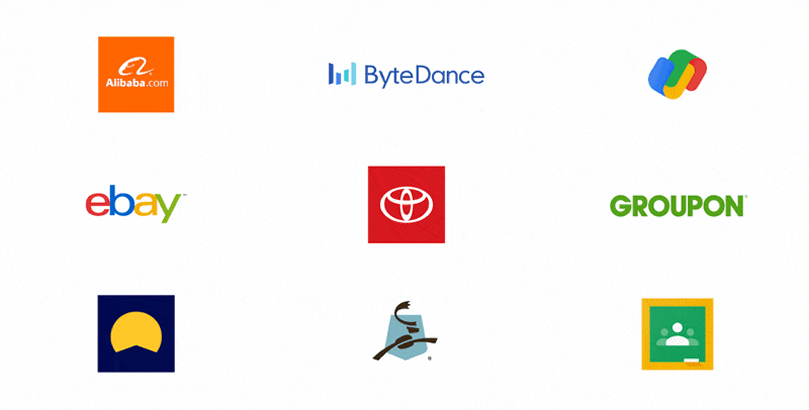
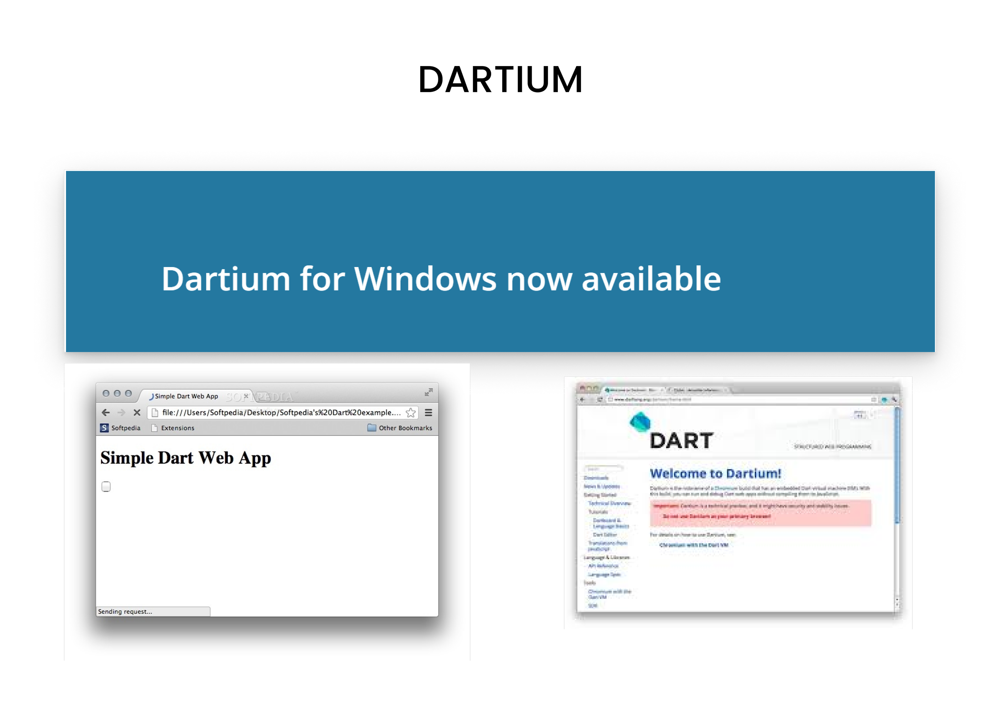

import { ImageZoom } from 'fumadocs-ui/components/image-zoom';

<iframe
  width="100%" 
  height="400"
  src="https://www.youtube.com/embed/bRcnbiqwtQE"
  title="Understanding Hive in Flutter"
  frameBorder="0"
  allow="accelerometer; autoplay; clipboard-write; encrypted-media; gyroscope; picture-in-picture"
  allowFullScreen
/>

<Callout type="info">
Welcome to the Dart programming series! By the end of this course, you'll have a solid foundation in Dart and be ready to build Flutter apps.
</Callout>

## What is Dart?

Dart is a programming language developed by Google, primarily used to build **Flutter applications**. Flutter is an open-source UI framework that allows you to create cross-platform apps for mobile, web, and desktop from a single codebase.

<Callout type="tip">
Many popular apps like Google Pay, Alibaba, and BMW apps are built using Flutter and Dart!
</Callout>

---

## The History of Dart

<Steps>

<Step>
### 2011: The Birth of Dart

Google introduced Dart as a potential replacement for JavaScript. The goal was to address several limitations:

- JavaScript was **slow** for large, complex web applications
- Being **dynamically typed**, it was prone to runtime errors
- Limited **debugging tools** available
- **Scalability issues** for large codebases

</Step>

<Step>
### The Dartium Browser

Google created a browser called **Dartium** with a built-in Dart VM to run Dart code directly without transpiling to JavaScript.

<Callout type="warn">
This approach ultimately failed due to lack of browser vendor support from Mozilla, Apple, and Microsoft.
</Callout>

</Step>

<Step>
### Dart's Comeback with Flutter

When Google decided to create Flutter, they chose Dart as its foundation. Now Dart powers one of the most popular cross-platform frameworks in the world!

</Step>

</Steps>

---

## Why Learn Dart?

<Accordions type="single">

<Accordion title="One Language, Multiple Platforms">
With Dart and Flutter, you can write code **once** and deploy it across:
- iOS and Android mobile apps
- Web applications
- Desktop apps (Windows, macOS, Linux)
</Accordion>

<Accordion title="High Performance">
Dart features **Ahead-of-Time (AOT) compilation**, which means Flutter apps run at native speed without the overhead of interpretation.
</Accordion>

<Accordion title="Strong Typing & Great Tooling">
Dart offers:
- **Strong typing** to catch errors at compile time
- Excellent IDE support in VS Code and Android Studio
- Built-in debugging and profiling tools
</Accordion>

<Accordion title="Clean, Easy-to-Learn Syntax">
If you know Java, JavaScript, or C#, you'll find Dart syntax very familiar and intuitive.
</Accordion>

</Accordions>

---

## Resources to Learn Dart

<Tabs items={['Official Resources', 'Online Tools', 'Video Courses']}>

<Tab value="Official Resources">

- **[dart.dev](https://dart.dev)** - Official Dart documentation with tutorials and API references
- **[flutter.dev](https://flutter.dev/docs)** - Flutter documentation (works hand-in-hand with Dart)

</Tab>

<Tab value="Online Tools">

- **[DartPad](https://dartpad.dev)** - Write, run, and share Dart code directly in your browser
- No installation required - perfect for learning and experimenting!
</Tab>

<Tab value="Video Courses">

- **[Dart And Flutter Series on YouTube](https://youtube.com/playlist?list=PL9eMLfd38heN2BbPEng6W9qBLl3oJAtwD&si=w_gsoYnIUSzFBLeR)** - Comprehensive video tutorials

</Tab>

</Tabs>

---

{/* ## What's Next?

In the next lesson, we'll dive into **Variables and Null Safety** - the fundamental building blocks of any Dart program. You'll learn:

- How to declare and use variables
- The difference between `var`, `dynamic`, `final`, and `const`
- What null safety is and why it matters

<Callout type="info">
Ready to start coding? Let's move on to the next lesson!
</Callout> */}