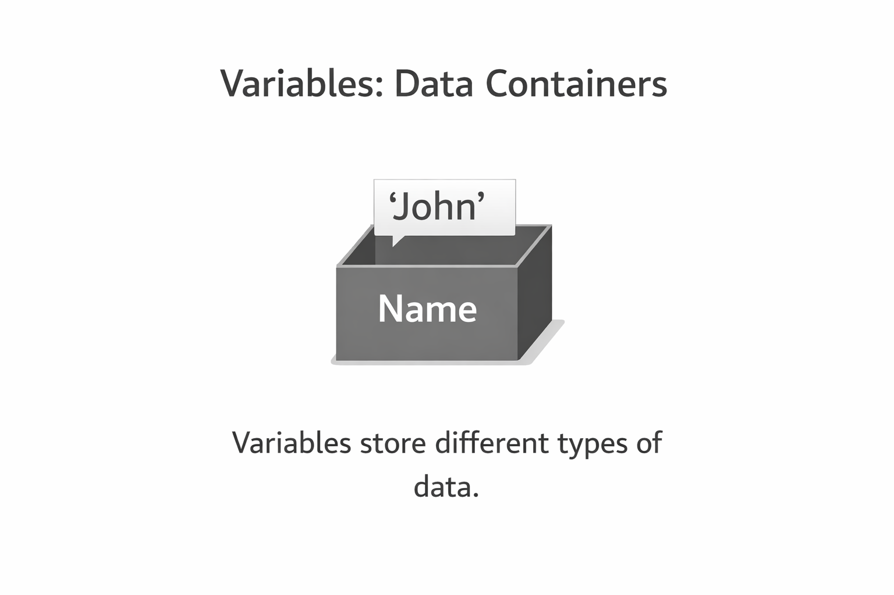

<iframe
  width="100%" 
  height="400"
  src="https://www.youtube.com/embed/2IdE_OBPzNI"
  title="Understanding Hive in Flutter"
  frameBorder="0"
  allow="accelerometer; autoplay; clipboard-write; encrypted-media; gyroscope; picture-in-picture"
  allowFullScreen
/>

<Callout type="info">
Before we start, open **[DartPad](https://dartpad.dev/)** in a new tab - it's a browser-based Dart editor where you can run all the code examples!
</Callout>

## What are Variables?

Variables are **containers** that store data values. Think of them like labeled boxes where you can put information and retrieve it later.

---

## Declaring Variables in Dart

<Steps>

<Step>
### Basic Syntax

A variable declaration starts with the **data type**, followed by the **variable name**, and the value assigned using `=`.

```dart
dataType variableName = value;
```


</Step>

<Step>
### Common Data Types

```dart
void main() {
  int age = 25;           // Integer (whole numbers)
  double height = 5.9;    // Double (decimal numbers)
  String name = 'John';   // String (text)
  bool isStudent = true;  // Boolean (true/false)

  print('Name: $name');
  print('Age: $age');
  print('Height: $height');
  print('Is Student: $isStudent');
}
```

<Callout type="tip">
This is called **statically typed** - we explicitly specify the data type during declaration.
</Callout>

</Step>

</Steps>
---

## Dynamic Variable Keywords

Dart provides several keywords for declaring variables with different behaviors:

<Tabs items={['var', 'dynamic', 'const', 'final']}>

<Tab value="var">

### Using `var`

Use when you want to declare a variable that can be **reassigned** but maintains its inferred type.

```dart
void main() {
  var city = 'New York';  // Inferred as String
  print('City: $city');

  city = 'Los Angeles';   // OK - same type
  print('Updated City: $city');
  
  // city = 123;  // ERROR - can't change type!
}
```

</Tab>

<Tab value="dynamic">

### Using `dynamic`

Use when you need a variable that can hold **any type** and can change types at runtime.

```dart
void main() {
  dynamic data = 42;       // Integer
  print('Data: $data');

  data = 'Hello';          // Now a String - OK!
  print('Updated Data: $data');

  data = true;             // Now a Boolean - OK!
  print('Final Data: $data');
}
```

<Callout type="warn">
Use `dynamic` sparingly - you lose type safety and compile-time error checking!
</Callout>

</Tab>

<Tab value="const">

### Using `const`

Use for values that are **compile-time constants** and will never change.

```dart
void main() {
  const pi = 3.14159;     // Constant value
  print('Value of pi: $pi');

  // pi = 3.14;  // ERROR - cannot reassign const!
}
```

</Tab>

<Tab value="final">

### Using `final`

Similar to `const`, but the value can be determined at **runtime**.

```dart
void main() {
  final currentTime = DateTime.now();  // Set at runtime
  print('Current Time: $currentTime');

  // currentTime = DateTime.now();  // ERROR - cannot reassign!
}
```

<Callout type="info">
**const vs final**: Use `const` when the value is known at compile time. Use `final` when it's determined at runtime.
</Callout>

</Tab>

</Tabs>

---

## Null Safety in Dart

Null safety means variables **cannot be null by default** unless you explicitly allow it.

<Accordions type="single">

<Accordion title="Why Null Safety Matters">

Without null safety, accessing properties on a null variable causes runtime crashes:

```dart
void main() {
  int age = null;  // ERROR in null-safe Dart!
}
```

Null safety catches these errors at **compile time** instead of runtime.

</Accordion>

<Accordion title="Making Variables Nullable">

Add `?` after the type to allow null values:

```dart
void main() {
  int? age = null;  // OK - explicitly nullable
  print('Age: $age');  // Output: Age: null
}
```

</Accordion>

<Accordion title="The Null Assertion Operator (!)">

Use `!` to tell Dart you're certain a nullable value isn't null:

```dart
void main() {
  int? age = 25;
  int validAge = age!;  // Assert it's not null
  print('Valid Age: $validAge');
}
```

<Callout type="warn">
Be careful! If the value actually is null, using `!` will throw a runtime error.
</Callout>

</Accordion>

</Accordions>

---

## Bonus Tips

<Tabs items={['String Interpolation', 'Runtime Type Check']}>

<Tab value="String Interpolation">

### Embed variables in strings using `$`

```dart
void main() {
  String name = 'Alice';
  int age = 25;
  
  print('Hello, $name!');
  print('You are $age years old.');
  
  // For expressions, use ${}
  print('Next year you will be ${age + 1}');
}
```

</Tab>

<Tab value="Runtime Type Check">

### Check variable types

```dart
void main() {
  var number = 42;
  print('Type: ${number.runtimeType}');  // Output: int

  dynamic data = 'Hello';
  print('Is String: ${data is String}');  // Output: true
}
```

</Tab>

</Tabs>

---

## Summary

| Keyword | Mutable? | Type Changes? | When Assigned? |
|---------|----------|---------------|----------------|
| `var` | ✅ Yes | ❌ No | Runtime |
| `dynamic` | ✅ Yes | ✅ Yes | Runtime |
| `final` | ❌ No | ❌ No | Runtime |
| `const` | ❌ No | ❌ No | Compile time |

<Callout type="info">
**Up Next:** In the next lesson, we'll explore Control Flow in Dart - if statements, loops, and more!
</Callout>