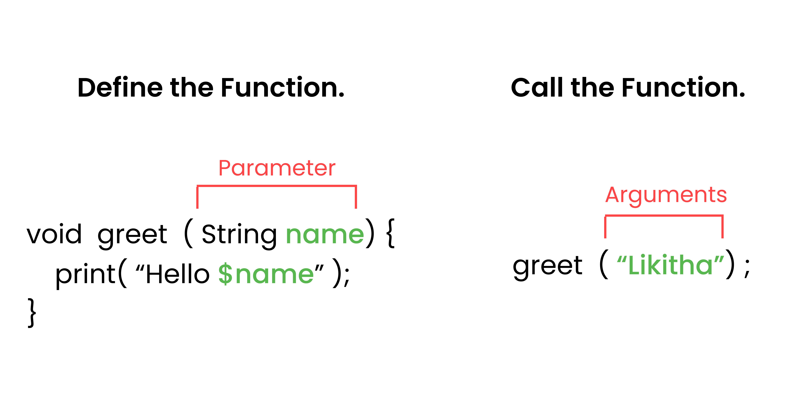

<iframe
  width="100%" 
  height="400"
  src="https://www.youtube.com/embed/tdk7J8uMn7g"
  title="Understanding Functions in Flutter"
  frameBorder="0"
  allow="accelerometer; autoplay; clipboard-write; encrypted-media; gyroscope; picture-in-picture"
  allowFullScreen
/>
<Callout type="info">
Before we start, open **[DartPad](https://dartpad.dev/)** - it's a browser-based Dart editor where you can run all the code examples!
</Callout>

## What are Functions?
- A function is a block of code that performs a specific task and can be reused multiple times throughout a program.


<Accordions type="single">

<Accordion title="Use of Functions">
-  Avoid code repetition by reusing the same function multiple times.
- Organize  code into smaller, manageable pieces.
- Make code easier to understand and maintain.
- Perform specific tasks.
</Accordion>


<Accordion title="Syntax of Functions">
A function in Dart is defined using a `returnType`, `functionName`, and optional `parameters`(optional) followed by the function body enclosed in curly braces `{}`.
```dart
void main(){
  // Function call
  String result = takeFive(10);
  print(result);
}

// Function definition
String takeFive(int number) {
  // Function body
  return 'Number is $number';
}
```


<Callout type="info">
Note: parameters are placeholders when a function is defined, and arguments are the actual values passed when the function is called.
</Callout>
</Accordion>

</Accordions>


---

## Types of Functions in Dart
<Steps>

<Step >
### Function without Return Type and without Parameters
```dart
void greet() {
  print('Hello, Welcome to Dart Functions!');
}
void main() {
  greet(); // Function call
}
```
</Step>

<Step>
###  Function with Return Type and without Parameters
```dart
int getRandomNumber() {
  return 42; //  Returning a fixed number
}
void main() {
  int number = getRandomNumber(); // Function call
  print('Random Number: $number');
}
```
</Step>

<Step>
### Function with Return Type and with Parameters
```dart
String greetUser(String name) {
  return 'Hello, $name! Welcome to Dart Functions.';
}
void main() {
  String message = greetUser('Alice'); // Function call with argument
  print(message);
}
```
</Step>

<Step>
###  Function with Optional Parameters
In Dart, you can define optional parameters using square brackets `[]`. These parameters can be omitted when calling the function.
```dart
void displayInfo(String name, [int? age]) {
  if (age != null) {
    print('Name: $name, Age: $age');
  } else {
    print('Name: $name, Age: Not provided');
  }
}
void main() {
  displayInfo('Bob', 25); // Calling with both parameters
  displayInfo('Charlie'); // Calling with only name
}
```
</Step>

<Step>
###  Function with Named Parameters 
In Dart, you can define named parameters using curly braces `{}`. When calling the function, you need to specify the parameter names.
```dart
void displayDetails({required String name, int? age}) {
  if (age != null) {
    print('Name: $name, Age: $age');
  } else {
    print('Name: $name, Age: Not provided');
  }
}
void main() {
  displayDetails(name: 'David', age: 30); // Calling with named parameters
  displayDetails(name: 'Eve'); // Calling with only name
}
```
</Step>

<Step>
### 6. Default Parameter Values
You can provide default values for optional parameters. If the caller does not provide a value, the default value will be used.
```dart
void greetUser(String name, {String greeting = 'Hello'}) {
  print('$greeting, $name!');
}
void main() {
  greetUser('Frank'); // Uses default greeting
  greetUser('Grace',greeting: 'Welcome'); // Uses custom greeting
}
```
</Step>


<Step>
### 7. Callback Functions
Functions can be passed as arguments to other functions. These are called callback functions.
```dart
void performOperation(int a, int b, Function operation) {
  int result = operation(a, b);
  print('Result: $result');
}
int add(int x, int y) {
  return x + y;
}
void main() {
  performOperation(5, 3, add); // Passing add function as a callback
}
```
</Step>

<Step>
### 8. Function as Variables
In Dart, functions are first-class citizens, which means you can assign them to variables.
```dart
void main() {
  // Assigning function to a variable
  Function multiply = (int x, int y) {
    return x * y;
  };

  // Calling the function using the variable
  int result = multiply(4, 5);
  print('Multiplication Result: $result');
}
```
</Step>


<Step>
### 8. Arrow Functions
- Arrow functions provide a shorthand syntax for defining functions that contain a single expression. They use the `=>` syntax.
```dart
void main() {
  // Arrow function
  Function multiply = (int x, int y) => x * y;

  int result = multiply(4, 5);
  print('Multiplication Result: $result');
}
```
</Step>

</Steps>

---

## Resources to Learn Dart


<Tabs items={['Official Resources', 'Online Tools', 'Video Courses']}>

<Tab value="Official Resources">

- **[dart.dev](https://dart.dev)** - Official Dart documentation with tutorials and API references
- **[flutter.dev](https://flutter.dev/docs)** - Flutter documentation (works hand-in-hand with Dart)

</Tab>

<Tab value="Online Tools">

- **[DartPad](https://dartpad.dev)** - Write, run, and share Dart code directly in your browser
- No installation required - perfect for learning and experimenting!
</Tab>

<Tab value="Video Courses">

- **[Dart And Flutter Series on YouTube](https://youtube.com/playlist?list=PL9eMLfd38heN2BbPEng6W9qBLl3oJAtwD&si=w_gsoYnIUSzFBLeR)** - Comprehensive video tutorials

</Tab>

</Tabs>

---


