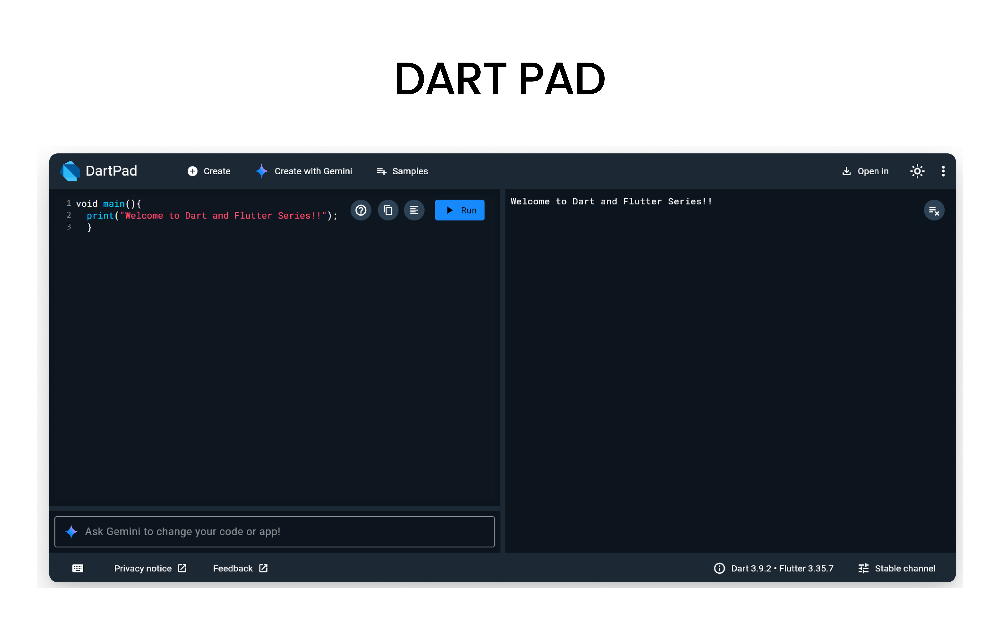

<iframe
  width="100%" 
  height="400"
  src="https://www.youtube.com/embed/TERHZrLOTpQ"
  title="Understanding Classes and Interfaces in Flutter"
  frameBorder="0"
  allow="accelerometer; autoplay; clipboard-write; encrypted-media; gyroscope; picture-in-picture"
  allowFullScreen
/>
<Callout type="info">
Before we start, open **[DartPad](https://dartpad.dev/)** - it's a browser-based Dart editor where you can run all the code examples!
</Callout>

## What are Classes in Dart?
- A class is a blueprint for creating objects. It defines the properties and behaviors (methods) that the objects created from the class will have.
- Example : Lets say your desgning a car, whats the common things we see in all cars , like windows, wheels, engine etc and whats the common actions like driving, braking, accelerating. So we can create a class Car which will have all these common properties and behaviors. 

<Steps>

<Step>
### How to Declare a Class in Dart?
- In Dart, you can declare a class using the `class` keyword followed by the class name and a pair of curly braces `{}` to define the body of the class.
```dart
class Car {
  // Properties
  String color;
  String model;
  
  // Method
  void drive() {
    print('The $color $model is driving.');
  }
}
```
</Step>


<Step>
### What are Objects in Dart?
- An object is an instance of a class. 
- If Class is considered as a blueprint, then object is the actual thing created using that blueprint.
- Continuation of the previous example, once we have the Car class defined, we can create objects (instances) of that class representing specific added features like air conditioning, sunroof etc. to the existing car class.
### How to Create an Object in Dart?
- You can create an object of a class using the `new` keyword followed by the class name and parentheses `()`. However, using `new` is optional in Dart.
```dart
void main() {
  // Creating an object of the Car class
  Car myCar = Car();
  
  // Setting properties
  myCar.color = 'Red';
  myCar.model = 'Toyota';
  
  // Calling method
  myCar.drive(); // Output: The Red Toyota is driving.
}
```
</Step>

<Step>
### What is Contructor in Dart?
- A constructor is default method that is called when an object of a class is created.- It is used to initialize the properties of the object.
- In Dart, a constructor has the same name as the class and does not have a return
- It helps to pass the agruments while creating the object.
```dart
class Car {
  // Properties
  String color;
  String model;
  
  // Constructor
  Car({required this.color, required this.model});
  
  // Method
  void drive() {
    print('The $color $model is driving.');
  }
}
void main() {
  // Creating an object of the Car class using constructor
  Car myCar = Car(color: 'Blue', model: 'Honda');
  
  // Calling method
  myCar.drive(); // Output: The Blue Honda is driving.
}

```
</Step>


<Step>
### What is Static variable and method in Dart?
- Static variables and methods belong to the class itself rather than to any specific instance (object) of the class.
- You can access static members using the class name without creating an object of the class.
### How to Declare Static variable and method in Dart?
- You can declare a static variable or method using the `static` keyword inside the class.

```dart
void main() {
  Car car1 = Car();
  Car car2 = Car();
  
  print('Number of cars created: ${Car.numberOfCars}'); // Output: Number of cars created: 50

  Car.displayCarsInfo();  // Output: Car details are displayed here.
}

class Car {
  // Static variable
  static int numberOfCars = 50;
  
  // Constructor
  Car() {
     print('Car created.');
  }
  
  // Static method
  static void displayCarsInfo() {
    print('Car details are displayed here.');
  }
}


```
</Step>

<Step>
### Optional Positional Parameters in Dart Constructor
- In Dart, you can define optional positional parameters (we use them when we want to make some parameters optional) in a constructor by enclosing them in square brackets `[]`.
```dart
class Car {
  String color;
  String model;
  
  // Constructor with optional positional parameters
  Car(this.color = 'White', [this.model = 'DefaultModel']);
  
  void displayInfo() {
    print('Car Color: $color, Model: $model');
  }
}
void main() {
  // Creating objects with and without optional parameters
  Car car1 = Car('Red', 'Toyota');
  Car car2 = Car('Blue');
  
  car1.displayInfo(); // Output: Car Color: Red, Model: Toyota
  car2.displayInfo(); // Output: Car Color: White, Model: DefaultModel
}
```
</Step>

<Step>

### Named Parameters in Dart Constructor
- In Dart, you can define named parameters (its use to give a name to the parameters) in a constructor by enclosing them in curly braces `{}`. Named parameters are optional by default, but you can make them required using the `required` keyword.
```dart
class Car {
  String color;
  String model;
  
  // Constructor with named parameters
  Car({required this.color, this.model = 'DefaultModel'});
  
  void displayInfo() {
    print('Car Color: $color, Model: $model');
  }
}
void main() {
  // Creating objects with named parameters
  Car car1 = Car(color: 'Red', model: 'Toyota');
  Car car2 = Car(color: 'Blue');
  
  car1.displayInfo(); // Output: Car Color: Red, Model: Toyota
  car2.displayInfo(); // Output: Car Color: Blue, Model: DefaultModel
}
```
</Step>

<Step>
### Named Constructor in Dart
- A named constructor allows you to create multiple constructors for a class with different names.
```dart
class Car {
  String color;
  String model;
  
  // Default constructor
  Car(this.color, this.model);
  
  // Named constructor
  Car.redCar() {
    color = 'Red';
    model = 'DefaultModel';
  }
  
  void displayInfo() {
    print('Car Color: $color, Model: $model');
  }
}
void main() {
  // Creating objects using default and named constructors
  Car car1 = Car('Blue', 'Honda');
  Car car2 = Car.redCar();
  
  car1.displayInfo(); // Output: Car Color: Blue, Model: Honda
  car2.displayInfo(); // Output: Car Color: Red, Model: DefaultModel
}
```
</Step>

<Step>
## What are Interfaces in Dart?
-  Its a list of rules that class must implement.
- Its says "Any class that implements this interface must provide implementations for all the methods defined in the interface."
- Every class automatically defines an interface, which other classes can implement.
- In Interface there are main two things:
  1. `Public things`
  2. `Private things`
- Only public things are available to the other classes that implement the interface.
- Private things are not available to the other classes that implement the interface and these are denoted by underscore (_) before the name.
</Step>

</Steps>
---

## Resources to Learn Dart


<Tabs items={['Official Resources', 'Online Tools', 'Video Courses']}>

<Tab value="Official Resources">

- **[dart.dev](https://dart.dev)** - Official Dart documentation with tutorials and API references
- **[flutter.dev](https://flutter.dev/docs)** - Flutter documentation (works hand-in-hand with Dart)

</Tab>

<Tab value="Online Tools">

- **[DartPad](https://dartpad.dev)** - Write, run, and share Dart code directly in your browser
- No installation required - perfect for learning and experimenting!
</Tab>

<Tab value="Video Courses">

- **[Dart And Flutter Series on YouTube](https://youtube.com/playlist?list=PL9eMLfd38heN2BbPEng6W9qBLl3oJAtwD&si=w_gsoYnIUSzFBLeR)** - Comprehensive video tutorials

</Tab>

</Tabs>

---
