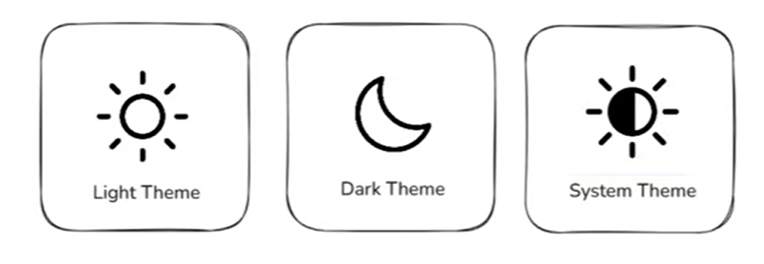
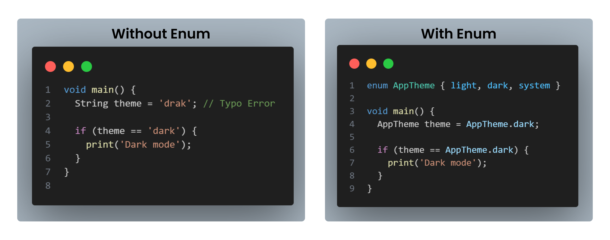
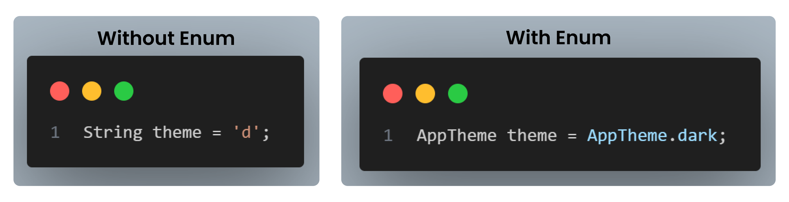
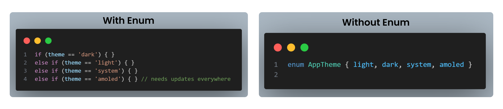

<iframe
  width="100%" 
  height="400"
  src="https://www.youtube.com/embed/z42UjM-pS9M"
  title="Understanding Enums in Dart"
  frameBorder="0"
  allow="accelerometer; autoplay; clipboard-write; encrypted-media; gyroscope; picture-in-picture"
  allowFullScreen
/>
<Callout type="info">
Before we start, open **[DartPad](https://dartpad.dev/)** - it's a browser-based Dart editor where you can run all the code examples!
</Callout>

## What are Enum in Dart?
- An enum is a fixed set of named values.
In simple terms
- Use enum when a value can be only one of a few options
- It prevents using random strings or numbers
- Makes code safer, readable, and bug-free

--- 

## Real-World Example
- We all have seen the themes in apps like Light mode, Dark mode, System default mode.
- We can create an enum ThemeMode with these three options.



<Steps>
<Step>
### Create an Enum

``` dart
enum AppTheme {
  light,
  dark,
  system,
}
<Callout type="info">
Enums are defined using the `enum` keyword followed by the name and the list of values inside curly braces.
</Callout>
```
</Step>


<Step>
### Use the Enum

``` dart
void main() {
  AppTheme selectedTheme = AppTheme.dark;

  if (selectedTheme == AppTheme.dark) {
    print('Dark mode enabled');
  }
}
```
<Callout type="info">
`AppTheme` is the enum that we have created. We can use it to set and check the theme mode in our app.
</Callout>

</Step>

</Steps>

## Benefits of Using Enums
<Steps>

<Step >
**Type Safety** : Prevents invalid values



<Callout type="info"> With enums, Dart won’t allow invalid values like `drak`. Only `light`, `dark`, or `system` are allowed. </Callout> 

</Step>
---

<Step >
**Readability** : Clear and meaningful names

<Callout type="info"> Enums make your code self-explanatory, even for beginners. </Callout>
</Step>


---
<Step >
**Maintainability** : Easy to update and manage options


<Callout type="info"> Enums centralize all options in one place, making future changes easy and safe. </Callout>
</Step>
</Steps>


---
## Resources to Learn Dart


<Tabs items={['Official Resources', 'Online Tools', 'Video Courses']}>

<Tab value="Official Resources">

- **[dart.dev](https://dart.dev)** - Official Dart documentation with tutorials and API references
- **[flutter.dev](https://flutter.dev/docs)** - Flutter documentation (works hand-in-hand with Dart)

</Tab>

<Tab value="Online Tools">

- **[DartPad](https://dartpad.dev)** - Write, run, and share Dart code directly in your browser
- No installation required - perfect for learning and experimenting!
</Tab>

<Tab value="Video Courses">

- **[Dart And Flutter Series on YouTube](https://youtube.com/playlist?list=PL9eMLfd38heN2BbPEng6W9qBLl3oJAtwD&si=w_gsoYnIUSzFBLeR)** - Comprehensive video tutorials

</Tab>

</Tabs>

---
