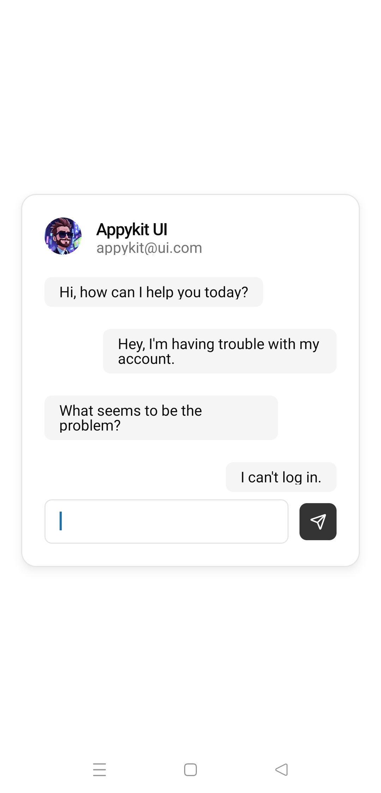
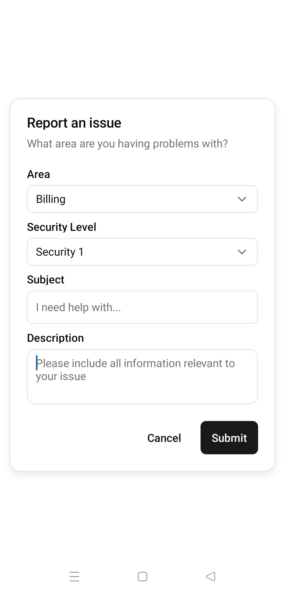
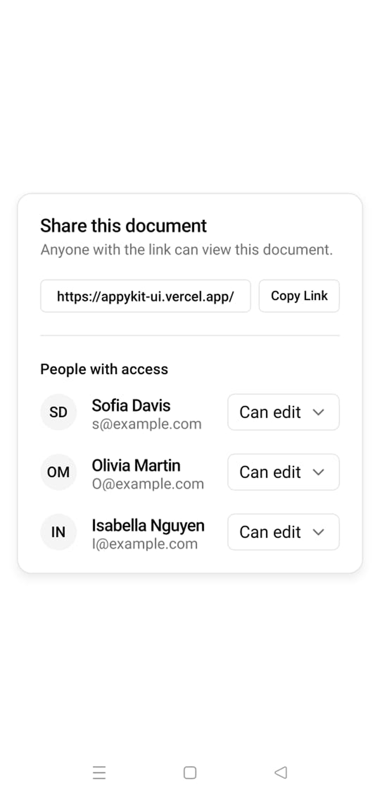
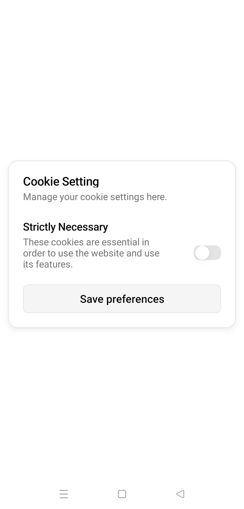
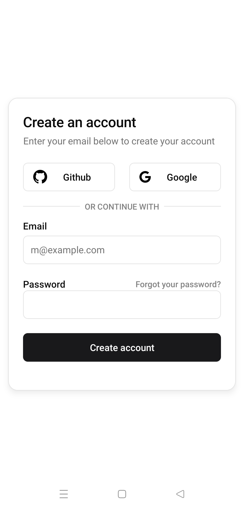
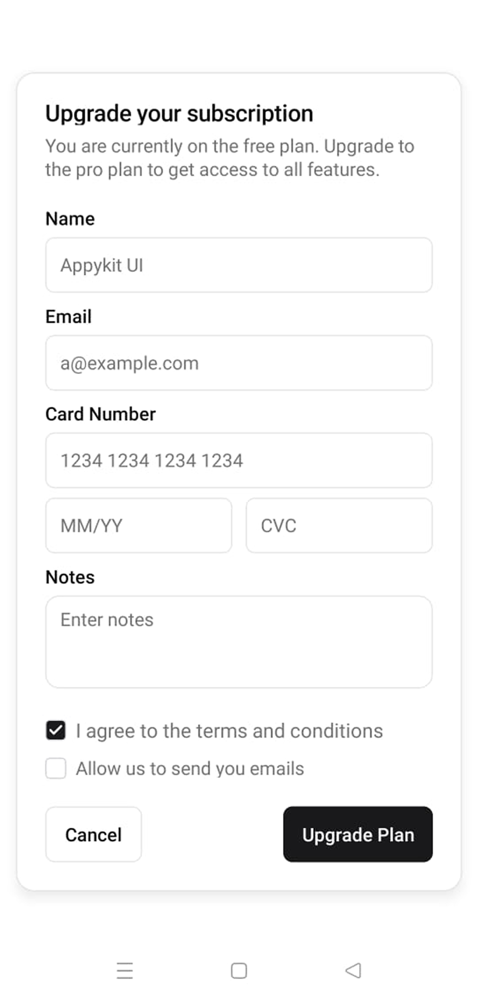
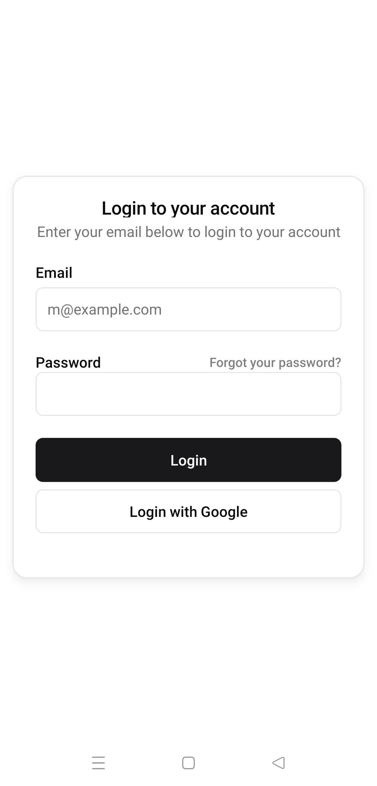
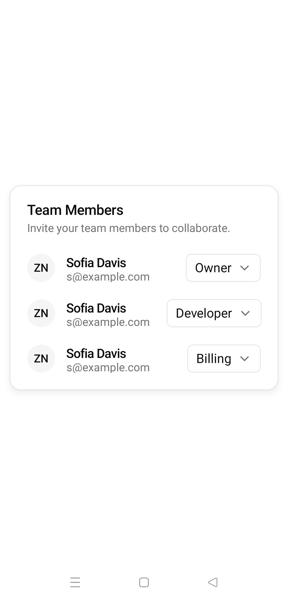

<BlocksHeroSection/ >

<div className='grid grid-cols-3 gap-4'>

<Tabs items={["preview", "code"]}>
  <Tab value="preview"></Tab>
  <Tab value="code">
```ts
working in progress
```
  </Tab>
</Tabs>
<Tabs items={["preview", "code"]}>
  <Tab value="preview"></Tab>
  <Tab value="code">
```ts
working in progress
```
  </Tab>
</Tabs>

<Tabs items={["preview", "code"]}>
  <Tab value="preview"></Tab>
  <Tab value="code">
```ts
working in progress
```
  </Tab>
</Tabs>

<Tabs items={["preview", "code"]}>
  <Tab value="preview"></Tab>
  <Tab value="code">
```ts
working in progress
```
  </Tab>
</Tabs>

<Tabs items={["preview", "code"]}>
  <Tab value="preview"></Tab>
  <Tab value="code">
```ts
working in progress
```
  </Tab>
</Tabs>

<Tabs items={["preview", "code"]}>
  <Tab value="preview"></Tab>
  <Tab value="code">
```ts
working in progress
```
  </Tab>
</Tabs>

<Tabs items={["preview", "code"]}>
  <Tab value="preview"></Tab>
  <Tab value="code">
```ts
working in progress
```
  </Tab>
</Tabs>
<Tabs items={["preview", "code"]}>
  <Tab value="preview"></Tab>
  <Tab value="code">
```ts
working in progress
```
  </Tab>
</Tabs>


</div>


