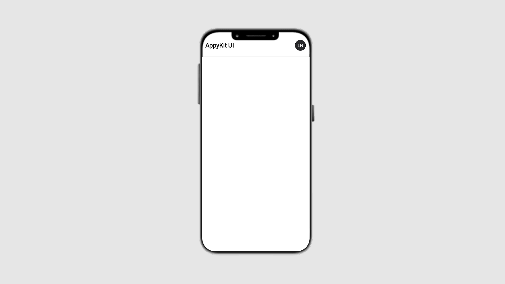

<BlocksHeroSection/ >

<div className='grid grid-cols-3 gap-4'>

<Tabs items={["preview", "code"]}>
  <Tab value="preview"></Tab>
  <Tab value="code">
```ts
working in progress
```
  </Tab>
</Tabs>
<Tabs items={["preview", "code"]}>
  <Tab value="preview"></Tab>
  <Tab value="code">
```ts
working in progress
```
  </Tab>
</Tabs>

<Tabs items={["preview", "code"]}>
  <Tab value="preview"></Tab>
  <Tab value="code">
```ts
working in progress
```
  </Tab>
</Tabs>
<Tabs items={["preview", "code"]}>
  <Tab value="preview"></Tab>
  <Tab value="code">
```ts
working in progress
```
  </Tab>
</Tabs>


<Tabs items={["preview", "code"]}>
  <Tab value="preview"></Tab>
  <Tab value="code">
  ```ts
import React from "react";
import { Alert, Text, TextInput, View } from "react-native";
import { Button } from "~/components/ui/button";
import { Checkbox } from "~/components/ui/checkbox";

export const InviteTeamBlock = () => {
  const [email, setEmail] = React.useState("");
  const [isAdmin, setIsAdmin] = React.useState(false);
  const [isLoading, setIsLoading] = React.useState(false);
  const [emailError, setEmailError] = React.useState("");

const validateEmail = (email) => {
const emailRegex = /^[^\s@]+@[^\s@]+\.[^\s@]+$/;
return emailRegex.test(email);
};

const handleEmailChange = (value) => {
setEmail(value);
if (emailError) {
setEmailError("");
}
};

const handleInvite = async () => {
if (!email.trim()) {
setEmailError("Email is required");
return;
}

    if (!validateEmail(email.trim())) {
      setEmailError("Please enter a valid email address");
      return;
    }

    setIsLoading(true);

    try {
      await new Promise(resolve => setTimeout(resolve, 1500));

      Alert.alert(
        "Invitation Sent!",
        `Invitation sent to ${email}${isAdmin ? " as admin" : ""}.`,
        [{ text: "OK" }]
      );

      setEmail("");
      setIsAdmin(false);
      setEmailError("");

    } catch (error) {
      Alert.alert("Error", "Failed to send invitation. Please try again.");
    } finally {
      setIsLoading(false);
    }

};

const isFormValid = email.trim() && !emailError && !isLoading;

return (

<View className="p-4 rounded-2xl bg-white shadow-md gap-4 w-full">
<Text className="text-xl font-semibold">Invite a Teammate</Text>
<Text className="text-gray-500">
Send an invite to someone to join your workspace.
</Text>

      <View className="gap-2">
        <TextInput
          placeholder="Enter email address"
          value={email}
          onChangeText={handleEmailChange}
          keyboardType="email-address"
          autoCapitalize="none"
          autoCorrect={false}
          editable={!isLoading}
          className={`px-4 py-3 border rounded-xl ${emailError
            ? "border-red-500 bg-red-50"
            : "border-gray-300 bg-white"}`}
        />
        {emailError ? (
          <Text className="text-red-500 text-sm ml-1">{emailError}</Text>
        ) : null}
      </View>

      <View className="flex-row items-center gap-3">
        <Checkbox
          className="border-gray-300 rounded-full"
          checked={isAdmin}
          onCheckedChange={() => setIsAdmin(!isAdmin)}
          disabled={isLoading}
        />
        <View className="flex-1">
          <Text className="font-medium">Add as admin</Text>
          <Text className="text-gray-500 text-sm">
            Admins can manage workspace settings and invite others
          </Text>
        </View>
      </View>

      <Button
        onPress={handleInvite}
        disabled={!isFormValid}
        className={`${!isFormValid
          ? "bg-gray-300"
          : "bg-blue-600 hover:bg-blue-700"}`}
      >
        <Text className="text-white font-medium">
          {isLoading ? "Sending..." : "Send Invite"}
        </Text>
      </Button>

      {email && validateEmail(email) && (
        <View className="bg-blue-50 p-3 rounded-xl">
          <Text className="text-blue-800 text-sm">
            📧 Invite will be sent to: <Text className="font-medium">{email}</Text>
            {isAdmin && (
              <Text className="text-blue-600"> (Admin privileges)</Text>
            )}
          </Text>
        </View>
      )}
    </View>

);
};

````
</Tab>
</Tabs>


<Tabs items={["preview", "code"]}>
  <Tab value="preview"></Tab>
  <Tab value="code">
  ```ts
import { Button } from "@/components/ui/button";
import { Checkbox } from "@/components/ui/checkbox";
import { Input } from "@/components/ui/input";
import { Plus, Trash } from "lucide-react-native";
import React, { useState } from "react";
import { FlatList, KeyboardAvoidingView, Platform, Text, View } from "react-native";

type TodoItem = { label: string; checked: boolean };

const TodoBlock = () => {
const [value, setValue] = useState("");
const [todos, setTodos] = useState<TodoItem[]>([]);

const handleAdd = () => {
if (!value.trim()) return;
setTodos([...todos, { label: value, checked: false }]);
setValue("");
};

const toggleCheck = (index: number) => {
const updated = todos.map((todo, i) =>
i === index ? { ...todo, checked: !todo.checked } : todo
);
setTodos(updated);
};

const handleDelete = (index: number) => {
const updated = todos.filter((\_, i) => i !== index);
setTodos(updated);
};

return (
<View className="gap-4 bg-white flex-1">
<KeyboardAvoidingView behavior={Platform.OS === "ios" ? "padding" : "height"} className="flex-row gap-2">
<Input
          className="flex-1 bg-white text-black"
          placeholder="Write something..."
          value={value}
          onChangeText={setValue}
        />
<Button className="w-12 bg-black" onPress={handleAdd}>
<Plus color="white" />
</Button>
</KeyboardAvoidingView>

      <FlatList
        data={todos}
        keyExtractor={(_, i) => i.toString()}
        ItemSeparatorComponent={() => <View className="h-2" />}
        ListEmptyComponent={() => <Text className="text-center text-black">No items yet</Text>}
        renderItem={({ item, index }) => (
          <View className="flex-row justify-between items-center bg-gray-100 p-4 rounded-md">
            <Text className="text-black">{item.label}</Text>
            <View className="flex-row gap-4 items-center">
              <Checkbox
                className="border-black border-[1.5px] rounded-full"
                checked={item.checked}
                onCheckedChange={() => toggleCheck(index)}
              />
              <Trash size={20} onPress={() => handleDelete(index)} />
            </View>
          </View>
        )}
      />
    </View>

);
};

export default TodoBlock;
  ```
  </Tab>
</Tabs>

<Tabs items={["preview", "code"]}>
<Tab value="preview"></Tab>
<Tab value="code">
```ts
import React from "react";
import { Text, View } from "react-native";
import { Avatar, AvatarFallback, AvatarImage } from "../ui/avatar";

const NavbarBlock = () => {
return (
  <View className="flex flex-row justify-between items-center px-4 py-2">
    <Text className="text-2xl font-bold text-black">onHabit</Text>
    <Avatar alt="User Avatar">
      <AvatarImage source={{ uri: "https://unsplash.com/photos/dog-holding-flower-2s6ORaJY6gI" }} />
      <AvatarFallback>
        <Text className="text-white">LN</Text>
      </AvatarFallback>
    </Avatar>
  </View>
);
};

export default NavbarBlock;

````

  </Tab>
</Tabs>

</div>


