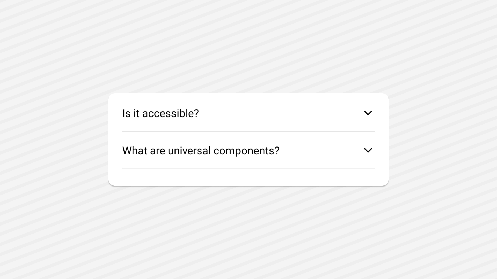

<Tabs items={['preview', 'code']}>
  <Tab value="preview">
  <div>
    
  </div>
  </Tab>
  <Tab value="code">
    ```ts
    import * as AccordionPrimitive from '@rn-primitives/accordion';
import { ChevronDown } from 'lucide-react-native';
import * as React from 'react';
import { Platform, Pressable, View } from 'react-native';
import Animated, {
  Extrapolation,
  FadeIn,
  FadeOutUp,
  LayoutAnimationConfig,
  LinearTransition,
  interpolate,
  useAnimatedStyle,
  useDerivedValue,
  withTiming,
} from 'react-native-reanimated';
import { TextClassContext } from '~/components/ui/text';
import { cn } from '~/lib/utils';

function Accordion({
  children,
  ...props
}: Omit<AccordionPrimitive.RootProps, 'asChild'> & {
  ref?: React.RefObject<AccordionPrimitive.RootRef>;
}) {
  return (
    <LayoutAnimationConfig skipEntering>
      <AccordionPrimitive.Root
        {...(props as AccordionPrimitive.RootProps)}
        asChild={Platform.OS !== 'web'}
      >
        <Animated.View layout={LinearTransition.duration(200)}>{children}</Animated.View>
      </AccordionPrimitive.Root>
    </LayoutAnimationConfig>
  );
}

function AccordionItem({
  className,
  value,
  ...props
}: AccordionPrimitive.ItemProps & {
  ref?: React.RefObject<AccordionPrimitive.ItemRef>;
}) {
  return (
    <Animated.View className={'overflow-hidden'} layout={LinearTransition.duration(200)}>
      <AccordionPrimitive.Item
        className={cn('border-b border-border ', className)}
        value={value}
        {...props}
      />
    </Animated.View>
  );
}

const Trigger = Platform.OS === 'web' ? View : Pressable;

function AccordionTrigger({
  className,
  children,
  ...props
}: AccordionPrimitive.TriggerProps & {
  children?: React.ReactNode;
  ref?: React.RefObject<AccordionPrimitive.TriggerRef>;
}) {
  const { isExpanded } = AccordionPrimitive.useItemContext();

  const progress = useDerivedValue(() =>
    isExpanded ? withTiming(1, { duration: 250 }) : withTiming(0, { duration: 200 })
  );
  const chevronStyle = useAnimatedStyle(() => ({
    transform: [{ rotate: `${progress.value * 180}deg` }],
    opacity: interpolate(progress.value, [0, 1], [1, 0.8], Extrapolation.CLAMP),
  }));

  return (
    <TextClassContext.Provider value='native:text-lg font-medium web:group-hover:underline'>
      <AccordionPrimitive.Header className='flex'>
        <AccordionPrimitive.Trigger {...props} asChild>
          <Trigger
            className={cn(
              'flex flex-row web:flex-1 items-center justify-between py-4 web:transition-all group web:focus-visible:outline-none web:focus-visible:ring-1 web:focus-visible:ring-muted-foreground',
              className
            )}
          >
            {children}
            <Animated.View style={chevronStyle}>
              <ChevronDown size={18} className={'text-foreground shrink-0'} />
            </Animated.View>
          </Trigger>
        </AccordionPrimitive.Trigger>
      </AccordionPrimitive.Header>
    </TextClassContext.Provider>
  );
}

function AccordionContent({
  className,
  children,
  ...props
}: AccordionPrimitive.ContentProps & {
  ref?: React.RefObject<AccordionPrimitive.ContentRef>;
}) {
  const { isExpanded } = AccordionPrimitive.useItemContext();
  return (
    <TextClassContext.Provider value='native:text-lg'>
      <AccordionPrimitive.Content
        className={cn(
          'overflow-hidden text-sm web:transition-all',
          isExpanded ? 'web:animate-accordion-down' : 'web:animate-accordion-up'
        )}
        {...props}
      >
        <InnerContent className={cn('pb-4', className)}>{children}</InnerContent>
      </AccordionPrimitive.Content>
    </TextClassContext.Provider>
  );
}

function InnerContent({ children, className }: { children: React.ReactNode; className?: string }) {
  if (Platform.OS === 'web') {
    return <View className={cn('pb-4', className)}>{children}</View>;
  }
  return (
    <Animated.View
      entering={FadeIn}
      exiting={FadeOutUp.duration(200)}
      className={cn('pb-4', className)}
    >
      {children}
    </Animated.View>
  );
}

export { Accordion, AccordionContent, AccordionItem, AccordionTrigger };


    ```
  </Tab>
</Tabs>


## Installation

<Tabs items={['cli','manual', ]}>
 
  <Tab value="cli">
  ```ts
npx shadcn@latest add accordion
```
  </Tab>
  <Tab value="manual">
   
<Steps>

{/* <Step>
Create the following folder structure in your project:
<Files>
  <Folder name="app" defaultOpen>
    <File name="layout.tsx" />
    <File name="page.tsx" />
  </Folder>
  <Folder name="components" defaultOpen>
  <Folder name="ui" defaultOpen>
  <File name="avatar.tsx" />
  </Folder>
    
  </Folder>
  <Folder name="lib" defaultOpen>
    <File name="utils.ts" />
  </Folder>
  <File name="package.json" />

</Files>
</Step> */}

<Step>
Install the following dependencies:
```shell
npx expo install @rn-primitives/accordion
```


</Step>
<Step>
Create a folder named `ui` under component folder in your project and add the following code in a file named `accordion.tsx`:
```ts
import * as AccordionPrimitive from '@rn-primitives/accordion';
import * as React from 'react';
import { Platform, Pressable, View } from 'react-native';
import Animated, {
  Extrapolation,
  FadeIn,
  FadeOutUp,
  LayoutAnimationConfig,
  LinearTransition,
  interpolate,
  useAnimatedStyle,
  useDerivedValue,
  withTiming,
} from 'react-native-reanimated';
import { TextClassContext } from '~/components/ui/text';
import { ChevronDown } from '~/lib/icons/ChevronDown';
import { cn } from '~/lib/utils';

function Accordion({
  children,
  ...props
}: Omit<AccordionPrimitive.RootProps, 'asChild'> & {
  ref?: React.RefObject<AccordionPrimitive.RootRef>;
}) {
  return (
    <LayoutAnimationConfig skipEntering>
      <AccordionPrimitive.Root
        {...(props as AccordionPrimitive.RootProps)}
        asChild={Platform.OS !== 'web'}
      >
        <Animated.View layout={LinearTransition.duration(200)}>{children}</Animated.View>
      </AccordionPrimitive.Root>
    </LayoutAnimationConfig>
  );
}

function AccordionItem({
  className,
  value,
  ...props
}: AccordionPrimitive.ItemProps & {
  ref?: React.RefObject<AccordionPrimitive.ItemRef>;
}) {
  return (
    <Animated.View className={'overflow-hidden'} layout={LinearTransition.duration(200)}>
      <AccordionPrimitive.Item
        className={cn('border-b border-border ', className)}
        value={value}
        {...props}
      />
    </Animated.View>
  );
}

const Trigger = Platform.OS === 'web' ? View : Pressable;

function AccordionTrigger({
  className,
  children,
  ...props
}: AccordionPrimitive.TriggerProps & {
  children?: React.ReactNode;
  ref?: React.RefObject<AccordionPrimitive.TriggerRef>;
}) {
  const { isExpanded } = AccordionPrimitive.useItemContext();

  const progress = useDerivedValue(() =>
    isExpanded ? withTiming(1, { duration: 250 }) : withTiming(0, { duration: 200 })
  );
  const chevronStyle = useAnimatedStyle(() => ({
    transform: [{ rotate: `${progress.value * 180}deg` }],
    opacity: interpolate(progress.value, [0, 1], [1, 0.8], Extrapolation.CLAMP),
  }));

  return (
    <TextClassContext.Provider value='native:text-lg font-medium web:group-hover:underline'>
      <AccordionPrimitive.Header className='flex'>
        <AccordionPrimitive.Trigger {...props} asChild>
          <Trigger
            className={cn(
              'flex flex-row web:flex-1 items-center justify-between py-4 web:transition-all group web:focus-visible:outline-none web:focus-visible:ring-1 web:focus-visible:ring-muted-foreground',
              className
            )}
          >
            {children}
            <Animated.View style={chevronStyle}>
              <ChevronDown size={18} className={'text-foreground shrink-0'} />
            </Animated.View>
          </Trigger>
        </AccordionPrimitive.Trigger>
      </AccordionPrimitive.Header>
    </TextClassContext.Provider>
  );
}

function AccordionContent({
  className,
  children,
  ...props
}: AccordionPrimitive.ContentProps & {
  ref?: React.RefObject<AccordionPrimitive.ContentRef>;
}) {
  const { isExpanded } = AccordionPrimitive.useItemContext();
  return (
    <TextClassContext.Provider value='native:text-lg'>
      <AccordionPrimitive.Content
        className={cn(
          'overflow-hidden text-sm web:transition-all',
          isExpanded ? 'web:animate-accordion-down' : 'web:animate-accordion-up'
        )}
        {...props}
      >
        <InnerContent className={cn('pb-4', className)}>{children}</InnerContent>
      </AccordionPrimitive.Content>
    </TextClassContext.Provider>
  );
}

function InnerContent({ children, className }: { children: React.ReactNode; className?: string }) {
  if (Platform.OS === 'web') {
    return <View className={cn('pb-4', className)}>{children}</View>;
  }
  return (
    <Animated.View
      entering={FadeIn}
      exiting={FadeOutUp.duration(200)}
      className={cn('pb-4', className)}
    >
      {children}
    </Animated.View>
  );
}

export { Accordion, AccordionContent, AccordionItem, AccordionTrigger };


```

</Step>


<Step>
Update the import paths to match your project setup.
</Step>

</Steps>
  
  </Tab>


</Tabs>

## Usage

```tsx
import {
  Accordion,
  AccordionContent,
  AccordionItem,
  AccordionTrigger,
} from "~/components/ui/accordion";
```
```tsx
   <Accordion type="single" collapsible className="w-full">
      <AccordionItem value="item-1">
        <AccordionTrigger>
          <Text>Is it accessible?</Text>
        </AccordionTrigger>
        <AccordionContent>
          <Text>Yes. It adheres to the WAI-ARIA design pattern.</Text>
        </AccordionContent>
      </AccordionItem>
    </Accordion>
```

