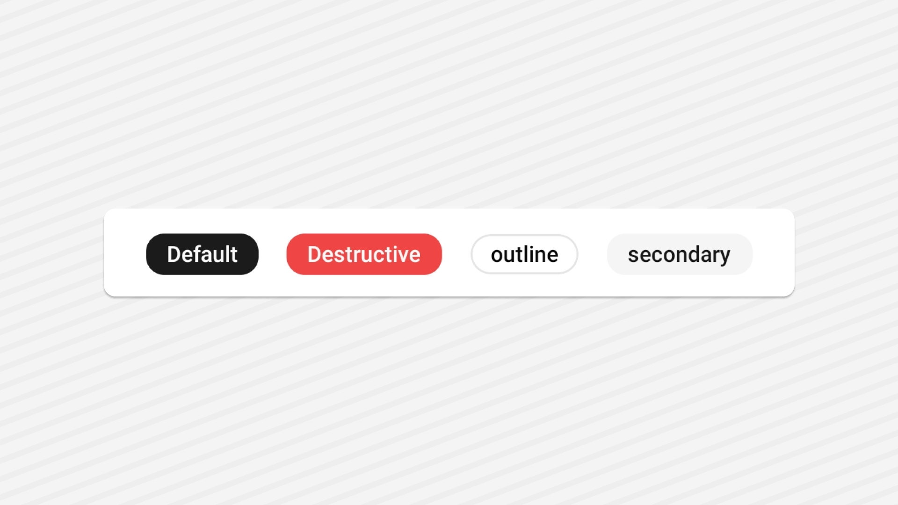

<Tabs items={['preview', 'code']}>
  <Tab value="preview">
    
  </Tab>
  <Tab value="code">
```tsx
import { Badge } from "@/components/ui/badge";
import { Text } from "@/components/ui/text";
import { View } from "react-native";
export default function BadgeDemo() {
  return (
    <View className="flex-1 flex-row gap-4 justify-center items-center bg-background p-5">
      <Badge>
        <Text>Default</Text>
      </Badge>
      <Badge variant={"destructive"}>
        <Text>Destructive</Text>
      </Badge>
      <Badge variant={"outline"}>
        <Text>outline</Text>
      </Badge>
      <Badge variant={"secondary"}>
        <Text>secondary</Text>
      </Badge>
    </View>
  );
}
```
  </Tab>
</Tabs>


## Installation

<Tabs items={['cli','manual', ]}>
 
  <Tab value="cli">
  ```ts
npx shadcn@latest add badge
```
  </Tab>
  <Tab value="manual">
   
<Steps>


<Step>
Install the following dependencies:
```shell
npx expo install @rn-primitives/slot
```


</Step>
<Step>
Create a folder named `ui` under component folder in your project and add the following code in a file named `badge.tsx`:
```ts
import * as Slot from '@rn-primitives/slot';
import { cva, type VariantProps } from 'class-variance-authority';
import { View, ViewProps } from 'react-native';
import { cn } from '~/lib/utils';
import { TextClassContext } from '~/components/ui/text';

const badgeVariants = cva(
  'web:inline-flex items-center rounded-full border border-border px-2.5 py-0.5 web:transition-colors web:focus:outline-none web:focus:ring-2 web:focus:ring-ring web:focus:ring-offset-2',
  {
    variants: {
      variant: {
        default: 'border-transparent bg-primary web:hover:opacity-80 active:opacity-80',
        secondary: 'border-transparent bg-secondary web:hover:opacity-80 active:opacity-80',
        destructive: 'border-transparent bg-destructive web:hover:opacity-80 active:opacity-80',
        outline: 'text-foreground',
      },
    },
    defaultVariants: {
      variant: 'default',
    },
  }
);

const badgeTextVariants = cva('text-xs font-semibold ', {
  variants: {
    variant: {
      default: 'text-primary-foreground',
      secondary: 'text-secondary-foreground',
      destructive: 'text-destructive-foreground',
      outline: 'text-foreground',
    },
  },
  defaultVariants: {
    variant: 'default',
  },
});

type BadgeProps = ViewProps & {
  asChild?: boolean;
} & VariantProps<typeof badgeVariants>;

function Badge({ className, variant, asChild, ...props }: BadgeProps) {
  const Component = asChild ? Slot.View : View;
  return (
    <TextClassContext.Provider value={badgeTextVariants({ variant })}>
      <Component className={cn(badgeVariants({ variant }), className)} {...props} />
    </TextClassContext.Provider>
  );
}

export { Badge, badgeTextVariants, badgeVariants };
export type { BadgeProps };

```

</Step>

<Step>
This component depends on the `Text` component.
Please follow the installation guide [here](/components/text) before using the `Badge`.

</Step>

<Step>
Update the import paths to match your project setup.
</Step>

</Steps>
  
  </Tab>


</Tabs>

## Usage

```tsx
import { Badge } from "@/components/ui/badge";
```
```tsx
<Badge>
  <Text>Badge</Text>
</Badge>
```

