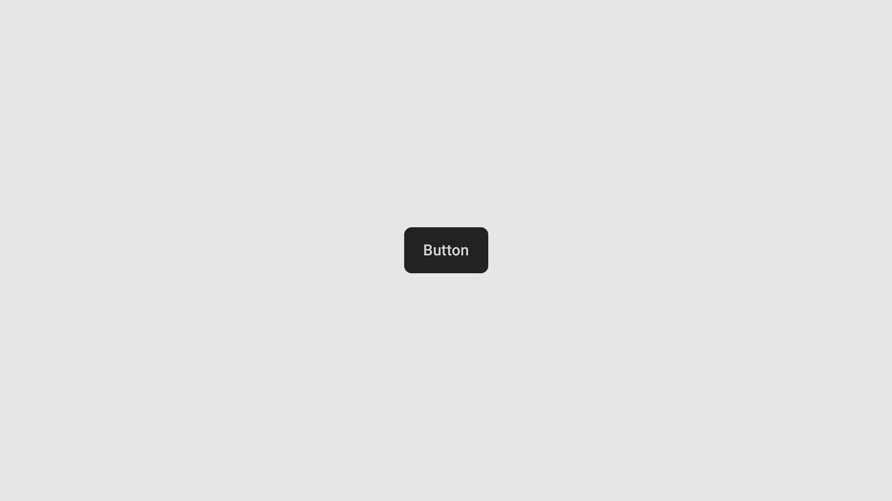
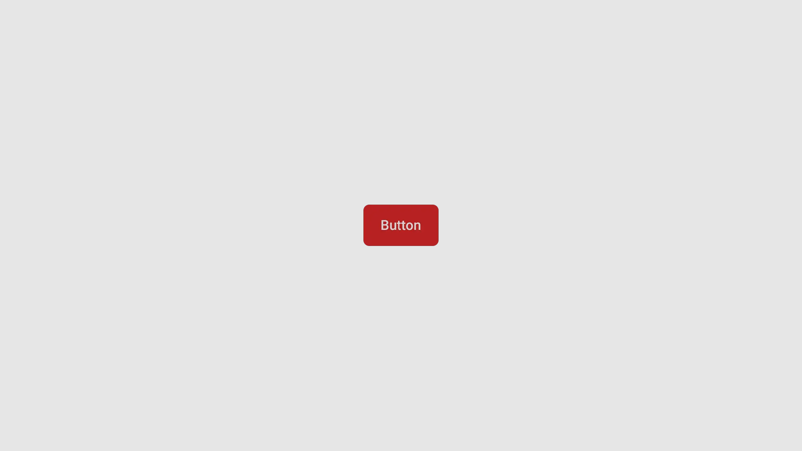
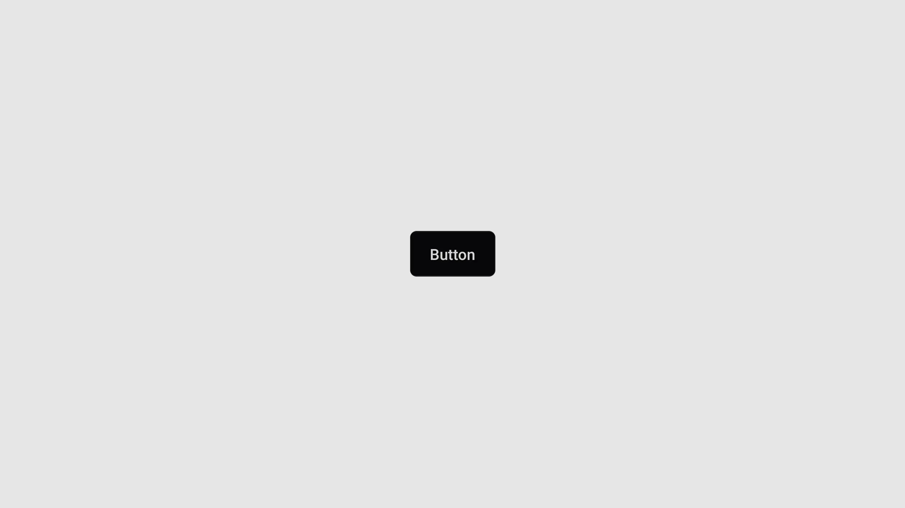

import { Step, Steps } from 'fumadocs-ui/components/steps';
import { File, Folder, Files } from 'fumadocs-ui/components/files';

## Preview


## Installation

<Tabs items={['manual','cli', ]}>
  <Tab value="manual">
   
<Steps>

<Step>
Create the following folder structure in your project:
<Files>
  <Folder name="app" defaultOpen>
    <File name="layout.tsx" />
    <File name="page.tsx" />
  </Folder>
  <Folder name="components" defaultOpen>
  <Folder name="ui" defaultOpen>
  <File name="button.tsx" />
  <File name="text.tsx" />
  </Folder>
    
  </Folder>
  <Folder name="lib" defaultOpen>
    <File name="utils.ts" />
  </Folder>
  <File name="package.json" />

</Files>
</Step>

<Step>
Install the following dependencies:
```shell
npx expo add tailwind-variants
npx expo install @rn-primitives/slot
npx expo install @rn-primitives/types
npx expo install clsx
npm install class-variance-authority
```
{/* TODO: add tabs for other installation purposes*/}

</Step>
<Step>
Create a folder named `ui` under component folder in your project and add the following code in a file named `button.tsx`:
```ts
import { cva, type VariantProps } from 'class-variance-authority';
import * as React from 'react';
import { Pressable } from 'react-native';
import { cn } from '../../lib/utils';
import { TextClassContext } from '../ui/text';

const buttonVariants = cva(
  'flex items-center justify-center rounded-md',
  {
    variants: {
      variant: {
        default: 'bg-primary active:opacity-90',
        destructive: 'bg-destructive active:opacity-90',
        outline: 'border border-input bg-background active:bg-accent',
        secondary: 'bg-secondary active:opacity-80',
      },
      size: {
        default: 'h-12 px-5 py-3',
        sm: 'h-9 rounded-md px-3',
        lg: 'h-14 rounded-md px-8',
        icon: 'h-10 w-10',
      },
    },
    defaultVariants: {
      variant: 'default',
      size: 'default',
    },
  }
);

const buttonTextVariants = cva(
  'text-base font-medium text-foreground',
  {
    variants: {
      variant: {
        default: 'text-primary-foreground',
        destructive: 'text-destructive-foreground',
        outline: '',
        secondary: 'text-secondary-foreground',
      },
      size: {
        default: '',
        sm: '',
        lg: 'text-lg',
        icon: '',
      },
    },
    defaultVariants: {
      variant: 'default',
      size: 'default',
    },
  }
);

type ButtonProps = React.ComponentProps<typeof Pressable> & VariantProps<typeof buttonVariants>;

function Button({ ref, className, variant, size, ...props }: ButtonProps) {
  return (
    <TextClassContext.Provider
      value={buttonTextVariants({ variant, size, className })}
    >
      <Pressable
        className={cn(
          props.disabled && 'opacity-50',
          buttonVariants({ variant, size, className })
        )}
        ref={ref}
        role='button'
        {...props}
      />
    </TextClassContext.Provider>
  );
}

export { Button, buttonTextVariants, buttonVariants };
export type { ButtonProps };


```

</Step>
<Step>
Create a folder named `ui` under component folder in your project and add the following code in a file named `text.tsx`:
```ts
import * as Slot from '@rn-primitives/slot';
import * as React from 'react';
import { Text as RNText } from 'react-native';
import { cn } from '~/lib/utils';

const TextClassContext = React.createContext<string | undefined>(undefined);

function Text({
  className,
  asChild = false,
  ...props
}: React.ComponentProps<typeof RNText> & {
  ref?: React.RefObject<RNText>;
  asChild?: boolean;
}) {
  const textClass = React.useContext(TextClassContext);
  const Component = asChild ? Slot.Text : RNText;
  return (
    <Component
      className={cn('text-base text-foreground ', textClass, className)}
      {...props}
    />
  );
}

export { Text, TextClassContext };

```
</Step>


<Step>
Update the import paths to match your project setup.
</Step>

</Steps>
  
  </Tab>
  <Tab value="cli">
  ```ts
npx shadcn@latest add ""
```
  </Tab>
</Tabs>


## Usage

```tsx
import { Button } from "@/components/ui/button"
```

```tsx
<Button className=" bg-black " >
  <Text className="text-white"> Button </Text>
</Button>
```

## Examples

### Secondary 
<Tabs  items={['Preview', 'Code']}>
  <Tab value="Preview">
  
  </Tab>
  <Tab value="Code">
  ```tsx
<Button className=" "variant="destructive">
<Text className=""> Button </Text>
</Button>
```
  </Tab>
</Tabs>


### Destructive
<Tabs  items={['Preview', 'Code']}>
  <Tab value="Preview">
  
  </Tab>
  <Tab value="Code">
```tsx
<Button className=" "variant="destructive">
<Text className=""> Button </Text>
</Button>
```
  </Tab>
</Tabs>


{/* ### Outline
<Tabs  items={['Preview', 'Code']}>
  <Tab value="Preview">
  
  </Tab>
  <Tab value="Code">
```tsx
<Button variant="outline">Button</Button>
```
  </Tab>
</Tabs> */}

{/* ### Icon 
```tsx */}

