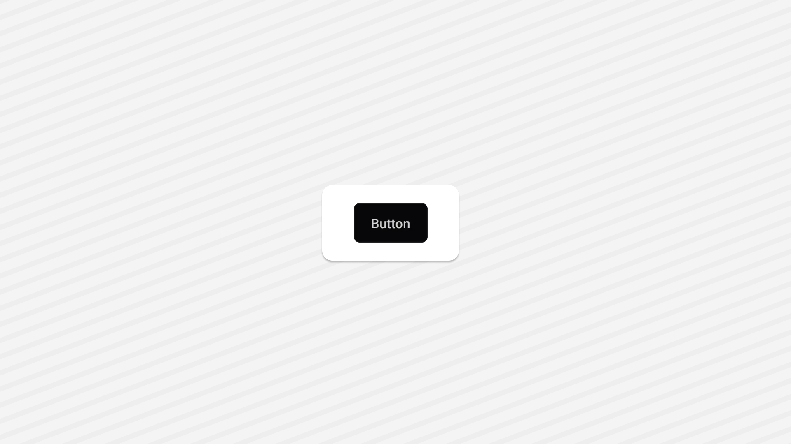

<Tabs items={['preview', 'code']}>
  <Tab value="preview">
    
  </Tab>
  <Tab value="code">
   ```ts
   import { Button } from "@/components/ui/button";
import { Text } from "@/components/ui/text";
import { Upload } from "lucide-react-native";
import { View } from "react-native";
export default function AccordionDemo() {
  return (
    <View className="flex-1  gap-4 justify-center items-center bg-background p-5">
      <Button variant={"outline"} size={"icon"}>
        <Upload size={15} />
      </Button>
      <Button>
        <Text>Default</Text>
      </Button>
      <Button variant={"secondary"}>
        <Text>secondary</Text>
      </Button>
      <Button variant={"outline"}>
        <Text>outline</Text>
      </Button>
      <Button variant={"destructive"}>
        <Text>destructive</Text>
      </Button>
      <Button size={"lg"}>
        <Text>Large Sized Buton</Text>
      </Button>
    </View>
  );
}
   ```
  </Tab>
</Tabs>


## Installation

<Tabs items={['cli','manual', ]}>
 
  <Tab value="cli">
  ```ts
npx shadcn@latest add button
```
  </Tab>
  <Tab value="manual">
   
<Steps>


<Step>
Create a folder named `ui` under component folder in your project and add the following code in a file named `button.tsx`:
```ts
import { cva, type VariantProps } from 'class-variance-authority';
import * as React from 'react';
import { Pressable } from 'react-native';
import { TextClassContext } from '~/components/ui/text';
import { cn } from '~/lib/utils';

const buttonVariants = cva(
  'inline-flex  gap-1 flex-row  items-center justify-center rounded-lg',
  
  {
    variants: {
      variant: {
        default: 'bg-primary active:opacity-90  hover:bg-primary/90',
        destructive: 'bg-destructive  active:opacity-90',
        outline: 'border border-input bg-background active:bg-accent',
        secondary: 'bg-secondary  active:opacity-80',

      },
      size: {
        default: 'h-12 px-4 py-2 ',
        //? has-[>svg]:bg-green-500  - find out how to to use this in nativewind, but it works on tailwind v4
        sm: 'h-9 rounded-md px-3 ',
        lg: 'h-12  rounded-md px-8  ',
        icon: 'size-10 ',
      },
    },
    defaultVariants: {
      variant: 'default',
      size: 'default',
    },
  }
);

const buttonTextVariants = cva(
  'text-sm font-medium text-center text-foreground whitespace-nowrap',
  {
    variants: {
      variant: {
        default: 'text-primary-foreground',
        destructive: 'text-destructive-foreground',
        outline: '',
        secondary: 'text-secondary-foreground',
      },
      size: {
        default: 'text-[14px] ',
        sm: '',
        lg: 'text-lg',
        icon: '',
      },
    },
    defaultVariants: {
      variant: 'default',
      size: 'default',
    },
  }
);

type ButtonProps = React.ComponentProps<typeof Pressable> & VariantProps<typeof buttonVariants>;

function Button({ ref, className, variant, size, ...props }: ButtonProps) {
  return (
    <TextClassContext.Provider
      value={buttonTextVariants({ variant, size, className })}
    >
      <Pressable
        className={cn(
          props.disabled && 'opacity-50',
          buttonVariants({ variant, size, className })
        )}
        ref={ref}
        role='button'
        {...props}
      />
    </TextClassContext.Provider>
  );
}

export { Button, buttonTextVariants, buttonVariants };
export type { ButtonProps };


```

</Step>


<Step>
This component depends on the `Text` component.
Please follow the installation guide [here](/components/text) before using the `Avatar`.

</Step>


<Step>
Update the import paths to match your project setup.
</Step>

</Steps>
  
  </Tab>


</Tabs>

## Usage

```tsx
import { Button } from "@/components/ui/button";
```
```tsx
<Button>
  <Text>Button</Text>
</Button>
```

