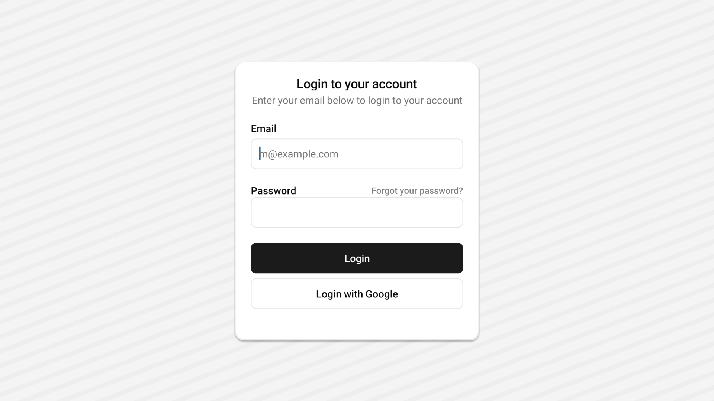

<Tabs items={['preview', 'code']}>
  <Tab value="preview">
    
  </Tab>
  <Tab value="code">
    ```ts
    import React from "react";
import { StyleSheet, View } from "react-native";
import {
  Card,
  CardContent,
  CardDescription,
  CardFooter,
  CardHeader,
  CardTitle,
} from "@/components/ui/card";
import { Button } from "../ui/button";
import { Input } from "../ui/input";
import { Text } from "../ui/text";
const CardDemo = () => {
  return (
    <View>
      <Card className="w-full max-w-sm ">
        <CardHeader className="">
          <CardTitle>Login to your account</CardTitle>
          <CardDescription>
            Enter your email below to login to your account
          </CardDescription>
        </CardHeader>
        <CardContent>
          <View className="flex flex-col gap-6">
            <View className="grid gap-2">
              <Text className="font-semibold">Email</Text>
              <Input
                keyboardType="email-address"
                autoCapitalize="none"
                autoCorrect={false}
                id="email"
                placeholder="m@example.com"
              />
            </View>
            <View className="">
              <View className="flex flex-row items-center justify-between">
                <Text className="font-semibold">Password</Text>
                <Text className="text-sm text-black/50">
                  Forgot your password?
                </Text>
              </View>
              <Input
                secureTextEntry
                autoCapitalize="none"
                autoCorrect={false}
                id="password"
              />
            </View>
          </View>
        </CardContent>
        <CardFooter className="flex-col gap-2">
          <Button className="w-full ">
            <Text className="text-[14px] ">Login</Text>
          </Button>
          <Button variant="outline" className="w-full">
            <Text className="text-[14px] ">Login with Google</Text>
          </Button>
        </CardFooter>
      </Card>
    </View>
  );
};

export default CardDemo;
    ```
  </Tab>
</Tabs>


## Installation

<Tabs items={['cli','manual', ]}>
 
  <Tab value="cli">
  ```ts
npx appykit@latest add card
```
  </Tab>
  <Tab value="manual">
   
<Steps>


<Step>
Create a folder named `ui` under component folder in your project and add the following code in a file named `card.tsx`:
```ts
import * as React from 'react';
import { Text, type TextProps, View, type ViewProps } from 'react-native';
import { TextClassContext } from '@/components/ui/text';
import { cn } from '@/lib/utils';

function Card({
  className,
  ...props
}: ViewProps & {
  ref?: React.RefObject<View>;
}) {
  return (
    <View
      className={cn(
        'rounded-2xl  border border-border bg-card shadow-md ',
        className
      )}
      {...props}
    />
  );
}

function CardHeader({
  className,
  ...props
}: ViewProps & {
  ref?: React.RefObject<View>;
}) {
  return <View className={cn('flex flex-col items-center justify-center gap-1 p-6 ', className)} {...props} />;
}

function CardTitle({
  className,
  ...props
}: TextProps & {
  ref?: React.RefObject<Text>;
}) {
  return (
    <Text
      role='heading'
      aria-level={3}
      className={cn(
        'text-xl text-card-foreground font-semibold leading-none tracking-tight',
        className
      )}
      {...props}
    />
  );
}

function CardDescription({
  className,
  ...props
}: TextProps & {
  ref?: React.RefObject<Text>;
}) {
  return <Text  className={cn('text-[14px] text-center leading-6 text-muted-foreground', className)} {...props} />;
}

function CardContent({
  className,
  ...props
}: ViewProps & {
  ref?: React.RefObject<View>;
}) {
  return (
    <TextClassContext.Provider value='text-card-foreground '>
      <View className={cn('p-6 pt-0', className)} {...props} />
    </TextClassContext.Provider>
  );
}

function CardFooter({
  className,
  ...props
}: ViewProps & {
  ref?: React.RefObject<View>;
}) {
  return <View className={cn('flex flex-row items-center p-6 pt-0', className)} {...props} />;
}

export { Card, CardContent, CardDescription, CardFooter, CardHeader, CardTitle };


```

</Step>

<Step>
This component depends on the `Text` component.
Please follow the installation guide [here](/components/text) before using the `Card`.

</Step>

<Step>
Update the import paths to match your project setup.
</Step>

</Steps>
  
  </Tab>


</Tabs>

## Usage

```tsx
import {
  Card,
  CardContent,
  CardDescription,
  CardFooter,
  CardHeader,
  CardTitle,
} from '@/components/ui/card';
```
```tsx
<Card className="w-full max-w-sm">
  <CardHeader>
    <CardTitle>Card Title</CardTitle>
    <CardDescription>Card Description</CardDescription>
  </CardHeader>
  <CardContent>
    <Text>Card Content</Text>
  </CardContent>
  <CardFooter>
    <Text>Card Footer</Text>
  </CardFooter>
</Card>
```
`
