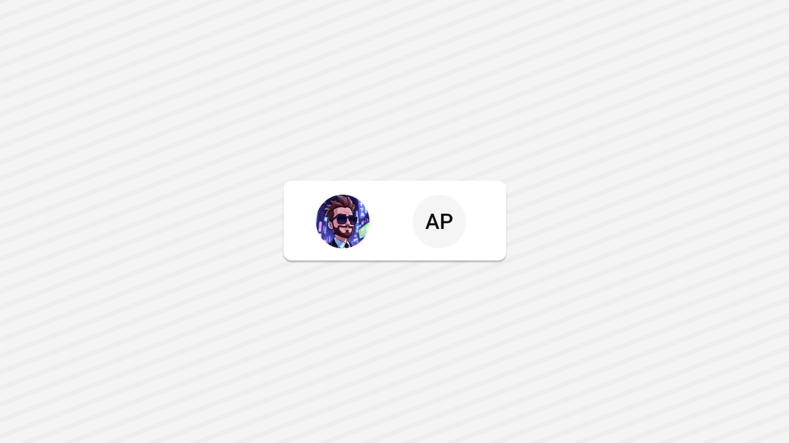

import { Step, Steps } from "fumadocs-ui/components/steps";
import { File, Folder, Files } from 'fumadocs-ui/components/files';


## Preview

{/*  */}

## Installation

<Tabs items={['manual','cli', ]}>
  <Tab value="manual">
   
<Steps>

{/* <Step>
Create the following folder structure in your project:
<Files>
  <Folder name="app" defaultOpen>
    <File name="layout.tsx" />
    <File name="page.tsx" />
  </Folder>
  <Folder name="components" defaultOpen>
  <Folder name="ui" defaultOpen>
  <File name="avatar.tsx" />
  </Folder>
    
  </Folder>
  <Folder name="lib" defaultOpen>
    <File name="utils.ts" />
  </Folder>
  <File name="package.json" />

</Files>
</Step> */}

<Step>
Install the following dependencies:
```shell
npx expo add tailwind-variants
npx expo install clsx
```
{/* TODO: add tabs for other installation purposes*/}

</Step>
<Step>
Create a folder named `ui` under component folder in your project and add the following code in a file named `card.tsx`:
```ts
import * as React from 'react';
import { Text, type TextProps, View, type ViewProps } from 'react-native';
import { cn } from '~/lib/utils';
import { TextClassContext } from '~/components/ui/text';

function Card({
  className,
  ...props
}: ViewProps & {
  ref?: React.RefObject<View>;
}) {
  return (
    <View
      className={cn(
        'rounded-lg border border-border bg-card shadow-sm shadow-foreground/10',
        className
      )}
      {...props}
    />
  );
}

function CardHeader({
  className,
  ...props
}: ViewProps & {
  ref?: React.RefObject<View>;
}) {
  return <View className={cn('flex flex-col space-y-1.5 p-6', className)} {...props} />;
}

function CardTitle({
  className,
  ...props
}: TextProps & {
  ref?: React.RefObject<Text>;
}) {
  return (
    <Text
      role='heading'
      aria-level={3}
      className={cn(
        'text-2xl text-card-foreground font-semibold leading-none tracking-tight',
        className
      )}
      {...props}
    />
  );
}

function CardDescription({
  className,
  ...props
}: TextProps & {
  ref?: React.RefObject<Text>;
}) {
  return <Text className={cn('text-sm text-muted-foreground', className)} {...props} />;
}

function CardContent({
  className,
  ...props
}: ViewProps & {
  ref?: React.RefObject<View>;
}) {
  return (
    <TextClassContext.Provider value='text-card-foreground'>
      <View className={cn('p-6 pt-0', className)} {...props} />
    </TextClassContext.Provider>
  );
}

function CardFooter({
  className,
  ...props
}: ViewProps & {
  ref?: React.RefObject<View>;
}) {
  return <View className={cn('flex flex-row items-center p-6 pt-0', className)} {...props} />;
}

export { Card, CardContent, CardDescription, CardFooter, CardHeader, CardTitle };

```

</Step>

<Step>
Create a folder named `ui` under component folder in your project and add the following code in a file named `text.tsx`:
```ts
import * as Slot from '@rn-primitives/slot';
import * as React from 'react';
import { Text as RNText } from 'react-native';
import { cn } from '~/lib/utils';

const TextClassContext = React.createContext<string | undefined>(undefined);

function Text({
  className,
  asChild = false,
  ...props
}: React.ComponentProps<typeof RNText> & {
  ref?: React.RefObject<RNText>;
  asChild?: boolean;
}) {
  const textClass = React.useContext(TextClassContext);
  const Component = asChild ? Slot.Text : RNText;
  return (
    <Component
      className={cn('text-base text-foreground ', textClass, className)}
      {...props}
    />
  );
}

export { Text, TextClassContext };

```
</Step>


<Step>
Create a utility function to merge class names. 
Create a file named `utils.ts` in your project and add the following code:
```ts
import { clsx, type ClassValue } from 'clsx';
import { twMerge } from 'tailwind-merge';

export function cn(...inputs: ClassValue[]) {
  return twMerge(clsx(inputs));
}
```
</Step>
<Step>
Update the import paths to match your project setup.
</Step>

</Steps>
  
  </Tab>
 
  <Tab value="cli">
  ```ts
npx shadcn@latest add ""
```
  </Tab>

</Tabs>

## Usage

```tsx
import { Avatar, AvatarFallback, AvatarImage } from "../ui/avatar";
```

```tsx
<Avatar alt="Zach Nugent's Avatar">
  <AvatarImage
    source={{
      uri: "https://github.com/mrzachnugent.png",
    }}
  />
  <AvatarFallback>
    <Text className="text-white">LN</Text>
  </AvatarFallback>
</Avatar>
```

## Examples
