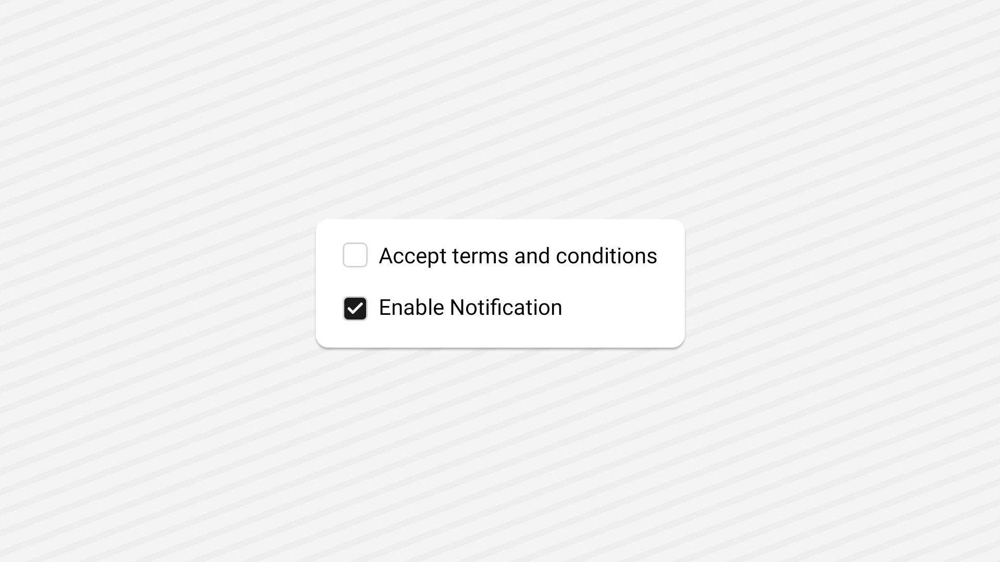

<Tabs items={['preview', 'code']}>
  <Tab value="preview">
    
  </Tab>
  <Tab value="code">
    ```ts
    import { Checkbox } from "@/components/ui/checkbox";
import React from "react";
import { Text, View } from "react-native";

export default function Demo() {
  const [checked, setChecked] = React.useState(false);
  const [checked2, setChecked2] = React.useState(false);
  return (
    <View className="flex-1   gap-4 justify-center items-start  bg-background p-20">
      <View className="flex-row items-center gap-2">
        <Checkbox checked={checked} onCheckedChange={setChecked} />
        <Text>Accept terms and conditions</Text>
      </View>
      <View className="flex-row    items-end gap-2">
        <Checkbox checked={checked2} onCheckedChange={setChecked2} />
        <Text>Enable Notification</Text>
      </View>
    </View>
  );
}
    ```
  </Tab>
</Tabs>


## Installation

<Tabs items={['cli','manual', ]}>
 
  <Tab value="cli">
  ```ts
npx shadcn@latest add checkbox
```
  </Tab>
  <Tab value="manual">
   
<Steps>


<Step>
Install the following dependencies:
```shell
npx expo install @rn-primitives/checkbox
```


</Step>
<Step>
Create a folder named `ui` under component folder in your project and add the following code in a file named `checkbox.tsx`:
```ts
import * as CheckboxPrimitive from '@rn-primitives/checkbox';
import * as React from 'react';
import { Platform } from 'react-native';
import { Check } from '~/lib/icons/Check';
import { cn } from '~/lib/utils';

function Checkbox({
  className,
  ...props
}: CheckboxPrimitive.RootProps & {
  ref?: React.RefObject<CheckboxPrimitive.RootRef>;
}) {
  return (
    <CheckboxPrimitive.Root
      className={cn(
        'web:peer h-4 w-4 native:h-[16] native:w-[16] shrink-0 rounded-sm native:rounded border border-gray-300   web:ring-offset-background web:focus-visible:outline-none web:focus-visible:ring-2 web:focus-visible:ring-ring web:focus-visible:ring-offset-2 disabled:cursor-not-allowed disabled:opacity-50',
        props.checked && 'bg-primary',
        className
      )}
      {...props}
    >
      <CheckboxPrimitive.Indicator className={cn('items-center justify-center h-full w-full')}>
        <Check
          size={12}
          strokeWidth={Platform.OS === 'web' ? 2.5 : 3.5}
          className='text-primary-foreground'
        />
      </CheckboxPrimitive.Indicator>
    </CheckboxPrimitive.Root>
  );
}

export { Checkbox };

```

</Step>


<Step>
Update the import paths to match your project setup.
</Step>

</Steps>
  
  </Tab>


</Tabs>

## Usage

```tsx
import { Checkbox } from "@/components/ui/checkbox";
```
```tsx
function CheckboxDemo() {
  const [checked, setChecked] = React.useState(false);
  return (
     <Checkbox checked={checked} onCheckedChange={setChecked} />
  );
}
```

