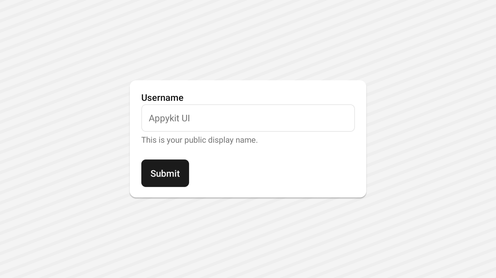

<Tabs items={['preview', 'code']}>
  <Tab value="preview">
    
  </Tab>
  <Tab value="code">
    ```ts
    import { Button } from "@/components/ui/button";
import { Input } from "@/components/ui/input";
import { Text } from "@/components/ui/text";
import React from "react";
import { View } from "react-native";

export default function InputDemo() {
  const [value, setValue] = React.useState("");

  const onChangeText = (text: string) => {
    setValue(text);
  };
  return (
    <View className="flex-1   gap-6 justify-center items-start bg-background p-5">
      <View className="w-full gap-1">
        <Text>Username</Text>
        <Input
          className=""
          placeholder="Appykit UI"
          value={value}
          onChangeText={onChangeText}
          aria-labelledby="inputLabel"
          aria-errormessage="inputError"
        />
        <Text className="font-normal text-muted-foreground text-sm">
          This is your public display name.
        </Text>
      </View>
      <Button>
        <Text className="">Submit</Text>
      </Button>
    </View>
  );
}

    ```
  </Tab>
</Tabs>


## Installation

<Tabs items={['cli','manual', ]}>
 
  <Tab value="cli">
  ```ts
npx shadcn@latest add input
```
  </Tab>
  <Tab value="manual">
   
<Steps>


<Step>
Create a folder named `ui` under component folder in your project and add the following code in a file named `input.tsx`:
```ts
import * as React from 'react';
import { TextInput, type TextInputProps } from 'react-native';
import { cn } from '~/lib/utils';

function Input({
  className,
  placeholderClassName,
  ...props
}: TextInputProps & {
  ref?: React.RefObject<TextInput>;
}) {
  return (
    <TextInput
      className={cn(
        'web:flex h-10 native:h-12 web:w-full rounded-lg border border-input bg-background px-3  web:py-2 text-base lg:text-sm native:text-[14px] native:leading-[1.25] text-foreground placeholder:text-muted-foreground web:ring-offset-background file:border-0 file:bg-transparent file:font-medium web:focus-visible:outline-none web:focus-visible:ring-2 web:focus-visible:ring-ring web:focus-visible:ring-offset-2',
        props.editable === false && 'opacity-50 web:cursor-not-allowed',
        className
      )}
      placeholderClassName={cn('text-muted-foreground', placeholderClassName)}
      {...props}
    />
  );
}

export { Input };


```

</Step>

<Step>
This component depends on the `Text` component.
Please follow the installation guide [here](/components/text) before using the `Input`.

</Step>


<Step>
Update the import paths to match your project setup.
</Step>

</Steps>
  
  </Tab>


</Tabs>

## Usage

```tsx
import { Input } from "@/components/ui/input";
```
```tsx
 <Input
  className="w-full"
  placeholder="Appykit UI"
  value={value}
  onChangeText={onChangeText}
  aria-labelledby="inputLabel"
  aria-errormessage="inputError"
/>
```

