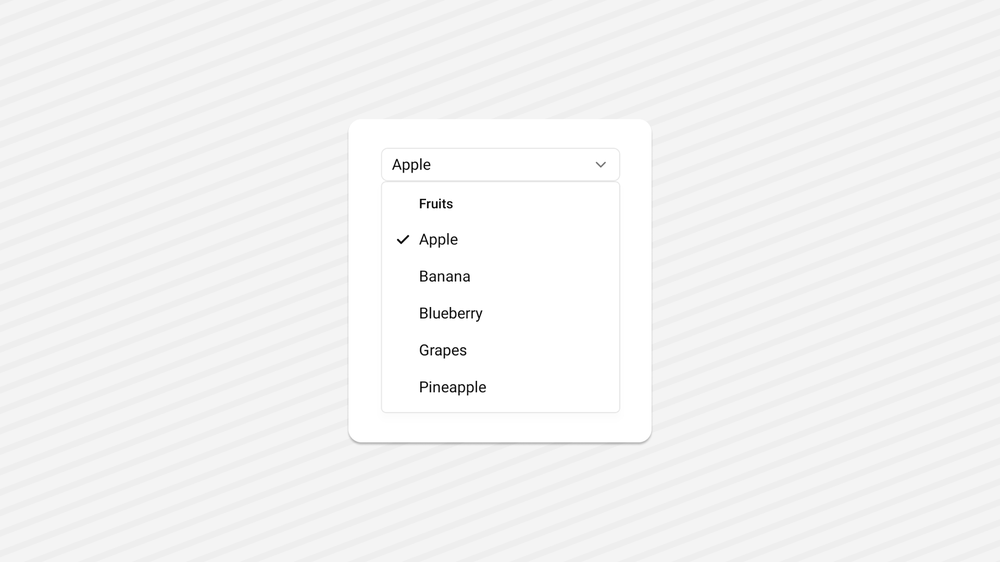

<Tabs items={['preview', 'code']}>
  <Tab value="preview">
    
  </Tab>
  <Tab value="code">
    ```ts
    import React from "react";
import { View } from "react-native";
import { useSafeAreaInsets } from "react-native-safe-area-context";
import {
  Select,
  SelectContent,
  SelectGroup,
  SelectItem,
  SelectLabel,
  SelectTrigger,
  SelectValue,
} from '~/components/ui/select';
export default function SelectDemo() {
  const insets = useSafeAreaInsets();
  const contentInsets = {
    top: insets.top,
    bottom: insets.bottom,
    left: 12,
    right: 12,
  };

  return (
    <View className="flex-1   gap-6 justify-center items-center bg-background p-5">
     <Select defaultValue={{ value: 'apple', label: 'Apple' }}>
      <SelectTrigger className='w-[250px]'>
        <SelectValue
          className='text-foreground text-sm native:text-lg'
          placeholder='Select a fruit'
        />
      </SelectTrigger>
      <SelectContent insets={contentInsets} className='w-[250px]'>
        <SelectGroup>
          <SelectLabel>Fruits</SelectLabel>
          <SelectItem label='Apple' value='apple'>
            Apple
          </SelectItem>
          <SelectItem label='Banana' value='banana'>
            Banana
          </SelectItem>
          <SelectItem label='Blueberry' value='blueberry'>
            Blueberry
          </SelectItem>
          <SelectItem label='Grapes' value='grapes'>
            Grapes
          </SelectItem>
          <SelectItem label='Pineapple' value='pineapple'>
            Pineapple
          </SelectItem>
        </SelectGroup>
      </SelectContent>
    </Select>
    </View>
  );
}

    ```
  </Tab>
</Tabs>


## Installation

<Tabs items={['cli','manual', ]}>
 
  <Tab value="cli">
  ```ts
npx shadcn@latest add select
```
  </Tab>
  <Tab value="manual">
   
<Steps>


<Step>
Install the following dependencies:
```shell
npx expo install @rn-primitives/select
```


</Step>
<Step>
Create a folder named `ui` under component folder in your project and add the following code in a file named `select.tsx`:
```ts
import * as SelectPrimitive from '@rn-primitives/select';
import { Check, ChevronDown, ChevronUp } from 'lucide-react-native';
import * as React from 'react';
import { Platform, StyleSheet, View } from 'react-native';
import Animated, { FadeIn, FadeOut } from 'react-native-reanimated';
import { cn } from '~/lib/utils';

type Option = SelectPrimitive.Option;

const Select = SelectPrimitive.Root;

const SelectGroup = SelectPrimitive.Group;

const SelectValue = SelectPrimitive.Value;

function SelectTrigger({
  ref,
  className,
  children,
  ...props
}: SelectPrimitive.TriggerProps & {
  ref?: React.RefObject<SelectPrimitive.TriggerRef>;
  children?: React.ReactNode;
}) {
  return (
    <SelectPrimitive.Trigger
      ref={ref}
      className={cn(
        'flex flex-row h-10 native:h-10 items-center text-sm justify-between rounded-lg border border-input bg-background py-1 px-3 gap-2 web:ring-offset-background text-muted-foreground web:focus:outline-none web:focus:ring-2 web:focus:ring-ring web:focus:ring-offset-2 [&>span]:line-clamp-1',
        props.disabled && 'web:cursor-not-allowed opacity-50 ',
        className
      )}
      {...props}
    >
      {children}
      <ChevronDown size={18} aria-hidden={true} className='text-muted-foreground' />
    </SelectPrimitive.Trigger>
  );
}

/**
 * Platform: WEB ONLY
 */
function SelectScrollUpButton({ className, ...props }: SelectPrimitive.ScrollUpButtonProps) {
  if (Platform.OS !== 'web') {
    return null;
  }
  return (
    <SelectPrimitive.ScrollUpButton
      className={cn('flex web:cursor-default items-center justify-center py-1', className)}
      {...props}
    >
      <ChevronUp size={14} className='text-foreground' />
    </SelectPrimitive.ScrollUpButton>
  );
}

/**
 * Platform: WEB ONLY
 */
function SelectScrollDownButton({ className, ...props }: SelectPrimitive.ScrollDownButtonProps) {
  if (Platform.OS !== 'web') {
    return null;
  }
  return (
    <SelectPrimitive.ScrollDownButton
      className={cn('flex web:cursor-default items-center justify-center py-1', className)}
      {...props}
    >
      <ChevronDown size={14} className='text-foreground' />
    </SelectPrimitive.ScrollDownButton>
  );
}

function SelectContent({
  className,
  children,
  position = 'popper',
  portalHost,
  ...props
}: SelectPrimitive.ContentProps & {
  ref?: React.RefObject<SelectPrimitive.ContentRef>;
  className?: string;
  portalHost?: string;
}) {
  const { open } = SelectPrimitive.useRootContext();

  return (
    <SelectPrimitive.Portal hostName={portalHost}>
      <SelectPrimitive.Overlay style={Platform.OS !== 'web' ? StyleSheet.absoluteFill : undefined}>
        <Animated.View className='z-50' entering={FadeIn} exiting={FadeOut}>
          <SelectPrimitive.Content
            className={cn(
              'relative z-50 max-h-96 min-w-[8rem] rounded-md border border-border bg-popover shadow-md shadow-foreground/10 py-2 px-1 data-[side=bottom]:slide-in-from-top-2 data-[side=left]:slide-in-from-right-2 data-[side=right]:slide-in-from-left-2 data-[side=top]:slide-in-from-bottom-2',
              position === 'popper' &&
                'data-[side=bottom]:translate-y-1 data-[side=left]:-translate-x-1 data-[side=right]:translate-x-1 data-[side=top]:-translate-y-1',
              open
                ? 'web:zoom-in-95 web:animate-in web:fade-in-0'
                : 'web:zoom-out-95 web:animate-out web:fade-out-0',
              className
            )}
            position={position}
            {...props}
          >
            <SelectScrollUpButton />
            <SelectPrimitive.Viewport
              className={cn(
                'p-1',
                position === 'popper' &&
                  'h-[var(--radix-select-trigger-height)] w-full min-w-[var(--radix-select-trigger-width)]'
              )}
            >
              {children}
            </SelectPrimitive.Viewport>
            <SelectScrollDownButton />
          </SelectPrimitive.Content>
        </Animated.View>
      </SelectPrimitive.Overlay>
    </SelectPrimitive.Portal>
  );
}

function SelectLabel({
  className,
  ...props
}: SelectPrimitive.LabelProps & {
  ref?: React.RefObject<SelectPrimitive.LabelRef>;
}) {
  return (
    <SelectPrimitive.Label
      className={cn(
        'py-1.5 native:pb-2 pl-8 native:pl-10 pr-2 text-popover-foreground text-sm native:text-base font-semibold',
        className
      )}
      {...props}
    />
  );
}

function SelectItem({
  className,
  children,
  ...props
}: SelectPrimitive.ItemProps & {
  ref?: React.RefObject<SelectPrimitive.ItemRef>;
}) {
  return (
    <SelectPrimitive.Item
      className={cn(
        'relative web:group flex flex-row w-full web:cursor-default web:select-none items-center rounded-sm py-1.5 native:py-2 pl-8 native:pl-10 pr-2 web:hover:bg-accent/50 active:bg-accent web:outline-none web:focus:bg-accent',
        props.disabled && 'web:pointer-events-none opacity-50',
        className
      )}
      {...props}
    >
      <View className='absolute left-2 native:left-3.5 flex h-3.5 native:pt-px w-3.5 items-center justify-center'>
        <SelectPrimitive.ItemIndicator>
          <Check size={16} strokeWidth={3} className='text-popover-foreground' />
        </SelectPrimitive.ItemIndicator>
      </View>
      <SelectPrimitive.ItemText className='text-sm native:text-lg text-popover-foreground native:text-base web:group-focus:text-accent-foreground' />
    </SelectPrimitive.Item>
  );
}

function SelectSeparator({
  className,
  ...props
}: SelectPrimitive.SeparatorProps & {
  ref?: React.RefObject<SelectPrimitive.SeparatorRef>;
}) {
  return (
    <SelectPrimitive.Separator className={cn('-mx-1 my-1 h-px bg-muted', className)} {...props} />
  );
}

export {
  Select,
  SelectContent,
  SelectGroup,
  SelectItem,
  SelectLabel,
  SelectScrollDownButton,
  SelectScrollUpButton,
  SelectSeparator,
  SelectTrigger,
  SelectValue,
  type Option
};


```

</Step>

<Step>
This component depends on the `Text` component.
Please follow the installation guide [here](/components/text) before using the `Select`.

</Step>


<Step>
Update the import paths to match your project setup.
</Step>

</Steps>
  
  </Tab>


</Tabs>

## Usage

```tsx
import {
  Select,
  SelectContent,
  SelectGroup,
  SelectItem,
  SelectLabel,
  SelectTrigger,
  SelectValue,
} from '~/components/ui/select';
```
```tsx
<Select defaultValue={{ value: "Light", label: "Light" }}>
  <SelectTrigger className="w-[250px]">
    <SelectValue
      className="text-foreground text-sm native:text-lg"
      placeholder="Select a Theme"
    />
  </SelectTrigger>
  <SelectContent insets={contentInsets} className="w-[250px]">
    <SelectGroup>
      <SelectLabel>Theme</SelectLabel>
      <SelectItem label="Light" value="Light">
        Light
      </SelectItem>
      <SelectItem label="Dark" value="Dark">
        Dark
      </SelectItem>
    </SelectGroup>
  </SelectContent>
</Select>
```

