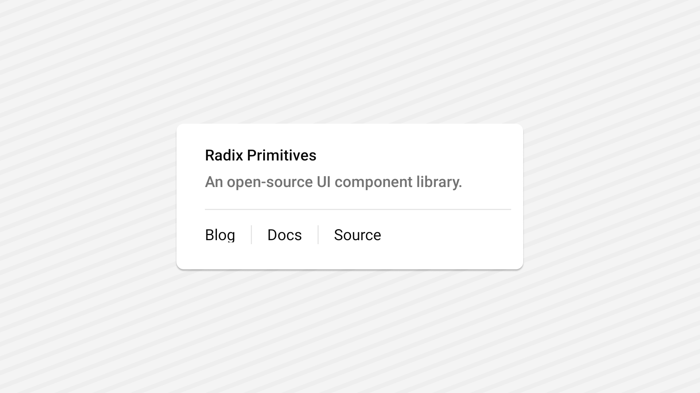

<Tabs items={['preview', 'code']}>
  <Tab value="preview">
    
  </Tab>
  <Tab value="code">
    ```ts
    import { Separator } from "@/components/ui/seperator";
import { Text } from "@/components/ui/text";
import React from "react";
import { View } from "react-native";
export default function SeperatorDemo() {
  return (
    <View className='flex-1 justify-center items-center p-6 gap-12 bg-white'>
      <View className='w-full max-w-xs '>
        <View className='gap-1'>
          <Text className='text-sm native:text-base font-medium leading-none'>Radix Primitives</Text>
          <Text className='text-sm native:text-base text-muted-foreground'>
            An open-source UI component library.
          </Text>
        </View>
        <Separator className='my-4' />
        <View className='flex flex-row h-5 items-center gap-4 '>
          <Text className='font-normal'>Blog</Text>
          <Separator orientation='vertical' />
          <Text className='font-normal'>Docs</Text>
          <Separator orientation='vertical' />
          <Text className='font-normal'>Source</Text>
        </View>
      </View>
    </View>
  );
}

    ```
  </Tab>
</Tabs>


## Installation

<Tabs items={['cli','manual', ]}>
 
  <Tab value="cli">
  ```ts
npx shadcn@latest add seperator
```
  </Tab>
  <Tab value="manual">
   
<Steps>


<Step>
Install the following dependencies:
```shell
npx expo install @rn-primitives/seperator

</Step>
<Step>
Create a folder named `ui` under component folder in your project and add the following code in a file named `seperator.tsx`:
```ts
import * as SeparatorPrimitive from '@rn-primitives/separator';
import * as React from 'react';
import { cn } from '~/lib/utils';

function Separator({
  className,
  orientation = 'horizontal',
  decorative = true,
  ...props
}: SeparatorPrimitive.RootProps & {
  ref?: React.RefObject<SeparatorPrimitive.RootRef>;
}) {
  return (
    <SeparatorPrimitive.Root
      decorative={decorative}
      orientation={orientation}
      className={cn(
        'shrink-0 bg-border',
        orientation === 'horizontal' ? 'h-[1px] w-full' : 'h-full w-[1px]',
        className
      )}
      {...props}
    />
  );
}

export { Separator };


```

</Step>

<Step>
This component depends on the `Text` component.
Please follow the installation guide [here](/components/text) before using the `Seperator`.

</Step>


<Step>
Update the import paths to match your project setup.
</Step>

</Steps>
  
  </Tab>


</Tabs>

## Usage

```tsx
import { Separator } from "@/components/ui/seperator";
```
```tsx
<Separator className='my-4' />
```

