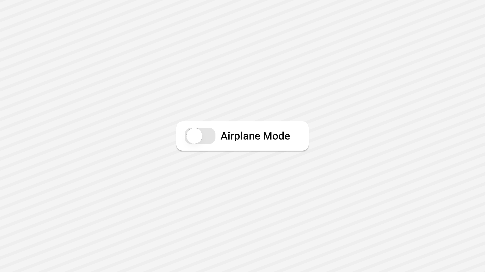

<Tabs items={["preview", "code"]}>
  <Tab value="preview"></Tab>
  <Tab value="code">
    ```ts
    <View className="flex-1 justify-center items-center p-6 gap-12">
      <View className="flex-row items-center gap-2">
        <Switch
          checked={checked}
          onCheckedChange={setChecked}
          nativeID="airplane-mode"
        />
        <Text
          nativeID="airplane-mode"
          onPress={() => {
            setChecked((prev) => !prev);
          }}
        >
          Airplane Mode
        </Text>
      </View>
    </View>
    ```
  </Tab>
</Tabs>

## Installation

<Tabs items={['cli','manual', ]}>
 
  <Tab value="cli">
  ```ts
npx shadcn@latest add switch
```
  </Tab>
  <Tab value="manual">
   
<Steps>

<Step>
Install the following dependencies:
```shell
npx expo install @rn-primitives/switch
```

</Step>
<Step>
Create a folder named `ui` under component folder in your project and add the following code in a file named `switch.tsx`:
```ts
import * as SwitchPrimitives from '@rn-primitives/switch';
import * as React from 'react';
import { Platform } from 'react-native';
import Animated, {
  interpolateColor,
  useAnimatedStyle,
  useDerivedValue,
  withTiming,
} from 'react-native-reanimated';
import { useColorScheme } from '~/lib/useColorScheme';
import { cn } from '~/lib/utils';

function SwitchWeb({
  className,
  ...props
}: SwitchPrimitives.RootProps & {
  ref?: React.RefObject<SwitchPrimitives.RootRef>;
}) {
  return (
    <SwitchPrimitives.Root
      className={cn(
        'peer flex-row h-5 w-10 shrink-0 cursor-pointer items-center native:rounded-full rounded-full border-2 border-transparent transition-colors focus-visible:outline-none focus-visible:ring-2 focus-visible:ring-ring focus-visible:ring-offset-2 focus-visible:ring-offset-background disabled:cursor-not-allowed',
        props.checked ? 'bg-primary' : 'bg-input',
        props.disabled && 'opacity-50',
        className
      )}
      {...props}
    >
      <SwitchPrimitives.Thumb
        className={cn(
          'pointer-events-none block h-4 w-4 rounded-full bg-background native:rounded-full shadow-md shadow-foreground/5 ring-0 transition-transform',
          props.checked ? 'translate-x-5' : 'translate-x-0'
        )}
      />
    </SwitchPrimitives.Root>
  );
}

const RGB_COLORS = {
  light: {
    primary: 'rgb(24, 24, 27)',
    input: 'rgb(228, 228, 231)',
  },
  dark: {
    primary: 'rgb(250, 250, 250)',
    input: 'rgb(39, 39, 42)',
  },
} as const;

function SwitchNative({
  className,
  ...props
}: SwitchPrimitives.RootProps & {
  ref?: React.RefObject<SwitchPrimitives.RootRef>;
}) {
  const { colorScheme } = useColorScheme();
  const translateX = useDerivedValue(() => (props.checked ? 18 : 0));
  const animatedRootStyle = useAnimatedStyle(() => {
    return {
      backgroundColor: interpolateColor(
        translateX.value,
        [0, 18],
        [RGB_COLORS[colorScheme].input, RGB_COLORS[colorScheme].primary]
      ),
    };
  });
  const animatedThumbStyle = useAnimatedStyle(() => ({
    transform: [{ translateX: withTiming(translateX.value, { duration: 200 }) }],
  }));
  return (
    <Animated.View
      style={animatedRootStyle}
      className={cn('h-6 w-[40px] rounded-full', props.disabled && 'opacity-50')}
    >
      <SwitchPrimitives.Root
        className={cn(
          'flex-row h-6 w-[40px] shrink-0 items-center rounded-full border-2 border-transparent',
          props.checked ? 'bg-primary' : 'bg-input',
          className
        )}
        {...props}
      >
        <Animated.View style={animatedThumbStyle}>
          <SwitchPrimitives.Thumb
            className={'h-[21px] w-[21px] rounded-full bg-background shadow-md shadow-foreground/25 ring-0'}
          />
        </Animated.View>
      </SwitchPrimitives.Root>
    </Animated.View>
  );
}

const Switch = Platform.select({
  web: SwitchWeb,
  default: SwitchNative,
});

export { Switch };

````

</Step>

<Step>
This component depends on the `Text` component.
Please follow the installation guide [here](/components/text) before using the `Avatar`.

</Step>


<Step>
Update the import paths to match your project setup.
</Step>

</Steps>
  
  </Tab>

</Tabs>

## Usage

```tsx
import { Switch } from "@/components/ui/switch";
```

```tsx
<Switch
  checked={checked}
  onCheckedChange={setChecked}
  nativeID="airplane-mode"
/>
```
