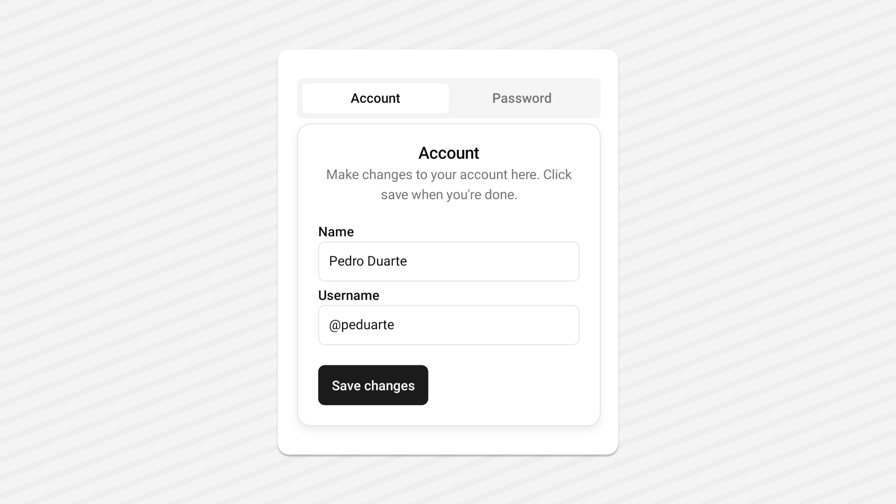

<Tabs items={["preview", "code"]}>
  <Tab value="preview"></Tab>
  <Tab value="code">
  ```ts
  import { Button } from "@/components/ui/button";
import { Input } from "@/components/ui/input";
import { Text } from "@/components/ui/text";
import React from "react";
import { View } from "react-native";
import {
  Card,
  CardContent,
  CardDescription,
  CardFooter,
  CardHeader,
  CardTitle,
} from '~/components/ui/card';
import { Tabs, TabsContent, TabsList, TabsTrigger } from "~/components/ui/tabs";
export default function TabsDemo() {
  const [value, setValue] = React.useState("account");

  return (
    <View className="flex-1 flex-row justify-center items-center p-6 gap-5 bg-white">
      <Tabs
        value={value}
        onValueChange={setValue}
        className="w-full max-w-[400px] mx-auto flex-col gap-1.5"
      >
        <TabsList className="flex-row w-full">
          <TabsTrigger value="account" className="flex-1">
            <Text>Account</Text>
          </TabsTrigger>
          <TabsTrigger value="password" className="flex-1">
            <Text>Password</Text>
          </TabsTrigger>
        </TabsList>
        <TabsContent value="account">
          <Card>
            <CardHeader>
              <CardTitle>Account</CardTitle>
              <CardDescription>
                Make changes to your account here. Click save when you're done.
              </CardDescription>
            </CardHeader>
            <CardContent className="gap-4 native:gap-2">
              <View className="gap-1">
                <Text nativeID="name">Name</Text>
                <Input
                  aria-aria-labelledby="name"
                  defaultValue="Pedro Duarte"
                />
              </View>
              <View className="gap-1">
                <Text nativeID="username">Username</Text>
                <Input id="username" defaultValue="@peduarte" />
              </View>
            </CardContent>
            <CardFooter>
              <Button>
                <Text>Save changes</Text>
              </Button>
            </CardFooter>
          </Card>
        </TabsContent>
        <TabsContent value="password">
          <Card>
            <CardHeader>
              <CardTitle>Password</CardTitle>
              <CardDescription>
                Change your password here. After saving, you'll be logged out.
              </CardDescription>
            </CardHeader>
            <CardContent className="gap-4 native:gap-2">
              <View className="gap-1">
                <Text nativeID="current">Current password</Text>
                <Input
                  placeholder="********"
                  aria-Textledby="current"
                  secureTextEntry
                />
              </View>
              <View className="gap-1">
                <Text nativeID="new">New password</Text>
                <Input
                  placeholder="********"
                  aria-labelledby="new"
                  secureTextEntry
                />
              </View>
            </CardContent>
            <CardFooter>
              <Button>
                <Text>Save password</Text>
              </Button>
            </CardFooter>
          </Card>
        </TabsContent>
      </Tabs>
    </View>
  );
}
```
  </Tab>
 
</Tabs>

## Installation

<Tabs items={['cli','manual', ]}>
 
  <Tab value="cli">
  ```ts
npx shadcn@latest add tabs
```
  </Tab>
  <Tab value="manual">
   
<Steps>

<Step>
Install the following dependencies:
```shell
npx expo install @rn-primitives/tabs
```

</Step>
<Step>
Create a folder named `ui` under component folder in your project and add the following code in a file named `tabs.tsx`:
```ts
import * as TabsPrimitive from '@rn-primitives/tabs';
import * as React from 'react';
import { TextClassContext } from '~/components/ui/text';
import { cn } from '~/lib/utils';

const Tabs = TabsPrimitive.Root;

function TabsList({
className,
...props
}: TabsPrimitive.ListProps & {
ref?: React.RefObject<TabsPrimitive.ListRef>;
}) {
return (
<TabsPrimitive.List
className={cn(
'web:inline-flex h-10 native:h-12 items-center justify-center rounded-md bg-muted p-1 native:px-1.5',
className
)}
{...props}
/>
);
}

function TabsTrigger({
className,
...props
}: TabsPrimitive.TriggerProps & {
ref?: React.RefObject<TabsPrimitive.TriggerRef>;
}) {
const { value } = TabsPrimitive.useRootContext();
return (
<TextClassContext.Provider
value={cn(
'text-sm native:text-base font-medium text-muted-foreground web:transition-all',
value === props.value && 'text-foreground'
)} >
<TabsPrimitive.Trigger
className={cn(
'inline-flex items-center justify-center shadow-none web:whitespace-nowrap rounded-md px-2 py-1.5 text-sm font-medium web:ring-offset-background web:transition-all web:focus-visible:outline-none web:focus-visible:ring-2 web:focus-visible:ring-ring web:focus-visible:ring-offset-2',
props.disabled && 'web:pointer-events-none opacity-50',
props.value === value && 'bg-background shadow-lg shadow-foreground/10',
className
)}
{...props}
/>
</TextClassContext.Provider>
);
}

function TabsContent({
className,
...props
}: TabsPrimitive.ContentProps & {
ref?: React.RefObject<TabsPrimitive.ContentRef>;
}) {
return (
<TabsPrimitive.Content
className={cn(
'web:ring-offset-background web:focus-visible:outline-none web:focus-visible:ring-2 web:focus-visible:ring-ring web:focus-visible:ring-offset-2',
className
)}
{...props}
/>
);
}

export { Tabs, TabsContent, TabsList, TabsTrigger };

````

</Step>

<Step>
This component depends on the `Text` component.
Please follow the installation guide [here](/components/text) before using the `Avatar`.

</Step>


<Step>
Update the import paths to match your project setup.
</Step>

</Steps>

  </Tab>


</Tabs>

## Usage

```tsx
import { Tabs, TabsContent, TabsList, TabsTrigger } from "~/components/ui/tabs";
````

```tsx
<Tabs
  value={value}
  onValueChange={setValue}
  className="w-full max-w-[400px] mx-auto flex-col gap-1.5"
>
  <TabsList className="flex-row w-full">
    <TabsTrigger value="account" className="flex-1">
      <Text>Account</Text>
    </TabsTrigger>
    <TabsTrigger value="password" className="flex-1">
      <Text>Password</Text>
    </TabsTrigger>
  </TabsList>
  <TabsContent value="account">
    <Text>Make changes to your account here.</Text>
  </TabsContent>
  <TabsContent value="password">
    <Text>Change your password here.</Text>
  </TabsContent>
</Tabs>
```
