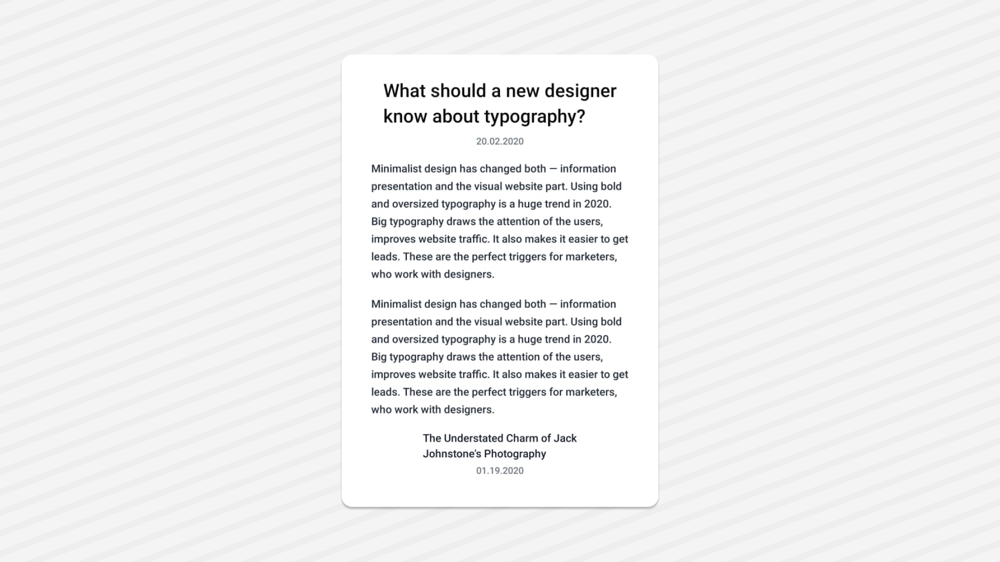

<Tabs items={['preview', 'code']}>
  <Tab value="preview">
    
  </Tab>
  <Tab value="code">
    ```ts
   import { Text } from "@/components/ui/text";
import React from "react";
import { View } from "react-native";
export default function TextDemo() {

  return (
    <View className="flex-1  justify-center items-center p-6 bg-white">
      <Text className="text-2xl font-semibold leading-snug mb-2">
        What should a new designer{'\n'}know about typography?
      </Text>

      <Text className="text-xs text-gray-500 mb-4">20.02.2020</Text>

      <Text className="text-sm text-gray-800 mb-4 leading-relaxed">
        Minimalist design has changed both — information{'\n'}
        presentation and the visual website part. Using bold{'\n'}
        and oversized typography is a huge trend in 2020.{'\n'}
        Big typography draws the attention of the users,{'\n'}
        improves website traffic. It also makes it easier to get{'\n'}
        leads. These are the perfect triggers for marketers,{'\n'}
        who work with designers.
      </Text>

      <Text className="text-sm text-gray-800 mb-4 leading-relaxed">
        Minimalist design has changed both — information{'\n'}
        presentation and the visual website part. Using bold{'\n'}
        and oversized typography is a huge trend in 2020.{'\n'}
        Big typography draws the attention of the users,{'\n'}
        improves website traffic. It also makes it easier to get{'\n'}
        leads. These are the perfect triggers for marketers,{'\n'}
        who work with designers.
      </Text>

      <Text className="text-sm font-semibold text-gray-900 mb-1">
        The Understated Charm of Jack{'\n'}Johnstone's Photography
      </Text>

      <Text className="text-xs text-gray-500">01.19.2020</Text>
    </View>
  );
}
    ```
  </Tab>
</Tabs>

## Installation

<Tabs items={['cli','manual', ]}>
 
  <Tab value="cli">
  ```ts
npx shadcn@latest add text
```
  </Tab>
  <Tab value="manual">
   
<Steps>

<Step>
Install the following dependencies:
```shell
npx expo install @rn-primitives/types
npx expo install @rn-primitives/slot
```

</Step>
<Step>
Create a folder named `ui` under component folder in your project and add the following code in a file named `text.tsx`:
```ts
import * as Slot from '@rn-primitives/slot';
import * as React from 'react';
import { Text as RNText } from 'react-native';
import { cn } from '~/lib/utils';

const TextClassContext = React.createContext<string | undefined>(undefined);

function Text({
  className,
  asChild = false,
  ...props
}: React.ComponentProps<typeof RNText> & {
  ref?: React.RefObject<RNText>;
  asChild?: boolean;
}) {
  const textClass = React.useContext(TextClassContext);
  const Component = asChild ? Slot.Text : RNText;
  return (
    <Component
      className={cn('text-base text-foreground flex-row items-center leading-none font-medium', textClass, className)}
      {...props}
      
    />
  );
}

export { Text, TextClassContext };


```

</Step>


<Step>
Update the import paths to match your project setup.
</Step>

</Steps>

  </Tab>


</Tabs>

## Usage

```tsx
import { Text } from "@/components/ui/text";
````

```tsx
<Text>Text</Text>
```
