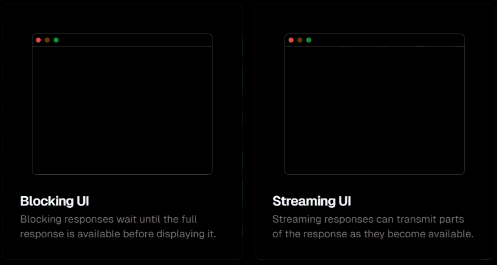

## Basic Syntax

```ts title="Basic syntax"
import { generateText } from "ai"
import { openai } from "@ai-sdk/openai"

const { text } = await generateText({
    model: openai("gpt-5"),
    prompt: "What is love?"
})
```

## Prompts:

Prompts are instructions that you give a large language model (LLM) to tell it what to do. It's like when you ask someone for directions; the clearer your question, the better the directions you'll get.

To simplify there are 3 kind of prompts:
1. Text prompts `prompts`
3. System prompts `system`
2. Message prompts `messages`

### Text prompts:
Text prompts are are normal query we ask the LLM's. They are ideal for simple generation use cases.

```ts
const {text} = await generateText({
    model: openai("gpt-5"),
    prompt: `Find the best places to visit in America`
})
```
you can also make it dynamic by

```ts
const location = "" // get it dynamically or from user

const {text} = await generateText({
    model: openai("gpt-5"),
    prompt: `Find the best places to visit in ${location}`
})
```
### System Prompts `system`

Are initial set of instructions given to a model to refine it's response and specify constraints to follow:

```ts
const { text } = await generateText({
    model: openai("gpt-5"),
    system: `Your are a travel agent planner and don't answer anything apart from travel queries`,
    prompt: 'hich is the worst politician in the world'
})
```
* this will make the LLM to consider the system prompt as a preferance, and follow the instructions `system` over `prompt`


### Message Prompts
{/* TODO: Paraphrase this to make is easy to understand */}
A message prompt is an array of user, assistant, and tool messages. They are great for chat interfaces and more complex, multi-modal prompts. You can use the messages property to set message prompts.

```ts
const result = await generateText({
  model: 'openai/gpt-4.1',
  messages: [

    { role: 'user', content: 'Hi!' },

    // Assistant messages are messages that have a role of assistant. They are typically previous responses from the assistant and can contain text, reasoning, and tool call parts.
    { role: 'assistant', content: 'Hello, how can I help?' },
    { role: 'user', content: 'Where can I buy the best Currywurst in Berlin?' },
  ],
});
```

### System Messages
System messages are messages that are sent to the model before the user messages to guide the assistant's behavior. You can alternatively use the system property.

```ts
const result = await generateText({
    model: 'openai/gpt-4.1',
    messages: [
        { role: 'system', content: 'You help planning travel itineraries.' },
        {
            role: 'user',
            content:
            'I am planning a trip to Berlin for 3 days. Please suggest the best tourist activities for me to do.',
        },
    ],
});
```


Advanced topics
https://ai-sdk.dev/docs/foundations/prompts#provider-options
* User Messages -> basically you can break down the user message content in different formats like chunks of text, image, pdf, audio 
* assistant message with tool call content -> https://ai-sdk.dev/docs/foundations/prompts#example-assistant-message-with-tool-call-content


# Streaming
Streaming conversational text UIs (like ChatGPT) have gained massive popularity over the past few months. This section explores the benefits and drawbacks of streaming and blocking interfaces.

Large language models (LLMs) are extremely powerful. However, when generating long outputs, they can be very slow compared to the latency you're likely used to. If you try to build a traditional blocking UI, your users might easily find themselves staring at loading spinners for 5, 10, even up to 40s waiting for the entire LLM response to be generated. This can lead to a poor user experience, especially in conversational applications like chatbots. Streaming UIs can help mitigate this issue by displaying parts of the response as they become available.




easy example
```ts
import { streamText } from 'ai';

const { textStream } = streamText({
  model: 'openai/gpt-4.1',
  prompt: 'Write a poem about embedding models.',
});

for await (const textPart of textStream) {
  console.log(textPart);
}
```