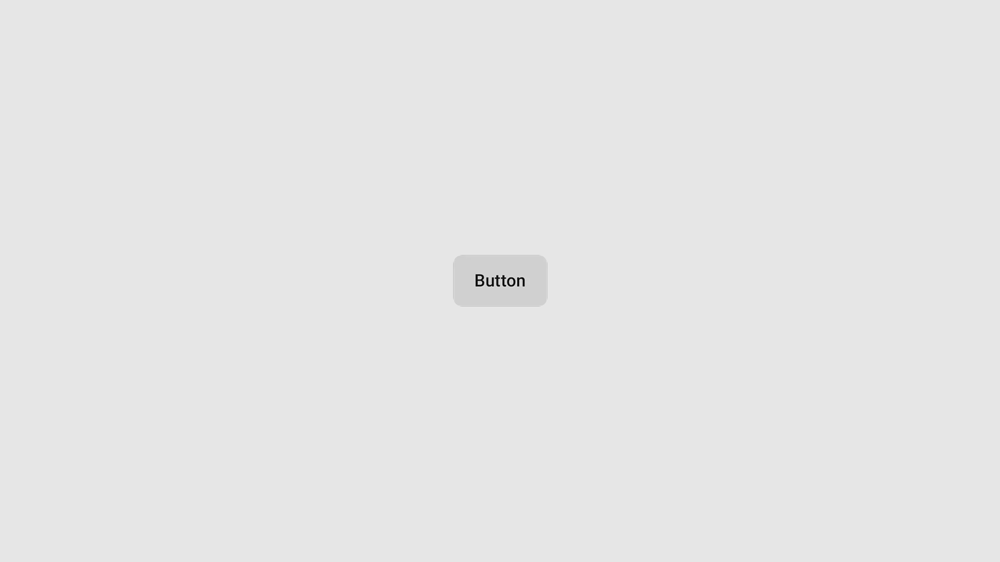

import { Step, Steps } from 'fumadocs-ui/components/steps';


## Preview



## Installation

<Tabs items={['cli','manual', ]}>
  <Tab value="manual">
   
<Steps>

<Step>
Install the following dependencies:
```shell
bun expo add tailwind-variants
```
{/* TODO: add tabs for other installation purposes*/}

</Step>
<Step>
Copy and paste the following code into your project.


```ts
// Internal button.tsx file
import { Pressable, Text } from "react-native";
import { tv } from "tailwind-variants";

export const buttonVariants = tv({ 
  base: "rounded-md px-4 py-2 ",
  variants: {
    variant: {
      primary: "bg-black ",
      secondary: "bg-gray-200 ",
      destructive: "bg-red-500 ",
      outline:  "border border-slate-400  bg-white box-shadow-sm "
    },
    size: {
      sm: "px-4",
      lg: "px-8 py-2",
    },
  },
  defaultVariants: {
    variant: "primary",
    size: "sm",
  },
 });
export const buttonTextVariants = tv({ 
  base: "font-medium  ",
  variants: {
    variant: {
      primary: "text-white",
      secondary: "text-black",
      destructive: "text-white",
      outline :"text-black"
    },
    size: {
      sm: "text-sm",
      lg: "text-sm",
    },
  },
  defaultVariants: {
    variant: "primary",
    size: "sm",
  },
 });

export type ButtonProps = {
  variant?: "primary" | "secondary" | "destructive"| "outline";
  size?: "sm" | "lg";
  children: React.ReactNode;
  className?: string;
};

export const Button = ({ children, variant, size,className }: ButtonProps) => {
  return (
    <Pressable  className={buttonVariants({ variant, size ,className})}>
      <Text className={buttonTextVariants({ variant, size,className })}>{children}</Text>
    </Pressable>
  );
};


```

</Step>
<Step>
Update the import paths to match your project setup.
</Step>

</Steps>
  
  </Tab>
  <Tab value="cli">
  ```ts
npx shadcn@latest add ""
```
  </Tab>
</Tabs>


## Usage

```tsx
import { Button } from "@/components/ui/button"
```

```tsx
<Button variant="outline">Button</Button>
```

## Examples

### Secondary 
```tsx
<Button variant="secondary">Button</Button>
```


### Destructive
```tsx
<Button variant="destructive">Button</Button>
```

### Outline
```tsx
<Button variant="outline">Button</Button>
```
{/* ### Icon 
```tsx */}

