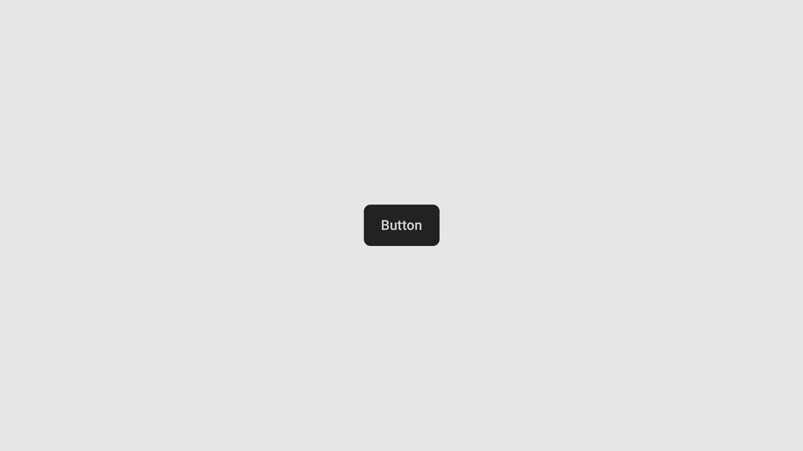
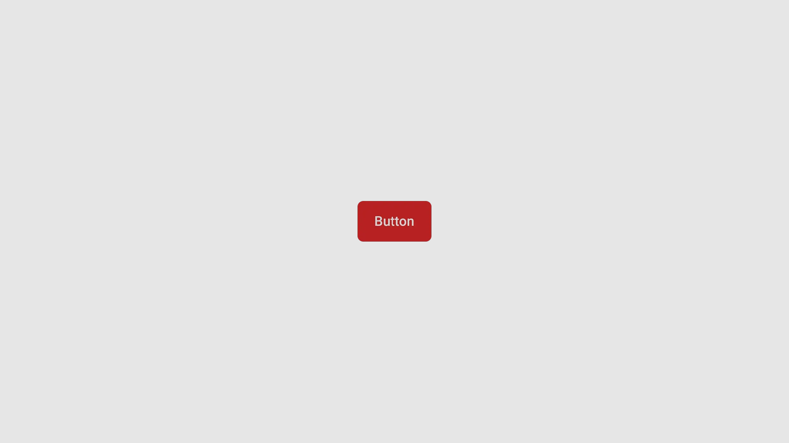
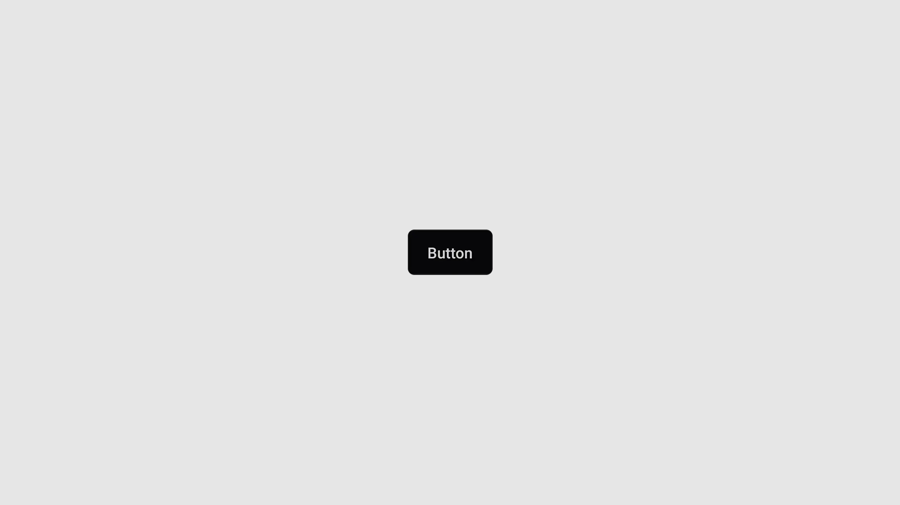

import { Step, Steps } from 'fumadocs-ui/components/steps';


## Preview

{/*  */}

{/*  */}

## Installation

<Tabs items={['cli','manual', ]}>
  <Tab value="manual">
   
<Steps>

<Step>
Install the following dependencies:
```shell
bun expo add tailwind-variants
```
{/* TODO: add tabs for other installation purposes*/}

</Step>
<Step>
Copy and paste the following code into your project.

```ts
import { cva, type VariantProps } from 'class-variance-authority';
import * as React from 'react';
import { Pressable } from 'react-native';
import { TextClassContext } from '~/components/ui/text';
import { cn } from '~/lib/utils';

const buttonVariants = cva(
  'flex items-center justify-center rounded-md',
  {
    variants: {
      variant: {
        default: 'bg-primary active:opacity-90',
        destructive: 'bg-destructive active:opacity-90',
        outline: 'border border-input bg-background active:bg-accent',
        secondary: 'bg-secondary active:opacity-80',
      },
      size: {
        default: 'h-12 px-5 py-3',
        sm: 'h-9 rounded-md px-3',
        lg: 'h-14 rounded-md px-8',
        icon: 'h-10 w-10',
      },
    },
    defaultVariants: {
      variant: 'default',
      size: 'default',
    },
  }
);

const buttonTextVariants = cva(
  'text-base font-medium text-foreground',
  {
    variants: {
      variant: {
        default: 'text-primary-foreground',
        destructive: 'text-destructive-foreground',
        outline: '',
        secondary: 'text-secondary-foreground',
      },
      size: {
        default: '',
        sm: '',
        lg: 'text-lg',
        icon: '',
      },
    },
    defaultVariants: {
      variant: 'default',
      size: 'default',
    },
  }
);

type ButtonProps = React.ComponentProps<typeof Pressable> & VariantProps<typeof buttonVariants>;

function Button({ ref, className, variant, size, ...props }: ButtonProps) {
  return (
    <TextClassContext.Provider
      value={buttonTextVariants({ variant, size, className })}
    >
      <Pressable
        className={cn(
          props.disabled && 'opacity-50',
          buttonVariants({ variant, size, className })
        )}
        ref={ref}
        role='button'
        {...props}
      />
    </TextClassContext.Provider>
  );
}

export { Button, buttonTextVariants, buttonVariants };
export type { ButtonProps };
```

</Step>
<Step>
Create a utility function to merge class names. 
Create a file named `utils.ts` in your project and add the following code:
```ts
import { clsx, type ClassValue } from 'clsx';
import { twMerge } from 'tailwind-merge';

export function cn(...inputs: ClassValue[]) {
  return twMerge(clsx(inputs));
}
```
</Step>
<Step>
Update the import paths to match your project setup.
</Step>

</Steps>
  
  </Tab>
  <Tab value="cli">
  ```ts
npx shadcn@latest add ""
```
  </Tab>
</Tabs>


## Usage

```tsx
import { Button } from "@/components/ui/button"
```

```tsx
<Button variant="default">Button</Button>
```

## Examples

### Secondary 
<Tabs  items={['Preview', 'Code']}>
  <Tab value="Preview">
  
  </Tab>
  <Tab value="Code">
  ```tsx
<Button variant="secondary">Button</Button>
```
  </Tab>
</Tabs>


### Destructive
<Tabs  items={['Preview', 'Code']}>
  <Tab value="Preview">
  
  </Tab>
  <Tab value="Code">
```tsx
<Button variant="destructive">Button</Button>
```
  </Tab>
</Tabs>


### Outline
<Tabs  items={['Preview', 'Code']}>
  <Tab value="Preview">
  
  </Tab>
  <Tab value="Code">
```tsx
<Button variant="outline">Button</Button>
```
  </Tab>
</Tabs>

{/* ### Icon 
```tsx */}

