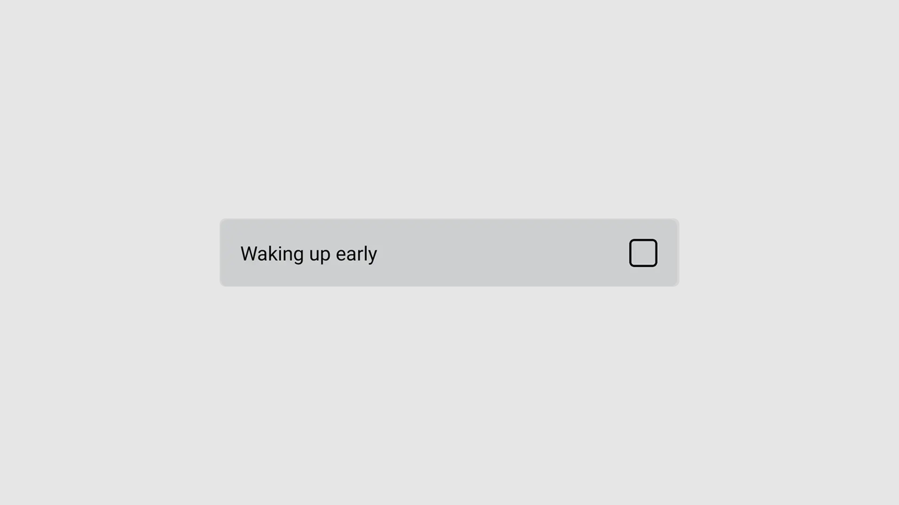

import { Step, Steps } from "fumadocs-ui/components/steps";

## Preview



## Installation

<Tabs items={['cli','manual', ]}>
  <Tab value="manual">
   
<Steps>

<Step>
Install the following dependencies:
```shell
bun expo add tailwind-variants
```
{/* TODO: add tabs for other installation purposes*/}

</Step>
<Step>
Copy and paste the following code into your project.

```ts
import * as CheckboxPrimitive from '@rn-primitives/checkbox';
import * as React from 'react';
import { Check } from '~/lib/icons/Check';
import { cn } from '~/lib/utils';

function Checkbox({
  className,
  ...props
}: CheckboxPrimitive.RootProps & {
  ref?: React.RefObject<CheckboxPrimitive.RootRef>;
}) {
  return (
    <CheckboxPrimitive.Root
      className={cn(
        'h-[20] w-[20] shrink-0 rounded-sm border border-primary',
        props.checked && 'bg-primary',
        props.disabled && 'opacity-50',
        className
      )}
      {...props}
    >
      <CheckboxPrimitive.Indicator className="items-center justify-center h-full w-full">
        <Check
          size={12}
          strokeWidth={3.5}
          className="text-primary-foreground"
        />
      </CheckboxPrimitive.Indicator>
    </CheckboxPrimitive.Root>
  );
}

export { Checkbox };
```

</Step>
<Step>
Create a utility function to merge class names. 
Create a file named `utils.ts` in your project and add the following code:
```ts
import { clsx, type ClassValue } from 'clsx';
import { twMerge } from 'tailwind-merge';

export function cn(...inputs: ClassValue[]) {
  return twMerge(clsx(inputs));
}
```
</Step>
<Step>
Update the import paths to match your project setup.
</Step>

</Steps>
  
  </Tab>
  <Tab value="cli">
  ```ts
npx shadcn@latest add ""
```
  </Tab>
</Tabs>

## Usage

```tsx
import { Checkbox } from "~/components/ui/checkbox";
```

```tsx
function Example() {
  const [checked, setChecked] = React.useState(false);
  return <Checkbox checked={checked} onCheckedChange={setChecked} />;
}
```

## Examples
